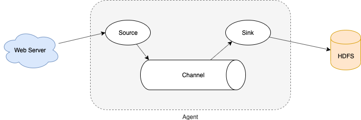

# 基本介绍

## 概述

Flume 是一个分布式、可靠、高可用的**海量日志采集、聚合和传输**的系统。

Flume 可以采集文件，socket数据包、文件、文件夹、kafka 等各种形式源数据，又可以将采集到的数据（下沉sink）输出到HDFS、hbase、hive、kafka等众多外部存储系统中。

一般的采集需求，通过对 Flume 的简单配置即可实现。Flume 针对特殊场景也具备良好的自定义扩展能力，因此，flume 可以适用于大部分的日常<font color=red>数据采集</font>场景。


## 运行机制

Flume分布式系统中最核心的角色是agent，flume采集系统就是由一个个agent所连接起来形成。每一个 agent 相当于一个数据传递员，内部有三个组件：

- Source：采集组件，用于跟数据源对接，以获取数据

- Sink：下沉组件，用于往下一级agent传递数据或者往最终存储系统传递数据

- Channel：传输通道组件，用于从source将数据传递到sink



# 安装部署

## 安装

node03执行

```bash
scp flume-ng-1.6.0-cdh5.14.2.tar.gz hadoop@node03:/bigdata/soft
tar -zxvf flume-ng-1.6.0-cdh5.14.2.tar.gz -C /bigdata/install/
```


## 配置

- flume-env.sh

  ```bash
  cd /bigdata/install/apache-flume-1.6.0-cdh5.14.2-bin/conf
  cp flume-env.sh.template flume-env.sh
  vi flume-env.sh
  
  # 增加java环境变量
  export JAVA_HOME=/bigdata/install/jdk1.8.0_141
  ```

  

- /etc/profile

  ```bash
  sudo vi /etc/profile
  
  # 增加flume环境变量
  export FLUME_HOME=/bigdata/install/apache-flume-1.6.0-cdh5.14.2-bin
  export PATH=$PATH:$FLUME_HOME/bin
  
  # 立即生效
  source /etc/profile
  ```


# 实战

## 采集网络端口数据并控制台打印

### 配置

netcat-memory-logger.conf

```properties
# 定义这个agent中各组件的名字
a1.sources = r1
a1.sinks = k1
a1.channels = c1

# 描述和配置source组件：r1
a1.sources.r1.type = netcat
a1.sources.r1.bind = 192.168.2.102
a1.sources.r1.port = 44444

# 描述和配置sink组件：k1
a1.sinks.k1.type = logger

# 描述和配置channel组件，此处使用是内存缓存的方式
a1.channels.c1.type = memory
a1.channels.c1.capacity = 1000
a1.channels.c1.transactionCapacity = 100

# 描述和配置source channel sink之间的连接关系
a1.sources.r1.channels = c1
a1.sinks.k1.channel = c1
```


### 启动

```bash
# -c conf	指定flume自身的配置文件所在目录
# -f conf/netcat-memory-logger.conf 指定描述的采集方案
flume-ng agent -c /bigdata/install/apache-flume-1.6.0-cdh5.14.2-bin/conf -f netcat-memory-logger.conf -n a1 -Dflume.root.logger=INFO,console
```


### 测试

```bash
# 安装telnet客户端模拟数据发送
sudo yum -y install telnet

# 测试
# control+]	回到telnet命令窗口
# quit 退出
telnet node03 44444
```


## 采集目录文件到HDFS

### 配置

spooldir.conf

```properties
# Name the components on this agent
a1.sources = r1
a1.sinks = k1
a1.channels = c1

# Describe/configure the source
# 注意，不能向监控目中重复放同名文件
a1.sources.r1.type = spooldir
a1.sources.r1.spoolDir = /home/hadoop/flumedatas/spooldir
a1.sources.r1.fileHeader = true

# Describe the sink
a1.sinks.k1.type = hdfs
a1.sinks.k1.hdfs.path = hdfs://node01:8020/test/flume/spooldir/files/%y-%m-%d/%H%M/
a1.sinks.k1.hdfs.filePrefix = events-
# ====
# 时间戳是否需要四舍五入，默认false，true影响所有基于时间的转义字符，除了%t
a1.sinks.k1.hdfs.round = true
# 时间戳四舍五入的倍数，小于当前时间
a1.sinks.k1.hdfs.roundValue = 10
# 时间戳四舍五入的单位，默认秒
a1.sinks.k1.hdfs.roundUnit = minute
# 以上为每隔10分钟产生一个文件
# ====
# 触发滚动文件等待时间（秒），默认30，0不会基于时间滚动文件
# a1.sinks.k1.hdfs.rollInterval = 3
a1.sinks.k1.hdfs.rollInterval = 0
# 触发滚动文件的文件大小（字节），默认1024，0不会基于文件大小滚动文件
# a1.sinks.k1.hdfs.rollSize = 20
a1.sinks.k1.hdfs.rollSize = 0
# 触发滚动文件的事件数量（最小传输单位），默认10，0不会基于事件数量滚动文件
# a1.sinks.k1.hdfs.rollCount = 5
a1.sinks.k1.hdfs.rollCount = 0
# ====
# 刷写到HDFS前的事件数量，默认100
a1.sinks.k1.hdfs.batchSize = 1
# ====
a1.sinks.k1.hdfs.useLocalTimeStamp = true
# 生成的文件类型，默认 SequenceFile，可用 DataStream 代替，为普通文本
a1.sinks.k1.hdfs.fileType = DataStream

# Use a channel which buffers events in memory
a1.channels.c1.type = memory
a1.channels.c1.capacity = 1000
a1.channels.c1.transactionCapacity = 100

# Bind the source and sink to the channel
a1.sources.r1.channels = c1
a1.sinks.k1.channel = c1
```


- Source：spooldir

  - 监视一个目录（**flume部署到数据源一端**），只要目录中出现新文件，就会采集文件中的内容

  - 采集完成的文件，会被agent自动添加一个后缀：COMPLETED
  - 所监视的目录中不允许重复出现相同文件名的文件（**出错后不会继续运行**）

- Sink：hdfs

  - round、roundValue、roundUnit

    控制多长时间生成一个文件，可以控制hdfs上小文件的数量。

  - rollInterval、rollSize、rollCount

    控制滚动生成文件的时间间隔、大小、事件数量，当全部设置为0时，不会基于此三项生成文件。


### 启动

```bash
flume-ng agent -c /bigdata/install/apache-flume-1.6.0-cdh5.14.2-bin/conf -f spooldir.conf -n a1 -Dflume.root.logger=INFO,console
```


### 测试

spooldir.sh

```bash
#!/bin/bash

i=0

while true
do
	echo $((++i)) >> /home/hadoop/flumedatas/spooldir/$i;
	sleep 10;
done
```


```bash
sh spooldir.sh
```


## 采集文件到HDFS

### 配置

taillog.conf

```properties
agent1.sources = source1
agent1.sinks = sink1
agent1.channels = channel1

# Describe/configure tail -F source1
agent1.sources.source1.type = exec
agent1.sources.source1.command = tail -F /home/hadoop/flumedatas/taillog/access_log


# Describe sink1
agent1.sinks.sink1.type = hdfs
agent1.sinks.sink1.hdfs.path = hdfs://node01:8020/test/flume/taillog/%y-%m-%d/%H-%M
agent1.sinks.sink1.hdfs.filePrefix = access_log
agent1.sinks.sink1.hdfs.maxOpenFiles = 5000
agent1.sinks.sink1.hdfs.batchSize = 100
agent1.sinks.sink1.hdfs.fileType = DataStream
agent1.sinks.sink1.hdfs.writeFormat = Text
agent1.sinks.sink1.hdfs.rollSize = 102400
agent1.sinks.sink1.hdfs.rollCount = 1000000
agent1.sinks.sink1.hdfs.roundValue = 10
agent1.sinks.sink1.hdfs.roundUnit = minute
agent1.sinks.sink1.hdfs.useLocalTimeStamp = true

# Use a channel which buffers events in memory
agent1.channels.channel1.type = memory
agent1.channels.channel1.keep-alive = 120
agent1.channels.channel1.capacity = 500000
agent1.channels.channel1.transactionCapacity = 600

# Bind the source and sink to the channel
agent1.sources.source1.channels = channel1
agent1.sinks.sink1.channel = channel1
```


- tail -F
  - 首次启动时，只加载文件最后10行
  - 常驻系统程序，监控文件末尾追加

- Sink：hdfs
  - 最下层文件夹是 `小时-分钟` ，也就是说每分钟生成一个文件夹。观察测试数据发现，每分钟会有两个小文件，是因为 `hdfs.rollInterval` 默认30秒滚动生成新文件。

### 启动

```bash
flume-ng agent -c /bigdata/install/apache-flume-1.6.0-cdh5.14.2-bin/conf -f taillog.conf -n agent1 -Dflume.root.logger=INFO,console
```


### 测试

taillog.sh

```shell
#!/bin/bash

while true
do
	date >> /home/hadoop/flumedatas/taillog/access_log;
	sleep 0.5;
done
```


```bash
sh taillog.sh
```


## 断点续传

### 配置

taildir.conf

```properties
# Name the components on this agent
a1.sources = r1
a1.sinks = k1
a1.channels = c1

# Describe/configure the source
a1.sources.r1.type = TAILDIR
# record the inode, the absolute path and the last position of each tailing file
a1.sources.r1.positionFile = /home/hadoop/flumedatas/taildir_position.json
# 可以有多个组，以空格分隔
a1.sources.r1.filegroups = f1
a1.sources.r1.filegroups.f1 = /home/hadoop/flumedatas/taildir/.*log.*

# Describe the sink
a1.sinks.k1.type = hdfs
a1.sinks.k1.hdfs.path = hdfs://node01:8020/test/flume/taildir/files/%y-%m-%d/%H%M/
a1.sinks.k1.hdfs.filePrefix = events-
a1.sinks.k1.hdfs.round = true
a1.sinks.k1.hdfs.roundValue = 10
a1.sinks.k1.hdfs.roundUnit = minute
a1.sinks.k1.hdfs.rollInterval = 3
a1.sinks.k1.hdfs.rollSize = 5000
a1.sinks.k1.hdfs.rollCount = 50000
a1.sinks.k1.hdfs.batchSize = 5000
a1.sinks.k1.hdfs.useLocalTimeStamp = true
a1.sinks.k1.hdfs.fileType = DataStream

# Use a channel which buffers events in memory
a1.channels.c1.type = memory
a1.channels.c1.capacity = 1000
a1.channels.c1.transactionCapacity = 100

# Bind the source and sink to the channel
a1.sources.r1.channels = c1
a1.sinks.k1.channel = c1
```


- Sink：TAILDIR
  - 可以监控文件夹下的文件，也可以监控文件内容
  - 断点续传功能，原理是taildir_position.json记录每一次生成事件的文件位置


### 启动

```bash
flume-ng agent -c /bigdata/install/apache-flume-1.6.0-cdh5.14.2-bin/conf -f taildir.conf -n a1 -Dflume.root.logger=INFO,console
```


### 测试

```bash
# > 新增文件写入内容
# >> 追加内容到文件末尾
echo "testlog1" >> /home/hadoop/flumedatas/taildir/file.log
echo "testlog2" >> /home/hadoop/flumedatas/taildir/file.log
```


## 级联Agent

### 安装

node03执行

```bash
scp -r apache-flume-1.6.0-cdh5.14.2-bin/ node02:$PWD
```


配置/etc/profile

```bash
sudo vi /etc/profile

# 增加flume环境变量
export FLUME_HOME=/bigdata/install/apache-flume-1.6.0-cdh5.14.2-bin
export PATH=$PATH:$FLUME_HOME/bin

# 立即生效
source /etc/profile
```


### 配置

node02

tail-avro-avro-logger.conf

```properties
# Name the components on this agent
a1.sources = r1
a1.sinks = k1
a1.channels = c1

# Describe/configure the source
a1.sources.r1.type = exec
a1.sources.r1.command = tail -F /home/hadoop/flumedatas/taillog/access_log

# Describe the sink
# 数据发送
a1.sinks.k1.type = avro
a1.sinks.k1.hostname = node03
a1.sinks.k1.port = 4141
a1.sinks.k1.batch-size = 10

# Use a channel which buffers events in memory
a1.channels.c1.type = memory
a1.channels.c1.capacity = 1000
a1.channels.c1.transactionCapacity = 100

# Bind the source and sink to the channel
a1.sources.r1.channels = c1
a1.sinks.k1.channel = c1
```


node03

avro-hdfs.conf

```properties
# Name the components on this agent
a1.sources = r1
a1.sinks = k1
a1.channels = c1

# Describe/configure the source
# 数据接收
a1.sources.r1.type = avro
a1.sources.r1.bind = node03
a1.sources.r1.port = 4141

# Describe the sink
a1.sinks.k1.type = hdfs
a1.sinks.k1.hdfs.path = hdfs://node01:8020/test/flume/avro/hdfs/%y-%m-%d/%H%M/
a1.sinks.k1.hdfs.filePrefix = events-
a1.sinks.k1.hdfs.round = true
a1.sinks.k1.hdfs.roundValue = 10
a1.sinks.k1.hdfs.roundUnit = minute
a1.sinks.k1.hdfs.rollInterval = 3
a1.sinks.k1.hdfs.rollSize = 20
a1.sinks.k1.hdfs.rollCount = 5
a1.sinks.k1.hdfs.batchSize = 1
a1.sinks.k1.hdfs.useLocalTimeStamp = true
a1.sinks.k1.hdfs.fileType = DataStream

# Use a channel which buffers events in memory
a1.channels.c1.type = memory
a1.channels.c1.capacity = 1000
a1.channels.c1.transactionCapacity = 100

# Bind the source and sink to the channel
a1.sources.r1.channels = c1
a1.sinks.k1.channel = c1
```


### 启动

```bash
# node03
flume-ng agent -c /bigdata/install/apache-flume-1.6.0-cdh5.14.2-bin/conf -f avro-hdfs.conf -n a1 -Dflume.root.logger=INFO,console

# node02
flume-ng agent -c /bigdata/install/apache-flume-1.6.0-cdh5.14.2-bin/conf -f tail-avro-avro-logger.conf -n a1 -Dflume.root.logger=INFO,console
```


### 测试

node02

taillog.sh

```shell
while true
do
	date >> /home/hadoop/flumedatas/taillog/access_log;
	sleep 0.5;
done
```


```bash
sh taillog.sh
```


# failover 高可用

