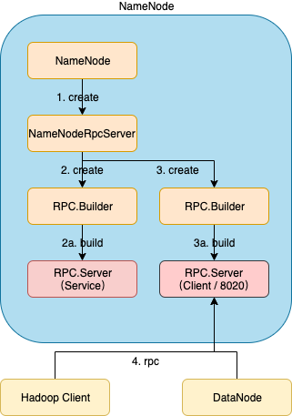
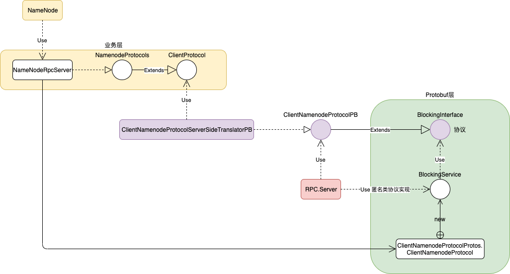

# 编译源码

在Mac OS环境下编译hadoop2.7.0

## 下载源码

```shell
git clone https://github.com/sciatta/hadoop.git
```


## 切换到目标版本

```shell
cd hadoop
git checkout -b work-2.7.0 release-2.7.0
```


## 安装依赖

### JDK

```shell
# 安装
jdk-8u231-macosx-x64.dmg

# 配置环境变量
# Mac使用的是iTerm2
vi ~/.zshrc

export JAVA_HOME=/Library/Java/JavaVirtualMachines/jdk1.8.0_231.jdk/Contents/Home
export PATH=$JAVA_HOME/bin:$PATH

# 立即生效
source ~/.zshrc
```

### Maven

```shell
# 安装
apache-maven-3.0.5-bin.tar.gz

tar -zxvf apache-maven-3.0.5-bin.tar.gz -C ../install/

# 配置环境变量
export MAVEN_HOME=/Users/yangxiaoyu/work/install/apache-maven-3.0.5
export PATH=$MAVEN_HOME/bin:$PATH

# 立即生效
source ~/.zshrc

# 修改镜像地址
cd /Users/yangxiaoyu/work/install/apache-maven-3.0.5/conf
vi settings.xml
# 增加
<mirror>
    <id>aliyunmaven</id>
    <mirrorOf>*</mirrorOf>
    <name>阿里云公共仓库</name>
    <url>https://maven.aliyun.com/repository/public</url>
</mirror>
```

### ProtocolBuffer 2.5.0

```shell
# 安装
protobuf-2.5.0.tar.gz

tar -zxvf protobuf-2.5.0.tar.gz -C ../install/

# 执行
cd /Users/yangxiaoyu/work/install/protobuf-2.5.0
./configure

# 编译
make && make install

# 验证安装情况
# libprotoc 2.5.0
protoc --version
```

### cmake

```shell
# 安装
brew install cmake
```

### openssl

```shell
# 安装
brew install openssl

# 配置环境变量
# hadoop2.7.0不支持高版本openssl@1.1/1.1.1g
export OPENSSL_ROOT_DIR=/usr/local/Cellar/openssl/1.0.2n
export OPENSSL_INCLUDE_DIR=/usr/local/Cellar/openssl/1.0.2n/include

# 立即生效
source ~/.zshrc
```


## 编译

```shell
# 编译
# -P 执行profile
mvn package -Pdist,native -DskipTests -Dtar

# 成功后生成文件
/Users/yangxiaoyu/work/bigdata/project/hadoop/hadoop-dist/target/hadoop-2.7.0.tar.gz

# 编译指定模块
mvn package -Pnative -DskipTests -pl hadoop-hdfs-project/hadoop-hdfs
```


# 项目配置

基于IEDA开发环境

## 导入项目

`open | 打开hadoop项目目录` 成功后自动识别Maven模块。

## 修正项目

### 修正hadoop-streaming引用错误conf问题

修改hadoop-streaming模块

- 将hadoop-yarn-server-resourcemanager模块下的conf文件夹转移到hadoop-streaming模块下

- 修改pom.xml

  ```xml
  <testResource>
    <!-- 修改相对路径 -->
  	<directory>${basedir}/conf</directory>
  	<includes>
  		<include>capacity-scheduler.xml</include>
  	</includes>
  	<filtering>false</filtering>
  </testResource>
  ```


### 修正Debug无法找到类的问题

`Run | Edit Configurations... | Application | NameNode`

选择 Include dependencies with “Provided” scope


### 修正hadoop-hdfs模块无法正常打印log4j日志

target/classes目录下新建log4j.properties

```properties
log4j.rootLogger=info,stdout
log4j.threshhold=ALL
log4j.appender.stdout=org.apache.log4j.ConsoleAppender
log4j.appender.stdout.layout=org.apache.log4j.PatternLayout
log4j.appender.stdout.layout.ConversionPattern=%d{ISO8601} %-5p %c{2} (%F:%M(%L)) - %m%n
```


### 修正hadoop-hdfs模块自定义用户配置

- target/classes目录下新建hdfs-site.xml

  ```xml
  <?xml version="1.0" encoding="UTF-8"?>
  <?xml-stylesheet type="text/xsl" href="configuration.xsl"?>
  
  <configuration>
      <property>
          <name>dfs.namenode.http-address</name>
          <value>localhost:50070</value>
          <description>
              The address and the base port where the dfs namenode web ui will listen on.
          </description>
      </property>
  </configuration>
  ```

- target/classes目录下新建core-site.xml

  ```xml
  <?xml version="1.0" encoding="UTF-8"?>
  <?xml-stylesheet type="text/xsl" href="configuration.xsl"?>
  
  <configuration>
      <property>
          <name>fs.defaultFS</name>
          <value>hdfs://localhost:8020</value>
          <description>The name of the default file system.  A URI whose
              scheme and authority determine the FileSystem implementation.  The
              uri's scheme determines the config property (fs.SCHEME.impl) naming
              the FileSystem implementation class.  The uri's authority is used to
              determine the host, port, etc. for a filesystem.</description>
      </property>
  </configuration>
  ```


### 修正类路径无法找到webapps/hdfs

将src/main/webapps复制一份到target/classes目录


### 修正NameNodeRpcServer找不到类ClientNamenodeProtocol的问题

因为ClientNamenodeProtocol所在的类ClientNamenodeProtocolProtos过大，idea无法加载。

`Help | Edit Custom Properties... | Create`

idea.properties

```properties
idea.max.intellisense.filesize=5000
```

重启idea。


# NameNode

## 启动脚本

### hadoop-daemon.sh

`hadoop-daemon.sh start namenode` 在主节点启动NameNode

- 包含 `hadoop-config.sh` 导出环境配置变量
  - 包含 `hadoop-env.sh` 导出环境变量，如：JAVA_HOME，可以避免ssh登录后执行的JAVA_HOME不正确的问题
- 包含 `hadoop-env.sh` 导出环境变量
- 调用 `hdfs`

### start-dfs.sh

`start-dfs.sh` 在主节点启动NameNode和DataNode

- 调用 `hadoop-daemon.sh`

### hdfs

- 包含 `hadoop-config.sh` 导出环境配置变量
- 入口类 `org.apache.hadoop.hdfs.server.namenode.NameNode` 。运行主类，启动NameNode服务


## 核心功能

### HttpServer

对外提供HTTPServer服务，用户可以通过浏览器访问元数据、文件和日志等。


### FSNamesystem

#### 目录结构


#### 格式化


#### 加载镜像


### RpcServer

#### 启动



#### 核心类结构



### SafeMode


1. NameNode从磁盘加载初始化FSNamesystem

2. 在初始化FSNamesystem实例过程中，会实例化SafeModeInfo，初始化参数：

   - threshold阈值，控制BlockSafe数量。默认0.999。
   - datanodeThreshold阈值，控制DataNode是Active状态的数量。默认0。
   - extension，控制当到达数据块阈值限制，需要达到的稳定时间限制，才会判断是否可以退出SafeMode。默认0。
   - safeReplication，控制BlockSafe的最小副本数。默认1。

   此时 `reached=-1` ，即SafeMode是 `off` 状态。

3. 创建NameNodeResourceChecker实例，初始化参数：

   - volumes，NN存放edits的本地目录，以及其他需要检查的卷。
   - duReserved，控制待检查卷的最小磁盘容量。默认100M。
   - minimumRedundantVolumes，控制最小冗余卷。默认1。

   同时，对待检查卷进行校验是否存在足够的磁盘空间，以防止edits无法写入导致数据丢失。

4. 从元数据获取COMPLETE状态的Block数量 `blockTotal` ，以及要达到阈值的数据块数为 `blockTotal*threshold` ，然后调用checkMode方法。

   <font color=red>进入安全模式的条件：</font>

   - 数据块阈值不等于0，并且DataNode报送数据块数小于要到达阈值的数据块数
   - DataNode阈值不为0，并且Active状态DataNode数小于DataNode阈值数
   - NN资源不可用

   如果是首次启动hdfs，因为还没有数据块产生，所以不满足进入安全模式的条件，此时退出安全模式 `reached=-1` ，即SafeMode是 `off` 状态。

   如果不是首次启动hdfs，并且满足进入安全模式的条件，此时进入安全模式  `reached=0` ，即SafeMode是 `on` 状态。

5. NameNode调用FSNamesystem的startActiveServices方法

6. FSNamesystem创建并启动**NameNodeResourceMonitor**线程，其作用就是对待检查卷进行校验是否存在足够的磁盘空间。

   - 如果有充足磁盘空间，则休眠一段时间后，持续检查。
   - 如果没有足够磁盘空间，则<font color=red>永久</font>进入安全模式  `reached=0` ，即SafeMode是 `on` 状态。

7. DataNode启动向NameNode注册后，通过RPC服务报送所有Block

8. NameNodeRpcServer调用BlockManager，增加BlockSafe。只统计副本状态是FINALIZED，然后通过此副本所在的DataNode节点数来统计此时该block的副本数。<font color=red>注意：DataNode向NameNode报送所有Block，NameNode处理的过程是有写锁的，因此会阻塞同时间其他DataNode的报送</font>。

9. BlockManager调用FSNamesystem，传入此时该block的副本数

10. FSNamesystem调用SafeModeInfo，传入此时该block的副本数，如果此时的副本数满足 `safeReplication` ，则累加报送数据块数BlockSafe。同时，调用checkMode方法检查是否满足退出安全模式条件。如果不满足，则继续等待其他DataNode报送所有Block

11. 一旦checkMode方法检查当前不满足进入安全模式的条件，则会设置 `reached>0` 即为不满足进入安全模式的时间。然后启动**SafeModeMonitor**线程监控是否可以离开安全模式。其作用就是如果数据块报送没有到达extension稳定时间限制，则不允许离开安全模式。

    - 当数据块报送到达稳定时间限制，并且不满足进入安全模式条件，则可以退出安全模式 `reached=-1` ，即SafeMode是 `off` 状态。同时，SafeModeMonitor线程退出。
    - 否则，线程持续运行检查。