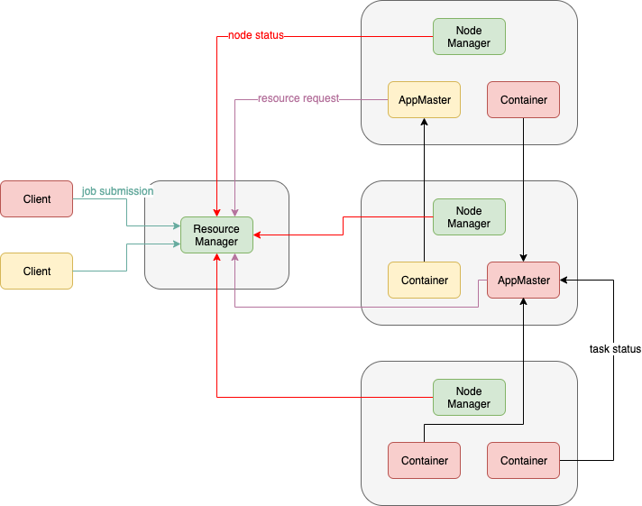
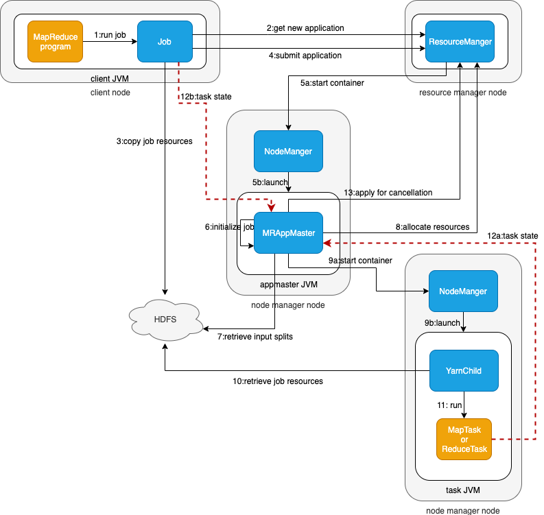

# YARN架构

YARN 的全称是 Yet Another Resource Negotiator，YARN 是经典的主从 Master/Slave 结构，在整个框架中，ResourceManager 为 Master，NodeManager 为 Slave。

## ResourceManager（RM）

RM 是一个全局的资源管理器，负责整个系统的资源管理和分配，主要有两个组件构成：

- 调度器：Scheduler；

调度器根据容量、􏳴队列等限制条件（如某个队列分配一定的资源，最多执行一定数量的作业等），将系统中的资源分配给各个正在运行的应用程序。􏰣要注意的是，该调度器是一个纯调度器，它不再从事任何与应用程序有关的工作，比如不负责重新启动（因应用程序失败或者硬件故障导致的失败），这些均交由应用程序相关的 ApplicationMaster 完成。调度器仅根据各个应用程序的资源需求进行资源分配，而资源分配单位用一个抽象概念 **资源容器(Resource Container，也即 Container)**，Container 是一个动态资源分配单位，它将内存、CPU、磁盘、网络等资源封装在一起，从而限定每个任务使用的资源量。此外，该调度器是一个可插拔的组件，用户可根据自己的需求设计新的调度器，YARN 提供了多种直接可用的调度器，比如 Fair Scheduler 和 Capacity Schedule 等。

- 应用程序管理器：Applications Manager，ASM。

应用程序管理器负责管理整个系统中所有应用程序，包括应用程序提交、与调度器协商资源以启动 AM、监控 AM 运行状态并在失败时重新启动它等。

## NodeManager（NM）

NM 是每个节点上运行的资源和任务管理器。

1. 它会定时向 RM 汇报本节点上的资源使用情况和各个 Container 的运行状态；
2. 它接收并处理来自 AM 和 RM 的请求（Container 启动/停止）。

## ApplicationMaster（AM）

提交的每个作业都会包含一个 AM，主要功能包括：

1. 与 RM 协商以获取资源（用 container 表示）；
2. 将得到的任务进一步分配给内部的任务；
3. 与 NM 通信以启动/停止任务；
4. 监控所有任务的运行状态，当任务有失败时，重新为任务申请资源并重启任务。

MapReduce 就是原生支持 ON YARN 的一种框架，可以在 YARN 上运行 MapReduce 作业。有很多分布式应用都开发了对应的应用程序框架，用于在 YARN 上运行任务，例如 Spark，Storm、Flink 等。

## Container

Container 是 YARN 中的资源抽象，它封装了某个节点上的多维度资源，如内存、CPU、磁盘、网络等，以及环境变量、启动命令等任务运行相关的信息。当 AM 向 RM 申请资源时，RM 为 AM 返回的资源便是用 Container 表示的。 YARN 会为每个任务分配一个 Container 且该任务只能使用该 Container 中描述的资源。

# 作业提交流程

1. client 调用 job.waitForCompletion 方法，向整个集群提交 MapReduce 作业 。 
2. 新的作业ID（应用ID）和 资源提交路径 由 RM 分配。
3. client 核实作业的输出，计算输入的split，将作业的资源（包括Jar包、配置文件、split信息）拷贝给 HDFS。
4. client 调用 RM 的 submitApplication() 来提交作业。
5. 当 RM 收到 submitApplication() 的请求时，就将该请求发给 scheduler，scheduler 分配 container，并与对应的 NM 通信，要求其在这个 container 中启动 AM。
6. MapReduce 作业的 AM 是一个主类为 MRAppMaster 的 Java 应用，其通过构造一些 bookkeeping 对象来监控作业的进度，得到任务的进度和完成报告。
7. MRAppMaster 通过 HDFS 得到由 client 计算好的输入 split。然后为每个输入 split 创建 MapTask，根据 `mapreduce.job.reduces` 创建 ReduceTask。
8. 如果作业很小，AM会选择在其自己的 JVM 中运行任务；如果不是小作业，那么 AM 向 RM 请求 container 来运行所有的 MapTask 和 ReduceTask。请求是通过心跳来传输的，包括每个 MapTask 的数据位置（如存放输入split的主机名和机架）。scheduler 利用这些信息来调度任务，尽量将任务分配给存储数据的节点，或退而分配给和存放输入 split 节点相同机架的节点。
9. 当一个任务由 RM 调度分配一个 container 后，AM与该 NM 通信，要求其在这个 container 中启动任务。其中，任务是一个主类为 YarnChild 的 Java 应用执行。
10. YarnChild 在运行任务之前首先本地化任务需要的资源，如作业配置、JAR文件、以及HDFS的所有文件。将任务启动命令写到一个脚本中，并通过运行该脚本启动任务。
11. YarnChild 运行 MapTask 或 ReduceTask。YarnChild运行在一个专用的JVM中，但是YARN不支持JVM重用。
12. YARN中的任务将其进度和状态返回给AM，以让AM随时掌握各个任务的运行状态，从而可以在任务失败时重新启动任务。同时，client通过 `mapreduce.client.progressmonitor.pollinterval` 向AM请求进度更新，向用户展示。
13. 应用程序运行完成后，AM 向 RM 请求注销并关闭自己。