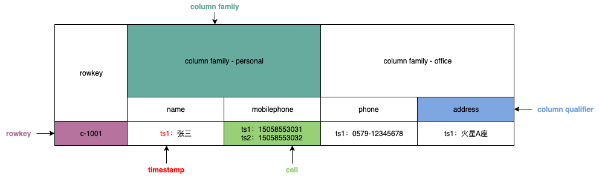
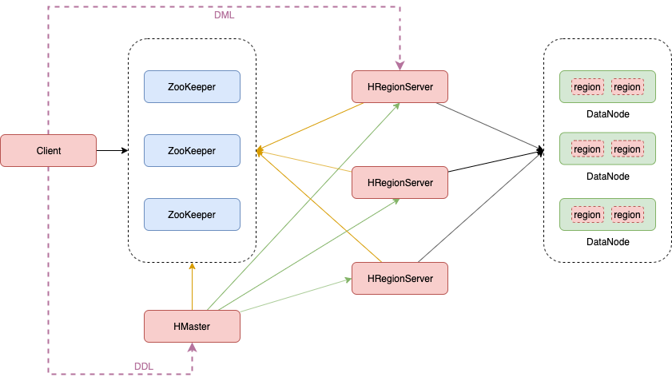

# 核心概念

## 概念

- HBase基于Google的BigTable论文，是建立的HDFS之上，提供**高可靠性**、**高性能**、**列存储**、**可伸缩**、**实时读写**的分布式数据库系统。
- 在需要<font color=red>实时读写随机访问</font>超大规模数据集时，可以使用HBase。


## 特点

- **海量存储**
  - 可以存储大批量的数据
- **列式存储**
  - HBase表的数据是基于列族进行存储的，列族是在列的方向上的划分
- **极易扩展**
  - 底层依赖HDFS，当磁盘空间不足的时候，只需要动态增加DataNode节点就可以了
  - 可以通过增加服务器来对集群的存储进行扩容
- **高并发**
  - 支持高并发的读写请求
- **稀疏**
  - 稀疏主要是针对HBase列的灵活性，在列族中，你可以指定任意多的列，在列数据为空的情况下，是不会占用存储空间的
- **数据的多版本**
  - HBase表中的数据可以有多个版本值，默认情况下是根据版本号去区分，版本号就是插入数据的时间戳
- **数据类型单一**
  - 所有的数据在HBase中是以字节数组进行存储


# 数据模型




- rowkey 行键
  - table的主键，table中的记录按照rowkey的字典序进行排序
  - rowkey可以是任意字符串，最大长度是 64KB，实际应用中长度一般为 10-100bytes。


- column family 列族
  - HBase表中的每个colum都归属于某个column family
  - column family是表的schema的一部分（而column不是），即建表时至少指定一个列族


- timestamp 时间戳
  - 可以对表中的cell多次赋值，每次赋值操作的timestamp可看成cell值的版本号version numbe
  - 一个cell可以有多个版本的值


- column qualifier 列限定
  - 列限定是表的某一列族下的一个列，用 `列族名:列名` 表示
  - 属于某一个column family，类似于mysql当中创建的具体的列


- cell 单元格
  - 根据 `{rowkey, column(=family+qualifier), version}` 可以映射到一个对应的单元格，单元格是HBase存储数据的具体地址
  - cell中的数据是没有类型的，全部是以<font color=red>字节数组</font>进行存储


# 整体架构




- Client
  - Client是操作HBase集群的入口
    - 对于管理类的操作，如表的增、删、改，Client通过RPC与HMaster通信完成
    - 对于表数据的读写操作，Client通过RPC与HRegionServer通信读写数据
  - Client类型
    - HBase shell
    - Java编程接口
    - Thrift、Avro、Rest等


-  ZooKeeper集群
  - 实现了HMaster的高可用，多HMaster间进行主备选举
  - 保存了HBase的元数据信息meta表，提供了HBase表中region寻址入口数据
  - 对HMaster和HRegionServer实现了监控


- HMaster
  - HBase集群也是主从架构，HMaster是主角色

  - 负责Table的管理工作

    - 管理Client对Table的增删改操作

  - 负责Region的管理工作
    - 在Region分裂后，负责将新Region分配到指定的HRegionServer
    - 管理HRegionServer间的负载均衡，迁移region分布
    - 当HRegionServer宕机后，负责将其上的region迁移


- HRegionServer
  - HRegionServer是从角色

  - 响应Client的读写数据请求
  - 负责管理一系列的Region
  - 切分在运行过程中变大的Region


- Region
  - HBase集群中分布式存储的最小单元
  - 一个Region对应一个Table表的部分数据


# HBase shell 命令

```bash
# 进入 hbase shell 交互客户端
hbase shell
```


## 基本命令

- help

  ```bash
  # ====显示帮助====
  help
  
  # 查看具体命令的帮助
  help 'create'
  ```


- exit

  ```bash
  # ====退出shell====
  exit
  ```

  

- create

  ```bash
  # ====创建表====
  # 创建user表，info和data列族
  # 默认一个版本
  create 'user', 'info', 'data'
  
  # 创建user1表，同时指定版本数
  create 'user1', {NAME => 'info', VERSIONS => 3}, {NAME => 'data'}
  ```


- put

  ```bash
  # ====插入数据====
  # row key为rk0001，列族info中添加名为name的列，值为zhangsan
  # column qualifier 在插入数据时指定
  put 'user', 'rk0001', 'info:name', 'zhangsan'
  put 'user', 'rk0001', 'info:gender', 'female'
  put 'user', 'rk0001', 'info:age', 20
  put 'user', 'rk0001', 'data:pic', 'picture'
  
  put 'user', 'rk0002', 'info:name', 'fanbingbing'
  put 'user', 'rk0002', 'info:gender', 'female'
  put 'user', 'rk0002', 'info:nationality', '中国'
  
  # ====更新数据====
  # cell有数据则更新，无数据则插入；本质还是插入数据，只不过查询数据时，显示最新版本号的数据
  put 'user', 'rk0001', 'info:name', 'lisi'
  ```


- get

  ```bash
  # ====查询数据====
  # 获取user表中row key为rk0001的所有 cell 信息
  get 'user', 'rk0001'
  
  # 过滤列族
  get 'user', 'rk0001', 'info'
  get 'user', 'rk0001', 'info', 'data'
  get 'user', 'rk0001', {COLUMN => ['info', 'data']}
  
  # 过滤列
  get 'user', 'rk0001', 'info:age'
  get 'user', 'rk0001', 'info:age', "info:name"
  get 'user', 'rk0001', {COLUMN => ['info:name', 'data:pic']}
  
  # 过滤值
  get 'user', 'rk0001', {FILTER => "ValueFilter(=, 'binary:zhangsan')"}
  # 过滤值包含中文
  get 'user', 'rk0002', {FILTER => "ValueFilter(=, 'binary:中国')"}
  
  # 过滤列限定名称
  # 列名称包含a
  get 'user', 'rk0001', {FILTER => "QualifierFilter(=,'substring:a')"}
  ```


- scan

  ```bash
  # ====全表扫描====
  # 查看user表的所有数据
  scan 'user'
  
  # 过滤列族
  scan 'user', {COLUMNS => 'info'}
  # RAW => true 已被标记为删除，但还没有被删除
  # 不能包含列限定
  scan 'user', {COLUMNS => 'info', RAW => true, VERSIONS => 5}
  scan 'user', {COLUMNS => ['info', 'data']}
  
  # 过滤列
  scan 'user', {COLUMNS => 'info:name'}
  scan 'user', {COLUMNS => ['info:name', 'data:pic']}
  # 版本最新的5个
  scan 'user', {COLUMNS => 'info:name', VERSIONS => 5}
  
  # 过滤列限定名称
  scan 'user', {COLUMNS => ['info', 'data'], FILTER => "(QualifierFilter(=,'substring:a'))"}
  
  # 指定行键范围 [rk0001, rk0003)
  scan 'user', {COLUMNS => 'info', STARTROW => 'rk0001', ENDROW => 'rk0003'}
  
  # row key 模糊查询
  scan 'user', {FILTER => "PrefixFilter('rk')"}
  
  # 指定时间戳范围 [1581477006014, 1581477079033) 
  scan 'user', {TIMERANGE => [1581477006014, 1581477079033]}
  ```


- delete

  ```bash
  # ====删除数据====
  # 注意当有多个版本时，自上向下逐个删除（逻辑删除，标记类型为Delete）；如一个cell有三个版本：ts3、ts2、ts1，第一次删除ts3版本，get查询时会显示ts2版本的数据
  # 可以通过 RAW => true 查询标记为删除，但没有被物理删除的数据
  delete 'user', 'rk0001', 'info:name'
  
  # 指定删除版本号
  delete 'user', 'rk0001', 'info:name', 1581489923991
  ```


## 管理命令

- status

  ```bash
  # ====显示服务器状态====
  status 'node01'
  ```

  

- whoami

  ```bash
  # ====显示当前用户====
  whoami
  ```

  

- list

  ```bash
  # ====显示数据库表====
  list
  ```


- count

  ```bash
  # ====统计表行数====
  count 'user'
  ```


- describe

  ```bash
  # ====显示表结构信息====
  describe 'user'
  ```

  

- exists

  ```bash
  # ====显示表是否存在====
  exists 'user'
  ```

  

- is_enabled / is_disabled

  ```bash
  # ====显示表是否启用====
  is_enabled 'user'
  
  # ====显示表是否禁用====
  is_disabled 'user'
  ```


- alter

  ```bash
  # ====增加列族====
  alter 'user', NAME => 'data'
  # 等价
  alter 'user', 'data'
  
  # ====删除列族====
  # 删除指定列族
  alter 'user', NAME => 'data', METHOD => 'delete' 
  alter 'user', 'delete' => 'data'
  
  # ====修改列族====
  # 列族info版本数修改为5
  alter 'user', NAME => 'info', VERSIONS => 5
  ```


- enable / disable

  ```bash
  # ====禁用表====
  disable 'user'
  
  # ====启用表====
  enable 'user'
  ```

  

- drop

  ```bash
  # ====删除表====
  # 先禁用，再删除
  disable 'user1'
  drop 'user1'
  ```


- truncate

  ```bash
  # ====清空表数据====
  # 禁用表 -> 删除表 -> 创建表
  truncate 'user'
  ```

