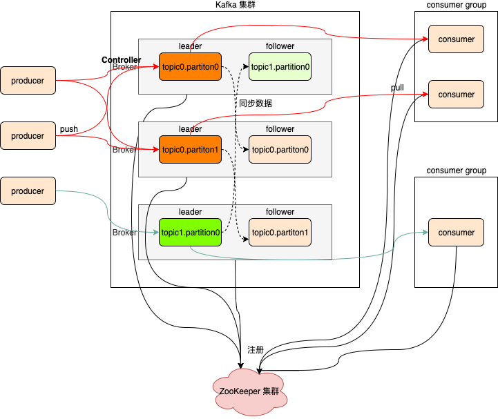

# 概述

## 为什么要有消息系统

**解耦**
允许你独立的扩展或修改两边的处理过程，只要确保它们遵守同样的接口约束。

**冗余**
消息队列把数据进行持久化直到它们已经被完全处理，通过这一方式规避了数据丢失风险。许多消息队列所采用的"插入-获取-删除"范式中，在把一个消息从队列中删除之前，需要你的处理系统明确的指出该消息已经被处理完毕，从而确保你的数据被安全的保存直到你使用完毕。

**扩展性**
因为消息队列解耦了你的处理过程，所以增大消息入队和处理的频率是很容易的，只要另外增加处理过程即可。

**灵活性 & 峰值处理能力**
在访问量剧增的情况下，应用仍然需要继续发挥作用，但是这样的突发流量并不常见。如果为以能处理这类峰值访问为标准来投入资源随时待命无疑是巨大的浪费。使用消息队列能够使关键组件顶住突发的访问压力，而不会因为突发的超负荷的请求而完全崩溃。

**可恢复性**
系统的一部分组件失效时，不会影响到整个系统。消息队列降低了进程间的耦合度，所以即使一个处理消息的进程挂掉，加入队列中的消息仍然可以在系统恢复后被处理。

**顺序保证**
在大多使用场景下，数据处理的顺序都很重要。大部分消息队列本来就是排序的，并且能保证数据会按照特定的顺序来处理。（Kafka 保证一个 Partition 内的消息的有序性）

**缓冲**
有助于控制和优化数据流经过系统的速度，解决生产消息和消费消息的处理速度不一致的情况。

**异步通信**
很多时候，用户不想也不需要立即处理消息。消息队列提供了<font color=red>异步处理</font>机制，允许用户把一个消息放入队列，但并不立即处理它。想向队列中放入多少消息就放多少，然后在需要的时候再去处理它们。

## 核心概念

Kafka最初由Linkedin公司开发，是一个**分布式**、**分区的**、**多副本的**、**多订阅者**，**基于zookeeper协调**的分布式日志系统（也可以当做MQ系统），常见可以用于web/nginx日志、访问日志，消息服务等等，Linkedin于2010年贡献给了Apache基金会并成为顶级开源项目。

kafka是一个分布式消息队列。具有高性能、持久化、多副本备份、横向扩展能力。生产者往队列里写消息，消费者从队列里取消息进行业务逻辑。Kafka就是一种<font color=red>发布-订阅模式</font>。将消息保存在磁盘中，以顺序读写方式访问磁盘，避免随机读写导致性能瓶颈。

## 特性

- 高吞吐、低延迟

  kakfa 最大的特点就是收发消息非常快，kafka 每秒可以处理几十万条消息，它的最低延迟只有几毫秒。

- 高伸缩性

  每个主题（topic）包含多个分区（partition），主题中的分区可以分布在不同的主机（broker）中。

- 持久性、可靠性

  Kafka 能够允许数据的持久化存储，消息被持久化到磁盘，并支持数据备份防止数据丢失。

- 容错性

  允许集群中的节点失败，某个节点宕机，Kafka 集群能够正常工作。

- 高并发

  支持数千个客户端同时读写。


# 集群架构



- producer

  消息生产者，发布消息到Kafka集群的终端或服务。

- consumer

  从Kafka集群中消费消息的终端或服务。

- consumer group

  - 每个 consumer 都属于一个 consumer group。
  - 每条消息只能被 consumer group 中的一个 Consumer 消费，但可以被多个 consumer group 中的 consumer消费。

- broker

  Kafka集群中包含的服务器，一个borker就表示kafka集群中的一个节点。

- topic

  - 每条发布到Kafka集群的消息属于的类别，即Kafka是面向 topic 的。更通俗的说Topic就像一个消息队列，生产者可以向其写入消息，消费者可以从中读取消息，一个Topic支持多个生产者或消费者同时订阅它，所以其扩展性很好。
  - 每条消息都要指定一个topic。

- partition

  - 每个 topic 包含一个或多个partition。Kafka分配的单位是partition。
  - 物理上的概念，每个topic包含一个或多个partition，一个partition对应一个文件夹，这个文件夹下存储partition的数据和索引文件，每个partition内部是有序的。
  - 消费者组的不同消费者不允许消费同一个partition。
  - 每条消息可被不同的消费者组消费，但只可被消费者组的一个消费者消费。
  - 如果 `消费者数 > partition` ，则多余的空闲；如果 `消费者数 < partition`，则会有消费者消费多个partition。

- replica

  <font color=red>partition的副本，保障 partition 的高可用</font>。

- leader

  每个partition有多个副本，其中有且仅有一个作为Leader，Leader是当前负责数据的读写的partition。producer 和 consumer 只跟 leader 交互。

- follower

  Follower跟随Leader，所有写请求都通过Leader路由，数据变更会广播给所有Follower，Follower与Leader保持数据同步。如果Leader失效，则从Follower中选举出一个新的Leader。

- controller

  - 集群运行时，broker向ZooKeeper注册并选举出一个controller。
  - controller负责Leader Partition的选举、感知集群中的其他broker、管理集群中的元数据。

- zookeeper

  - Kafka 通过 zookeeper 来存储集群的meta元数据信息。
  - 一旦controller所在broker宕机，此时临时节点消失，集群里其他broker会一直监听这个临时节点，发现临时节点消失了，就争抢再次创建临时节点，保证有一台新的broker会成为controller角色。

- offset

  消费者在对应分区上已经消费的消息数（位置），offset保存的地方跟kafka版本有关系。

  - kafka0.8 版本之前offset保存在zookeeper上。
  - kafka0.8 版本之后offset保存在kafka集群上。它是把消费者消费topic的位置保存在kafka集群内部有一个默认的topic，名称叫 __consumer_offsets，它默认有50个分区。

- ISR

  replica机制可以保证Kafka集群的高可用，但无法保证数据的一致性（不丢失）。如leader宕机，此时还没有把数据同步到follower上，即使选举出follower作为新的leader，但未同步的数据却丢失了。

  ISR（in-sync replica）就是同leader partition保持同步的follower partition的数量，只有处于ISR列表中的follower才可以在leader宕机之后被选举为新的leader，因为在这个ISR列表里代表他的数据同leader是同步的。

# 命令行的管理使用

- 创建topic

  ```shell
  bin/kafka-topics.sh --create --partitions 2 --replication-factor 2 --topic test --zookeeper node01:2181,node02:2181,node03:2181
  ```

- 查询topic

  ```shell
  bin/kafka-topics.sh --list --zookeeper node01:2181,node02:2181,node03:2181
  ```

- 查询topic的描述信息

  ```shell
  bin/kafka-topics.sh --describe --topic test --zookeeper node01:2181,node02:2181,node03:2181
  ```

- 删除topic

  ```shell
  bin/kafka-topics.sh --delete --topic test --zookeeper node01:2181,node02:2181,node03:2181
  ```

- 模拟生产者写入数据到topic中

  ```shell
  # ctrl+c 退出
  bin/kafka-console-producer.sh --broker-list node01:9092,node02:9092,node03:9092 --topic test
  ```

- 模拟消费者拉取topic中的数据

  <font color=red>可以查看push数据情况</font>

  ```shell
  # offset -> ZooKeeper
  bin/kafka-console-consumer.sh --zookeeper node01:2181,node02:2181,node03:2181 --topic test --from-beginning
  
  # offset -> kafka broker(推荐)
  bin/kafka-console-consumer.sh --bootstrap-server node01:9092,node02:9092,node03:9092 --topic test --from-beginning
  ```

  

# 分区策略

kafka的分区策略决定了producer生产者产生的一条消息最后会写入到topic的哪一个分区中。

## 指定具体的分区号

```java
producer.send(new ProducerRecord<>(UtilFactory.TOPIC_TEST, 0, String.valueOf(0), String.valueOf(0)));
```


## 按照key的hashcode（kafka规则）分区

```java
// 相同key到同一个分区
// 分区=hashcode(key)%分区数
producer.send(new ProducerRecord<>(UtilFactory.TOPIC_TEST, "key-1", "rain"));
producer.send(new ProducerRecord<>(UtilFactory.TOPIC_TEST, "key-0", "yo2"));
producer.send(new ProducerRecord<>(UtilFactory.TOPIC_TEST, "key-0", "lucky"));
producer.send(new ProducerRecord<>(UtilFactory.TOPIC_TEST, "key-1", "big rice"));
```


## 不指定key按照value轮循分区

```java
for (int i = 0; i < 10; i++) {
	producer.send(new ProducerRecord<>(UtilFactory.TOPIC_TEST, String.valueOf(i)));
}
```


## 自定义分区

- 自定义分区实现

  <font color=red>注意此处同 `按照key的hashcode（kafka规则）分区` 分区策略有区别，前一个是针对key直接hashcode求余分区数得到所属分区，后一个有自己的规则，但可以保证相同的key去到同一个分区</font>。

  ```java
  public class CustomHashPartition implements Partitioner {
  
      @Override
      public int partition(String topic, Object key, byte[] keyBytes, Object value, byte[] valueBytes, Cluster cluster) {
          int size = cluster.partitionCountForTopic(UtilFactory.TOPIC_TEST);
  
          return Math.abs(key.hashCode() % size);
      }
  
      @Override
      public void close() {
  
      }
  
      @Override
      public void configure(Map<String, ?> configs) {
  
      }
  }
  ```

- 测试

  ```java
  Map<String, String> props = new HashMap<>();
  props.put("partitioner.class", "com.sciatta.hadoop.kafka.example.partition.CustomHashPartition");
  
  producer = UtilFactory.getKafkaProducer(props);
  
  for (int i = 0; i < 10; i++) {
  	producer.send(new ProducerRecord<>(UtilFactory.TOPIC_TEST, String.valueOf(i), String.valueOf(i)));
  }
  
  producer.close();
  ```

  

# 文件存储机制

- 同一个topic下有多个不同的partition，每个partition为一个目录，partition命名的规则是topic的名称加上一个序号，序号从0开始，如：`test-0`。

- 每一个partition目录下的文件被平均切割成大小相等（默认一个文件是1G，可以手动去设置）的数据文件，每一个数据文件都被称为一个段（segment file），但每个段消息数量不一定相等，这种特性能够使得老的segment可以被快速清除。默认保留7天的数据。
- 每次满1G后，再写入到一个新的文件中。
- 每个partition只需要支持顺序读写就可以。如：00000000000000000000.log是最早产生的文件，该文件达到1G后又产生了新的00000000000002025849.log文件，新的数据会写入到这个新的文件里面。这个文件到达1G后，数据又会写入到下一个文件中。也就是说它只会往文件的末尾追加数据，这就是顺序写的过程，生产者只会对每一个partition做数据的追加（写操作）。

## 数据消费有序性问题

在分布式场景下，一个topic中包含多个partition，每一个partition分布在不同的broker上，只能做到**每一个partition内部间隔有序**，不能做到全局有序。如果只有一个partition，当然就可以实现全局有序，但与分布式，负载均衡的理念相违背。

## segment文件

- 生产者生产的消息按照一定的分区策略被发送到topic中的不同partition，partition在磁盘上就是一个目录，该目录名是topic的名称加上一个序号。
  - 在这个partition目录下，有两类文件，一类是以log为后缀的文件，一类是以index为后缀的文件，每一个log文件和一个index文件相对应，这一对文件就是一个segment file，也就是一个段。（<font color=red>segment file=log file+index file</font>）
  - 其中的log文件就是数据文件，里面存放的就是消息，而index文件是索引文件，索引文件记录了元数据信息。
  - log文件达到1G后滚动生成新的log文件。
- segment文件命名的规则：partition全局的第一个segment从0（20个0）开始，后续的每一个segment文件名是上一个segment文件中最后一条消息的offset值。
  - 这样设计的好处是方便定位消费某一条是offset的消息。也就是说，首先把所有的log文件名排序，然后通过二分查找法定位offset所在的log文件，然后在index文件中找到offset所对应数据在log文件中的物理偏移位置。

## 如何快速查询数据

- Kafka把topic中一个parition大文件分成多个小文件段，通过多个小文件段，就容易定期清除或删除已经消费完文件，减少磁盘占用。
- 通过索引信息可以快速定位message。
  - index文件内容是 `x,y` 形式，其中x是当前log的第x条数据（查找的offset - log的文件名），y是所在log文件的物理偏移位置。
  - 在index文件中x不连续，稀疏存储，index文件保存在内存中，提高查询效率。
  - 如果查找第z条数据，查找小于z的最大x值，然后通过x在log文件中的物理偏移位置，顺序扫描，找到第z条数据。
  - log文件中的一条消息数据的固定物理结构包括：offset（8 Bytes）、message size（4 Bytes）、crc32（4 Bytes）、magic（1 Byte）、attributes（1 Byte）、key length（4 Bytes）、key（K Bytes）、payload length（4 Bytes）、value bytes payload（K Bytes）。
- 通过index元数据全部映射到memory，可以避免segment file的IO磁盘操作。
- 通过索引文件稀疏存储，可以大幅降低index文件元数据占用空间大小。


# 高吞吐、低延时的原因

Kafka是大数据领域无处不在的消息中间件，目前广泛使用在企业内部的实时数据管道，并帮助企业构建自己的流计算应用程序。Kafka虽然是基于磁盘做的数据存储，但却具有高性能、高吞吐、低延时的特点，其吞吐量动辄几万、几十上百万，这其中的原由值得我们一探究竟。

## 顺序读写

磁盘顺序读写性能要高于内存的随机读写。

- 不管是内存还是磁盘，快或慢关键在于寻址的方式，磁盘分为顺序读写与随机读写，内存也一样分为顺序读写与随机读写。基于磁盘的随机读写确实很慢，但磁盘的顺序读写性能却很高，一般而言要高出磁盘随机读写三个数量级，一些情况下磁盘顺序读写性能甚至要高于内存随机读写。
- 磁盘的顺序读写是磁盘使用模式中最有规律的，并且操作系统也对这种模式做了大量优化，Kafka就是使用了磁盘顺序读写来提升的性能。Kafka的message是不断追加到本地磁盘文件末尾的，而不是随机的写入，这使得Kafka写入吞吐量得到了显著提升。

## Page Cache（页缓存）

为了优化读写性能，Kafka利用了操作系统本身的Page Cache，就是利用操作系统自身的内存而不是JVM空间内存。这样做的好处有：

- 避免Object消耗：如果是使用Java堆，Java对象的内存消耗比较大，通常是所存储数据的两倍甚至更多。
- 避免GC问题：随着JVM中数据不断增多，垃圾回收将会变得复杂与缓慢，使用系统缓存就不会存在GC问题。

## 零拷贝

零拷贝并不是不需要拷贝，而是减少不必要的拷贝次数。通常是说在IO读写过程中。Kafka利用linux操作系统的 "零拷贝（zero-copy）" 机制在消费端做的优化。

- 传统方式，读取磁盘文件并进行网络发送，经过的四次数据copy是非常繁琐的（内核态和用户态切换）。实际IO读写，需要进行IO中断，需要CPU响应中断（上下文切换），尽管后来引入DMA（Direct Memory Access）来接管CPU的中断请求（DMA可以绕过CPU，由硬件自己去直接访问系统主内存），但四次copy是存在“不必要的拷贝”的。
- 读取磁盘文件后，不需要做其他处理，直接用网络发送出去。

## 分区分段

## 索引优化

## 批量读写


# 整合flume


