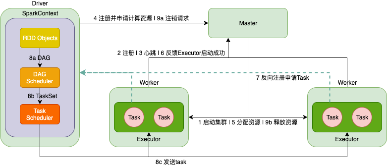
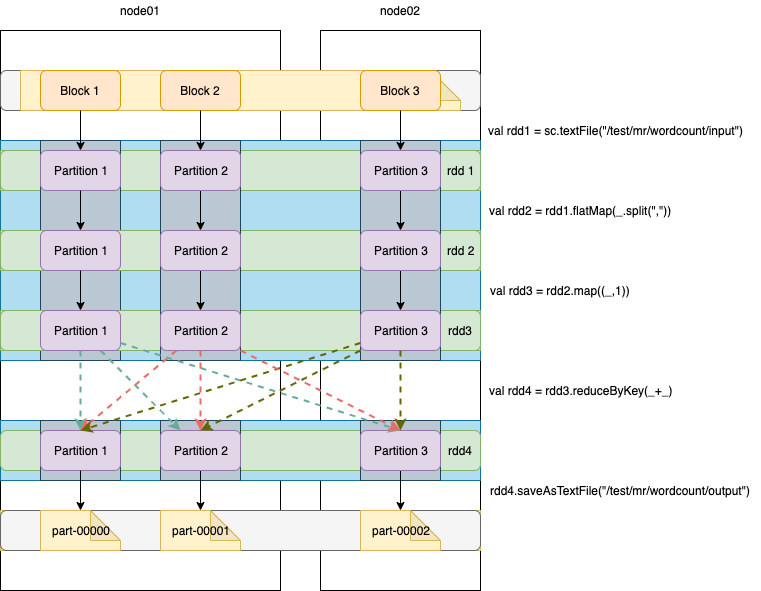

# 概述

Apache Spark™ 用于大规模数据处理的统一分析引擎。

- 速度

  使用最先进的DAG调度程序，查询优化程序和物理执行引擎，实现批处理和流数据的高性能处理。

  **相比MapReduce快的主要原因：**

  1. 基于内存

     涉及Job迭代，对于MapReduce需要将中间结果输出到HDFS，因此需要大量磁盘IO；而Spark将Job的输出结果可以保存在内存中，因此性能大大提高。需要注意的是，MapReduce和Spark都涉及到shuffle阶段，此阶段产生的数据都会涉及读写磁盘。

  2. 线程

     MapReduce的任务，以进程的方式独立运行于Yarn集群中；而Spark的任务是以线程的方式运行于进程中。线程的运行开销远低于进程。

- 易用

  可以快速通过 java、scala、python、R 和 SQL 等不同语言编写Spark程序。

- 通用

  Spark生态系统包括Spark SQL（离线分析）、Spark Streaming（实时计算）、MLib（机器学习） 和 GraphX（图计算） 无缝构建应用程序。

- 兼容

  Spark可以运行在 Hadoop（YARN集群）、Apache Mesos、Kubernetes、standalone（Spark集群） 或者 cloud上，同时可以访问各式数据源。其本质就是一个计算逻辑任务，可以提交到不同的可为其提供计算资源的平台上。


# 集群架构

## 术语

- Application

  构建在Spark上的用户程序，包含driver和集群上的executor。

- Application jar

  包含Spark用户程序的jar文件。<font color=red>注意jar文件不应包含依赖 Hadoop 或 Spark 的库，而是在运行时被添加</font>。

- Driver program

  运行 main() 函数的进程，创建SparkContext，Spark程序执行的入口。

- Cluster manager

  获取集群资源的外部服务。如：Spark standalone、Mesos、YARN

- Deploy mode

  以Dirver进程运行位置区分。“cluster”模式，在集群内部启动Driver；“Client”模式，在集群外部启动Driver。

- Worker node

  在集群中运行Application代码的任意一个节点。

- Executor

  在Worker节点运行Task的进程，将数据保存在内存或磁盘存储。每一个Application都有自己的Executor。

- Task

  发送到Executor的一个工作单元。以Executor进程内线程方式运行。

- Job

  由多个Task组成的一个并行计算，响应一个Spark action。也就是说一个action对于一个Job。

- Stage

  每一个Job划分为一组更小的Task集合称为Stage，Stage具有依赖关系。


## 流程简述



1. 启动Spark集群，启动相应的Master和Worker进程，标记为Mater和Worker节点

2. Worker节点启动后，会向Master注册

3. 同时，Worker节点会定时向Master发送心跳，汇报资源使用情况

4. 运行Driver程序，向Master注册并申请计算资源

5. Master收到资源请求后，会调用Worker节点分配资源，也就是启动与资源描述一致的Executor进程

6. Worker节点向Master节点反馈Executor启动成功

7. Executor向Driver反向注册自己，并申请执行Task请求

8. Driver运行用户main方法，构建SparkContext，SparkContext内部依次构建DAG Scheduler和Task Scheduler

   - 按照RDD依赖关系构建DAG，然后将DAG发送给DAG Scheduler

   - DAG Scheduler将DAG按照宽依赖划分为多个stage，每个stage包含多个并发执行的task，然后将task封装到TaskSet集合中，发送给Task Scheduler

   - Task Scheduler收到TaskSet后，按照stage的依赖关系，按顺序将task发送给Executor进行执行

9. 所有task运行完成后，Driver向Master发送注销资源请求；Master通知Worker节点释放资源，也就是关闭Executor进程。最后，整个Job执行完成


# 程序运行

## spark-submit

### 本地运行

```bash
bin/spark-submit \
--class org.apache.spark.examples.SparkPi \
--master local[2] \
--executor-memory 1G \
--total-executor-cores 2 \
examples/jars/spark-examples_2.11-2.3.3.jar \
10
```


### 集群普通模式提交

```bash
# --class：指定包含main方法的主类
# --master：指定spark集群master地址
# --executor-memory：指定任务在运行的时候需要的每一个executor内存大小
# --total-executor-cores： 指定任务在运行的时候需要总的cpu核数

bin/spark-submit \
--class org.apache.spark.examples.SparkPi \
--master spark://node01:7077 \
--executor-memory 1G \
--total-executor-cores 2 \
examples/jars/spark-examples_2.11-2.3.3.jar \
10
```


### 集群高可用模式提交

```bash
# 轮询 --master 列表找到 alive master
bin/spark-submit \
--class org.apache.spark.examples.SparkPi \
--master spark://node01:7077,node03:7077 \
--executor-memory 1G \
--total-executor-cores 2 \
examples/jars/spark-examples_2.11-2.3.3.jar \
10
```


## spark-shell

Spark shell 相当于一个Application，交互式 shell ，一般用于测试。

### 本地运行

```bash
# 本地运行，2个线程参与计算
# 默认启动 SparkSubmit 进程
bin/spark-shell --master local[2]

# 读取本地文件进行单词统计
sc.textFile("file:///home/hadoop/sparkdatas/wordcount").flatMap(x=>x.split(" ")).map(x=>(x,1)).reduceByKey((x,y)=>x+y).collect

# 读取hdfs文件进行单词统计
# 可以直接统计目录下的所有文件
sc.textFile("/test/mr/wordcount/input/2").flatMap(_.split(",")).map((_,1)).reduceByKey(_+_).collect
```


### 集群普通模式提交

```bash
# Spark shell 相当于一个 application
# --total-executor-cores 不会超过集群的CPU最大值
bin/spark-shell --master spark://node01:7077 --executor-memory 1G --total-executor-cores 4

sc.textFile("/test/mr/wordcount/input").flatMap(_.split(",")).map((_,1)).reduceByKey(_+_).collect
```


# RDD

## 概述

RDD（Resilient Distributed Dataset）叫做**弹性分布式数据集**，是Spark中最基本的数据抽象，它代表一个<font color=red>不可变、可分区、元素可并行计算的集合</font>。

* **Dataset**

  就是一个集合，存储很多数据

* **Distributed**
  内部的元素进行了分布式存储，方便于进行分布式计算

* **Resilient**

  表示弹性，RDD的数据可以保存在内存或者是磁盘中


### 属性

1. A list of partitions
   - 分区列表
   - 每一个分区包含了RDD的部分数据
   - Spark中的任务是以线程方式运行，一个分区对应一个Task线程
   - 用户可以在创建RDD时，指定分区个数；若没有指定，则采用默认值
   - RDD的分区数 = max(block数, defaultMinPartitions)
2. A function for computing each split
   - 一个计算每一个分区的函数
3. A list of dependencies on other RDDs
   - RDD的依赖关系列表
4. Optionally, a Partitioner for key-value RDDs (e.g. to say that the RDD is hash-partitioned)
   - 一个用于 key-value RDD 分区函数
   - 分区函数
     - HashPartitioner（默认） `key.hashcode % 分区数 = 分区号`
     - RangePartitioner
   - 只有对于 key-value 的 RDD `RDD[(String, Int)]` 并且产生shuffle，才会有Partitioner；非 key-value 的RDD `RDD[String]` 的 Parititioner 的值是None
5. Optionally, a list of preferred locations to compute each split on (e.g. block locations for an HDFS file)
   - 用于计算每个partition所在优先位置的一个列表
   - Spark任务在调度的时候会优先考虑存有数据的节点开启计算任务，减少数据的网络传输，提升计算效率


### 流程



假设一个300M的文件，默认每一个block的大小是128M，共有3个block。

- Spark的分区数是由文件block数量和defaultMinPartitions共同决定，取最大值。假设defaultMinPartitions是2，则分区数是3。
- rdd1是MapPartitionsRDD，作用于rdd1的flatMap函数，它将计算3个分区；rdd1没有分区函数
- rdd2是MapPartitionsRDD，作用于rdd2的map函数，它将计算3个分区；rdd2没有分区函数
- rdd3是MapPartitionsRDD，作用于rdd3的reduceByKey函数，它将计算3个分区；rdd3没有分区函数
- rdd4是ShuffledRDD，将数据写入到磁盘文件；rdd4有分区函数HashPartitioner。相当于ReduceTask，其数量取决于HashPartitioner的分区数，而默认情况下HashPartitioner的分区数就是上一步RDD的分区数


### 算子分类

- transformation（转换）
  - 根据已经存在的rdd转换生成一个新的rdd，它是<font color=red>延迟加载</font>，不会立即执行
  - 如 map / flatMap / reduceByKey 等
- action（动作）
  - 它会真正触发任务的运行，将rdd的计算的结果数据返回给Driver端，或者是保存结果数据到外部存储介质中
  - 如 collect / saveAsTextFile 等


## 依赖关系

### 宽窄依赖

- 窄依赖（narrow dependency）
  - 窄依赖指的是每一个父RDD的Partition最多被子RDD的一个Partition使用
  - 算子：map/flatMap/filter/union
  - 窄依赖不会产生shuffle
- 宽依赖（wide dependency）
  - 宽依赖指的是子RDD的多个Partition会依赖同一个父RDD的Partition
  - 算子：reduceByKey/sortByKey/groupBy/groupByKey/join
  - 宽依赖会产生shuffle
  - join分为宽依赖和窄依赖，如果RDD有相同的partitioner，那么将不会引起shuffle，这种join是窄依赖，反之就是宽依赖

### Lineage 血统

- RDD只支持粗粒度转换，即只记录单个块上执行的单个操作
- 将创建RDD的一系列Lineage（即血统）记录下来，以便恢复丢失的分区
- RDD的Lineage会记录RDD的元数据信息和转换行为，Lineage保存了RDD的依赖关系，当该RDD的部分分区数据丢失时，它可以根据这些信息来重新运算和恢复丢失的数据分区

### stage

#### 什么是stage

- 一个Job会被拆分为多组Task，每组任务被称为一个stage

- stage表示不同的调度阶段，一个spark job会对应产生很多个stage

  - stage类型

    - ShuffleMapStage

      shuffle之前的所有transformation的Stage叫ShuffleMapStage。它对应的task是shuffleMapTask。

    - ResultStage

      shuffle之后操作的Stage叫ResultStage。它对应的task是ResultTask。

#### 为什么划分stage

根据RDD之间依赖关系的不同将DAG划分成不同的stage

- 对于窄依赖，partition的转换处理在一个stage中完成计算
- 对于宽依赖，由于有Shuffle的存在，只能在parent RDD处理完成后，才能开始接下来的计算

由于划分完stage之后，在同一个stage中只有窄依赖，没有宽依赖，可以实现流水线计算，<font color=red>stage中的每一个分区对应一个task，在同一个stage中就有很多可以并行运行的task</font>。

#### 如何划分stage

1. 根据rdd的算子操作顺序生成DAG有向无环图，接下里从最后一个rdd往前推，创建一个新的stage，把该rdd加入到该stage中，它是最后一个stage
2. 在往前推的过程中运行遇到了窄依赖就把该rdd加入到本stage中，如果遇到了宽依赖，就从宽依赖切开，那么最后一个stage也就结束了
3. 重新创建一个新的stage，按照第二个步骤继续往前推，一直到最开始的rdd，整个划分stage也就结束了

#### stage间关系

- 划分完stage之后，每一个stage中有很多可以并行运行的task，后续会把每一个stage中的task封装在一个taskSet集合中，最后把一个一个的taskSet集合提交到worker节点上的executor进程中运行

- rdd与rdd之间存在依赖关系，stage与stage之间也存在依赖关系，前面stage中的task先运行，运行完成了再运行后面stage中的task，也就是说后面stage中的task输入数据是前面stage中task的输出结果数据


## 缓存机制

可以把一个rdd的数据缓存起来，后续有其他的job需要用到该rdd的结果数据，可以直接从缓存中获取得到，避免了重复计算。缓存加快后续对该数据的访问操作。

### cache和persist

#### 区别

对RDD设置缓存可以调用rdd的2个方法：cache 和 persist 。

调用上面2个方法都可以对rdd的数据设置缓存，但不是立即就触发缓存执行，后面需要有action才会触发缓存的执行。

- cache

  默认是把数据缓存在内存中，其本质就是调用persist方法

- persist

  可以把数据缓存在内存或者是磁盘，有丰富的缓存级别，这些缓存级别都被定义在StorageLevel这个object中

#### 设置缓存时机

- 某个rdd的数据后续会被多次使用

  默认情况下多次对一个rdd执行算子操作， rdd都会对这个rdd及之前的父rdd全部重新计算一次。 这种情况在实际开发代码的时候会经常遇到，但是我们一定要避免一个rdd重复计算多次，否则会导致性能急剧降低。因此，可以把多次使用到的rdd，也就是公共rdd进行持久化，避免后续需要时需要再次重新计算，提升效率。

- 为了获取得到一个rdd的结果数据，经过了大量的算子操作或者是计算逻辑比较复杂

####清除缓存

- 自动清除

  一个Application应用程序结束之后，对应的缓存数据也就自动清除

- 手动清除

  调用rdd的unpersist方法


### checkpoint机制

#### 同cache和persist区别

- cache是把数据缓存在内存中，访问速度很快，但是宕机或进程异常终止时会导致数据容易丢失；persist则可以把数据缓存在磁盘上，可以保证一定数据的安全有效，当由于用户的误操作或磁盘损坏，也会导致数据丢失。
- checkpoint提供了一种相对而言更加可靠的数据持久化方式。它是把数据保存在分布式文件系统，如HDFS。这里就是利用了HDFS高可用性，高容错性（多副本）来最大程度保证数据的安全性。
  - 对checkpoint在使用的时候进行优化，在调用checkpoint操作之前，可以先做一个cache操作，缓存对应rdd的结果数据，后续就可以直接从cache中获取到rdd的数据写入到指定checkpoint目录中
  - Application运行完成后对应的checkpoint数据不会消失

#### 设置checkpoint

```scala
// 设置checkpoint目录
sc.setCheckpointDir("hdfs://node01:8020/checkpoint") 

// 调用rdd的checkpoint方法
rdd.checkpoint

// 调用action触发
rdd.collect
```


# SparkSQL

SparkSQL是Apache Spark用来处理**结构化数据**的一个模块。

## DataFrame

### 概述

- 在Spark中，DataFrame是一种以RDD为基础的分布式数据集，类似于传统数据库的二维表格
- DataFrame带有Schema元信息，即DataFrame所表示的二维表数据集的每一列都带有名称和类型，但底层做了更多的优化
- DataFrame可以从很多数据源构建。如：已经存在的RDD、结构化文件、外部数据库、Hive表
- RDD可以把内部元素看作是java对象；而DataFrame可以把内部元素看作是Row对象，表示一行一行的数据

### DataFrame和RDD的优缺点

#### RDD

- 优点
  - 编译时类型安全
  - 具有面向对象的编程风格
- 缺点
  - 构建大量的java对象占用了大量heap堆空间，导致频繁的GC（程序在进行垃圾回收的过程中，所有的任务都是暂停，影响程序执行的效率）
  - 数据的序列化和反序列化性能开销很大（包括对象内容和结构）

#### DataFrame

DataFrame引入了schema元信息和off-heap

- 优点
  - DataFrame引入off-heap，大量的对象构建直接使用操作系统层面上的内存，不在使用heap堆中的内存，这样一来heap堆中的内存空间就比较充足，不会导致频繁GC，程序的运行效率比较高，它是解决了RDD构建大量的java对象占用了大量heap堆空间，导致频繁的GC这个缺点
  - DataFrame引入schema元信息（数据结构的描述信息），spark程序中的大量对象在进行网络传输的时候，只需要把数据的内容本身进行序列化就可以，数据结构信息可以省略掉。这样一来数据网络传输的数据量是有所减少，数据的序列化和反序列性能开销就不是很大了。它是解决了RDD数据的序列化和反序列性能开销很大这个缺点
- 缺点
  - 编译时类型不安全
  - 不再具有面向对象的编程风格

### 常用操作

#### DSL（domain-specific language）风格语法

```scala
// Michael, 29
// Andy, 30
// Justin, 19
case class People(name:String,age:Int)

// RDD[String]
val rdd1 = sc.textFile("/test/spark/people.txt")
// RDD[People]
val rdd2 = rdd1.map(_.split(", ")).map(x=>People(x(0),x(1).toInt))
// DataFrame
val df = rdd2.toDF

// 打印schema
df.printSchema
// 展示数据
df.show
df.select("name")

// $ 是一种方法调用，$"name" 相当于 new ColumnName("name") 的缩写
// 查询某一列
df.select($"name")

// 按年龄分组
df.groupBy("age").count.show

// 按年龄分组，统计结果排序
df.groupBy("age").count.sort($"count".desc).show
```


#### SQL（Standard Query Language）风格语法

```scala
// 创建临时表
df.createTempView("people")

// Spark session 调用 sql 方法
spark.sql("select * from people").show
spark.sql("select age, count(*) as count from people group by age").show
```


## DataSet

### 概述

- DataSet是分布式的数据集合，DataSet提供了强类型支持，也是在RDD的每行数据加了类型约束
- DataSet是在Spark1.6中添加的新的接口。它集中了RDD的优点（强类型和可以用强大lambda函数）以及使用了Spark SQL优化的执行引擎
- DataSet包含了DataFrame的功能，Spark2.0中两者统一，DataFrame表示为DataSet[Row]，即DataSet的子集
  - DataSet可以在编译时检查类型
  - 面向对象的编程接口

### 常用操作

```scala
val ds = spark.createDataset(sc.textFile("/test/spark/people.txt"))
// 展示数据
ds.show
```


## 系统集成

### Hive集成

#### 本地支持HiveSQL

- Maven依赖

  ```xml
  <dependency>
  	<groupId>org.apache.spark</groupId>
  	<artifactId>spark-hive_2.11</artifactId>
  	<version>2.3.3</version>
  </dependency>
  ```

  

- 自定义设置derby.log、数据仓库数据、元数据位置

  ```scala
  object Config {
    def getLocalConfig(appName: String): SparkConf = {
      // 自定义derby.log位置
      System.setProperty("derby.system.home", "/Users/yangxiaoyu/work/test/sparkdatas/hivelocal")
  
      val sparkConf = new SparkConf()
  
      sparkConf
        .setMaster("local[2]")
  
        .setAppName(appName)
  
        // 自定义数据仓库数据位置
        .set("spark.sql.warehouse.dir", "/Users/yangxiaoyu/work/test/sparkdatas/hivelocal/spark-warehouse")
  
        // 自定义元数据位置
        .set("javax.jdo.option.ConnectionURL", "jdbc:derby:;databaseName=/Users/yangxiaoyu/work/test/sparkdatas/hivelocal/metastore_db;create=true")
  
      sparkConf
    }

    def getServerConfig(appName: String): SparkConf = {
      val sparkConf = new SparkConf()
  
      sparkConf.setAppName(appName)
  
      sparkConf
    }
  }
  
  object HiveLocalSupport {
    def main(args: Array[String]): Unit = {
      val config = Config.getLocalConfig(getClass.getName)
  
      val sparkSession = SparkSession.builder().config(config).enableHiveSupport().getOrCreate()
  
      sparkSession.sql("create database if not exists test")
      sparkSession.sql("use test")
      sparkSession.sql("create table if not exists people(id string, name string, age int) row format delimited fields terminated by ' '")
      sparkSession.sql("load data local inpath '/Users/yangxiaoyu/work/test/sparkdatas/people' into table people")
      sparkSession.sql("select * from people").show()
  
      sparkSession.stop()
    }
  }
  ```
  


#### 联动Hive

- 初始化环境

  <font color=red>配置读取Hive元数据</font>

  - node03执行

    将hive的hive-site.xml分发到所有spark的conf目录下（mysql连接信息）

    ```bash
    cp hive-site.xml /bigdata/install/spark-2.3.3-bin-hadoop2.7/conf
    
    scp hive-site.xml node02:$PWD
    scp hive-site.xml node01:$PWD
    ```

  - node01执行

    将mysql驱动分发到所有spark的jars目录下

    ```bash
    cp mysql-connector-java-5.1.38.jar /bigdata/install/spark-2.3.3-bin-hadoop2.7/jars
    
    scp mysql-connector-java-5.1.38.jar node02:$PWD
    scp mysql-connector-java-5.1.38.jar node03:$PWD
    ```

- 启动交互式环境

  <font color=red>配置数据仓库位置 `spark.sql.warehouse.dir` </font>

  ```bash
  spark-sql \
  --master spark://node01:7077 \
  --executor-memory 1g \
  --total-executor-cores 2 \
  --conf spark.sql.warehouse.dir=hdfs://node01:8020/user/hive/warehouse
  ```

  运行Hive语句

  ```mysql
  select * from myhive.score;
  ```

- 提交脚本

  ```bash
  spark-sql \
  --master spark://node01:7077 \
  --executor-memory 1g \
  --total-executor-cores 2 \
  --conf spark.sql.warehouse.dir=hdfs://node01:8020/user/hive/warehouse \
  -e 'select * from myhive.score;'
  ```

  

### MySQL集成

- Maven依赖 MySQL JDBC 驱动

  ```xml
  <dependency>
  	<groupId>mysql</groupId>
  	<artifactId>mysql-connector-java</artifactId>
  	<version>5.1.38</version>
    <scope>runtime</scope>
  </dependency>
  ```

  

- 登录Mysql创建测试数据
  - 启动mysql服务

    ```bash
    # 启动服务
    systemctl start mysqld.service
    
    # 登录
    mysql -uroot -proot
    ```

    

  - 创建mysql测试数据

    ```mysql
    -- 创建数据库
    create database spark;
    
    -- 创建表
    use spark;
    create table user(id int, name varchar(40), age int);
    
    -- 插入数据
    insert into user(id, name, age) values(1,'yoyo',37);
    insert into user(id, name, age) values(2,'lucky',3);
    insert into user(id, name, age) values(2,'rain',38);
    ```

    

  - SparkSQL通过JDBC加载MySQL数据库表数据到DataFrame，利用Spark分布式计算框架的优势，对数据计算之后将结果写回到MySQL数据库表中

    ```scala
    object ReadWrite {
      def main(args: Array[String]): Unit = {
        val url = "jdbc:mysql://node03:3306/spark"
    
        val readTableName = "user"
        val writeTableName = "newuser"
    
        val properties = new Properties()
        properties.setProperty("user", "root")
        properties.setProperty("password", "root")
    
        // val config = Config.getLocalConfig(getClass.getName)
        val config = Config.getServerConfig(getClass.getName)
    
        val sparkSession = SparkSession.builder().config(config).getOrCreate()
    
        // 读取数据
        val readDF = sparkSession.read.jdbc(url, readTableName, properties)
        // readDF.printSchema()
        // readDF.show()
    
        // 创建临时表
        readDF.createTempView("user")
    
        // 处理数据
        val writeDF = sparkSession.sql("select id, name, age, age-10 as newhope from user")
    
        // 写入数据
        // mode
        // overwrite  表示覆盖，如果表不存在，创建
        // append     表示追加，如果表不存在，创建
        // ignore     表示忽略，如果表存在，不进行任何操作
        // error      如果表存在，报错（默认选项）
        writeDF.write.mode("overwrite").jdbc(url, writeTableName, properties)
    
        sparkSession.stop()
      }
    }
    ```

    

  - 集群运行

    ```bash
    # --driver-class-path 指定 Driver 端所需要的jar
    # --jars 指定 Executor 端所需要的jar
    spark-submit --master spark://node01:7077 \
    --executor-memory 1g --total-executor-cores 2 \
    --class com.sciatta.hadoop.spark.example.sql.mysql.ReadWrite \
    --driver-class-path /bigdata/soft/mysql-connector-java-5.1.38.jar \
    --jars /bigdata/soft/mysql-connector-java-5.1.38.jar \
    hadoop-spark-example-1.0-SNAPSHOT.jar
    ```


