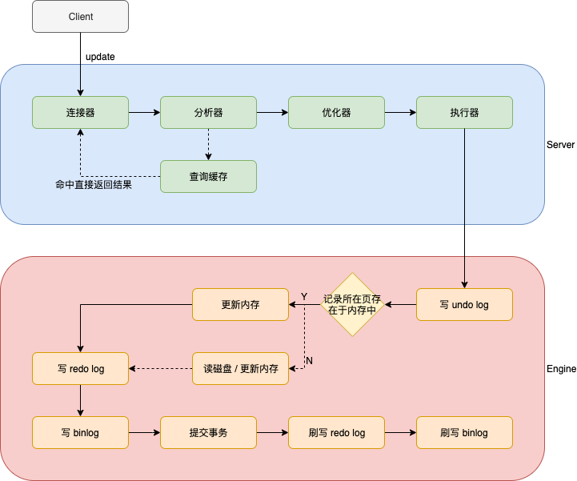

# 关系数据库

## 数据库设计范式

- 第一范式（1NF）关系 R 属于第一范式，当且仅当R中的每一个属性A的值域只包含原子项

  **消除重复数据**，即每一列都是不可再分的基本数据项；每个列都是原子的。

- 第二范式（2NF）在满足 1NF 的基础上，消除非主属性对码的部分函数依赖

  **消除部分依赖**，表中没有列只与主键的部分相关，即每一行都被主键唯一标识；每个列都有主键。

- 第三范式（3NF）在满足 2NF 的基础上，消除非主属性对码的传递函数依赖

  **消除传递依赖**，消除表中列不依赖主键，而是依赖表中的非主键列的情况，即没有列是与主键不相关的。从表只引用主表的主键，即表中每列都和主键相关。

- BC 范式（BCNF）在满足 3NF 的基础上，消除主属性对码的部分和传递函数依赖

- 第四范式（4NF）消除非平凡的多值依赖

- 第五范式（5NF）消除一些不合适的连接依赖


## 结构化查询语言

- 数据查询语言（DQL Data Query Language）其语句也称为“数据检索语句”，用以从表中获得数据，确定数据怎样在应用程序给出。保留字 SELECT 是 DQL（也是所有 SQL）用得最多的动词，其他 DQL 常用的保留字有 WHERE，ORDER BY，GROUP BY 和 HAVING。这些 DQL 保留字常与其它类型的 SQL 语句一起使用。
- 数据操作语言（DML Data Manipulation Language）其语句包括动词 INSERT、UPDATE 和 DELETE。它们分别用于添加、修改和删除。
- 事务控制语言（TCL）它的语句能确保被 DML 语句影响的表的所有行及时得以更新。包括COMMIT（提交）命令、SAVEPOINT（保存点）命令、ROLLBACK（回滚）命令。
- 数据控制语言（DCL）它的语句通过 GRANT 或 REVOKE 实现权限控制，确定单个用户和用户组对数据库对象的访问。某些 RDBMS 可用 GRANT 或 REVOKE 控制对表单个列的访问。
- 数据定义语言（DDL）其语句包括动词 CREATE, ALTER 和 DROP。在数据库中创建新表或修改、删除表（CREAT TABLE 或 DROP TABLE）；为表加入索引等。
- 指针控制语言（CCL）它的语句像 DECLARE CURSOR，FETCH INTO 和 UPDATE WHERE CURRENT 用于对一个或多个表单独行的操作。


## 数据库设计优化

- 如何恰当选择引擎

  myisam 适用于对读写性能要求高，但对数据一致性要求低的场景

  innodb 支持行锁，事务

  memory 临时表

  TokuDB 高压缩比，可在线添加索引不影响读写，支持ACID特性和事务

- 库表如何命名

  有意义

- 如何选择恰当数据类型

  **明确、尽量小**

-  文件、图片是否要存入到数据库

  建议存放结构化数据；读多写少的数据也可

- 时间日期的存储问题

  存放时间戳，int或long类型或string类型

- 数值的精度问题

  字符串存放，应用负责转换

- 是否使用外键、触发器

  不建议，应用保证。性能高

- 是否可以冗余字段

  高效查询可以适当冗余

- 是否使用游标、变量、视图、自定义函数、存储过程

  不建议，维护、调试成本高，移植性差

- 自增主键的使用问题

  - 分布式不建议

  - 为什么单调递增

    InnoDB引擎使用聚集索引，数据记录本身被存于主索引（一颗B+Tree）的叶子节点上，这就要求同一个叶子节点内（大小为一个内存页或磁盘页）的各条数据记录按主键顺序存放。因此每当有一条新的记录插入时，MySQL会根据其主键将其插入适当的节点和位置，如果页面达到装载因子（InnoDB默认为15/16），则开辟一个新的页（节点）。

    - 如果表使用自增主键，那么每次插入新的记录，记录就会顺序添加到当前索引节点的后续位置，当一页写满，就会自动开辟一个新的页。这样就会形成一个紧凑的索引结构，近似顺序填满。由于每次插入时也不需要移动已有数据，因此效率很高，也不会增加很多开销在维护索引上。
    - 如果使用非自增主键（如果身份证号或学号等），由于每次插入主键的值近似于随机，因此每次新纪录都要被插到现有索引页的中间某个位置：此时MySQL不得不为了将新记录插到合适位置而移动数据，甚至目标页面可能已经被回写到磁盘上而从缓存中清掉，此时又要从磁盘上读回来，这增加了很多开销，同时频繁的移动、分页操作造成了大量的碎片，得到了不够紧凑的索引结构，后续不得不通过OPTIMIZE TABLE来重建表并优化填充页面。

    在使用InnoDB存储引擎时，如果没有特别的需要，建议使用一个与业务无关的自增字段作为主键。mysql 在频繁地更新、删除操作，会产生碎片。而含碎片比较大的表，查询效率会降低。此时需对表进行优化，这样才会使查询变得更有效率。

    

- 能够在线修改表结构（DDL 操作）

  不建议，会锁表。备份也会锁表，尽量在无业务处理时操作

- 逻辑删除还是物理删除

  重要数据需要审计，增加字段表示逻辑删除

- 要不要加 create_time，update_time 时间戳

  建议，增量复制

- 数据库碎片问题

  插入和删除都会导致碎片，优化压缩

- 如何快速导入导出、备份数据

  批量导入导出内建命令

  批量导入时先删除索引、外键，导入数据后，再添加


## SQL语句的执行顺序

### 语法

```mysql
SELECT
    [ALL | DISTINCT | DISTINCTROW ]
    [HIGH_PRIORITY]
    [STRAIGHT_JOIN]
    [SQL_SMALL_RESULT] [SQL_BIG_RESULT] [SQL_BUFFER_RESULT]
    [SQL_CACHE | SQL_NO_CACHE] [SQL_CALC_FOUND_ROWS]
    select_expr [, select_expr] ...
    [into_option]
    [FROM table_references
      [PARTITION partition_list]]
    [WHERE where_condition]
    [GROUP BY {col_name | expr | position}
      [ASC | DESC], ... [WITH ROLLUP]]
    [HAVING where_condition]
    [ORDER BY {col_name | expr | position}
      [ASC | DESC], ...]
    [LIMIT {[offset,] row_count | row_count OFFSET offset}]
    [PROCEDURE procedure_name(argument_list)]
    [into_option]
    [FOR UPDATE | LOCK IN SHARE MODE]

into_option: {
    INTO OUTFILE 'file_name'
        [CHARACTER SET charset_name]
        export_options
  | INTO DUMPFILE 'file_name'
  | INTO var_name [, var_name] ...
}
```

### 执行顺序

1. from
2. on
   - 先on过滤条件之后，才会join生成临时表
3. join
4. where
   - 临时表生成之后，根据限制条件从临时表中筛选
   - 在分组（聚集函数）之前筛选数据
5. group by
   - 分组之后，执行聚集函数
6. having
   - 聚合函数执行之后对分组数据进一步筛选，同group by一起使用，不可单独使用
7. select
   - 如果有group by使用的话，select查询的字段可能是group by后跟的分组字段，也有可能是对字段聚合函数计算的结果
8. distinct
9. order by
   - group by和orderby可以实现组内排序，即 `group by A,B order by A,B`
10. limit


# MySQL

## 数据类型

### 数值类型

| 类型         | 大小                                     | 用途            |
| :----------- | :--------------------------------------- | :-------------- |
| TINYINT      | 1 byte                                   | 小整数值        |
| SMALLINT     | 2 bytes                                  | 大整数值        |
| MEDIUMINT    | 3 bytes                                  | 大整数值        |
| INT或INTEGER | 4 bytes                                  | 大整数值        |
| BIGINT       | 8 bytes                                  | 极大整数值      |
| FLOAT        | 4 bytes                                  | 单精度 浮点数值 |
| DOUBLE       | 8 bytes                                  | 双精度 浮点数值 |
| DECIMAL      | 对DECIMAL(M,D) ，如果M>D，为M+2否则为D+2 | 小数值          |


| 类型         | 范围（有符号）                                               | 范围（无符号）                                               |
| :----------- | :----------------------------------------------------------- | :----------------------------------------------------------- |
| TINYINT      | (-128，127)                                                  | (0，255)                                                     |
| SMALLINT     | (-32 768，32 767)                                            | (0，65 535)                                                  |
| MEDIUMINT    | (-8 388 608，8 388 607)                                      | (0，16 777 215)                                              |
| INT或INTEGER | (-2 147 483 648，2 147 483 647)                              | (0，4 294 967 295)                                           |
| BIGINT       | (-9,223,372,036,854,775,808，9 223 372 036 854 775 807)      | (0，18 446 744 073 709 551 615)                              |
| FLOAT        | (-3.402 823 466 E+38，-1.175 494 351 E-38)，0，(1.175 494 351 E-38，3.402 823 466 351 E+38) | 0，(1.175 494 351 E-38，3.402 823 466 E+38)                  |
| DOUBLE       | (-1.797 693 134 862 315 7 E+308，-2.225 073 858 507 201 4 E-308)，0，(2.225 073 858 507 201 4 E-308，1.797 693 134 862 315 7 E+308) | 0，(2.225 073 858 507 201 4 E-308，1.797 693 134 862 315 7 E+308) |
| DECIMAL      | 依赖于M和D的值                                               | 依赖于M和D的值                                               |


### 字符串类型

- char(n) 和 varchar(n) 中括号中 n 代表字符的个数，并不代表字节个数，比如 CHAR(30) 就可以存储 30 个字符

| 类型       | 大小                  | 用途                            |
| :--------- | :-------------------- | :------------------------------ |
| CHAR       | 0-255 bytes           | 定长字符串                      |
| VARCHAR    | 0-65535 bytes         | 变长字符串                      |
| TINYBLOB   | 0-255 bytes           | 不超过 255 个字符的二进制字符串 |
| TINYTEXT   | 0-255 bytes           | 短文本字符串                    |
| BLOB       | 0-65 535 bytes        | 二进制形式的长文本数据          |
| TEXT       | 0-65 535 bytes        | 长文本数据                      |
| MEDIUMBLOB | 0-16 777 215 bytes    | 二进制形式的中等长度文本数据    |
| MEDIUMTEXT | 0-16 777 215 bytes    | 中等长度文本数据                |
| LONGBLOB   | 0-4 294 967 295 bytes | 二进制形式的极大文本数据        |
| LONGTEXT   | 0-4 294 967 295 bytes | 极大文本数据                    |


### 日期和时间类型

| 型        | 大小 ( bytes) | 范围                                                         | 格式                | 用途                     |
| :-------- | :------------ | :----------------------------------------------------------- | :------------------ | :----------------------- |
| DATE      | 3             | 1000-01-01/9999-12-31                                        | YYYY-MM-DD          | 日期值                   |
| TIME      | 3             | '-838:59:59'/'838:59:59'                                     | HH:MM:SS            | 时间值或持续时间         |
| YEAR      | 1             | 1901/2155                                                    | YYYY                | 年份值                   |
| DATETIME  | 8             | 1000-01-01 00:00:00/9999-12-31 23:59:59                      | YYYY-MM-DD HH:MM:SS | 混合日期和时间值         |
| TIMESTAMP | 4             | 1970-01-01 00:00:00/2038 结束时间是第 **2147483647** 秒，北京时间 **2038-1-19 11:14:07**，格林尼治时间 2038年1月19日 凌晨 03:14:07 | YYYYMMDD HHMMSS     | 混合日期和时间值，时间戳 |


## 存储

### 独占模式

公共数据文件

- 日志组文件：ib_logfile0和ib_logfile1（redo log）
- 二进制日志文件，记录主数据库服务器的 DDL 和 DML 操作：默认文件名为 “主机名-bin.num”

- 二进制日志索引文件：主机名-bin.index

在MySQL数据目录下，每一个数据库都是一个文件目录

- 表结构文件：*.frm

- 独占表空间文件：*.ibd

- 字符集和排序规则文件：db.opt

### 共享模式

innodb_file_per_table=1

- 数据都在 ibdata1中


## 执行流程

update记录执行流程




- 连接器：管理连接，权限验证
- 分析器：词法分析、语法分析
- 优化器：索引确定，执行计划生成
- 执行器：和引擎交互，返回结果

- undo log：用于回滚，崩溃恢复，MVCC；存储回滚段指针和事务id，通过回滚段指针找到对应undo log记录，通过事务id判断记录的可见性
- 记录所在页存在于内存中
  - 存在
    - 唯一索引：找到数据，判断数据冲突与否，更新内存
    - 普通索引：找到数据，更新内存
  - 不存在
    - 唯一索引：将数据页从磁盘读入内存，判断数据冲突与否，更新内存
    - 普通索引：在change buffer更新记录，change buffer异步将更新同步到磁盘，通过change buffer降低磁盘IO次数
- redo log：WAL 用于事务崩溃恢复，以及将随机写变成顺序写，提过性能
- binlog：用于备份，主从同步
- 刷写 redo log：处于commit-prepare阶段
- 刷写 binlog：处于commit-commit阶段


## 执行引擎

| 存储引擎 | 存储限制 | 事务 | 索引 | 锁的粒度 | 数据压缩 | 外键 |
| -------- | -------- | ---- | ---- | -------- | -------- | ---- |
| myisam   | 256TB    | -    | 支持 | 表锁     | 支持     | -    |
| innodb   | 64TB     | 支持 | 支持 | 行锁     | -        | 支持 |
| memory   | 有       | -    | 支持 | 表锁     | -        | -    |
| archive  | 无       | -    | -    | 行锁     | 支持     | -    |

- myisam 适用于对读写性能要求高，但对数据一致性要求低的场景。


## 索引

### 语法

```mysql
CREATE [UNIQUE|FULLTEXT|SPATIAL] INDEX index_name [USING index_type] ON tbl_name (index_col_name,...)
-- index_col_name：col_name [(length)] [ASC | DESC]
-- index_type：存储引擎MyISAM允许的索引类型BTREE，存储引擎InnoDB允许的索引类型BTREE，存储引擎MEMORY/HEAP允许的索引类型HASH,BTREE
-- 普通索引：创建索引时，不附加任何限制条件(唯一、非空等限制)。该类型可以创建在任何数据类型的字段上
-- UNIQUE唯一索引：创建索引时限制索引的值必须是唯一的，通过该类型的索引可以更快速的查询某条记录，唯一索引字段不可加长度
-- FULLTEXT全文索引：主要关联在数据类型为char、varchar、text的字段上，以便能够更加快速的查询数据量较大的字符串类型的字段，必须加上长度
-- 多列索引：是指在创建索引时，所关联的字段不是一个字段，而是多个字段。虽然可以通过所关联的字段进行查询，但是只有查询条件中使用了所关联字段中的第一个字段，多列索引才会被使用
```


### 原理

数据是**按页来分块**的，假设当一个数据被用到时，其附近的数据通常也会被马上使用。

InnoDB使用B+Tree实现聚簇索引。

B+Tree 所有叶子节点才有指向数据的指针。非叶子节点就是纯索引数据和主键。每个叶子节点都有指向下一个叶子节点的连接。<font color=red>非叶子节点存放在内存中</font>，B-Tree中每个节点包含的数据的指针会带来额外的内存占用，减少了放入内存的非叶子节点数；B+Tree则尽可能多地将非叶子节点放入内存。

- 主键索引（聚簇索引）：<font color=red>叶子节点存放的是key值和数据，存放在磁盘上</font>，叶子节点加载到内存后，数据一起加载，即找到叶子节点的key，就找到了数据；
  - innodb一定存在聚簇索引，默认以主键作为聚簇索引
  - 没有主键时，会用一个唯一且不为空的索引列做为主键，成为此表的聚簇索引；如果没有这样的索引，InnoDB会隐式定义一个主键来作为聚簇索引
- 辅助索引（非聚簇索引）：叶子节点存放的是key值（索引字段的值）和对应记录的主键值，<font color=red>辅助索引的叶子节点仍然是索引</font>，使用辅助索引查询，首先检索辅助索引获取主键，然后用主键在主键索引中检索获取记录。
  - 每建立一个非聚簇索引，会根据索引字段生成一颗新的B+树。因此每加一个索引，就会增加表的体积， 占用磁盘存储空间
  - 当执行 `select col from table where col = ?` col上有索引的时候，效率比执行 `select * from table where col = ?` 速度要快很多，因为只需要在非聚簇索引检索即可
  - 多加一个索引，就会多生成一颗非聚簇索引树。因此在做插入时，需要同时维护N颗树的变化，如果索引太多，插入性能就会下降


**单表不建议超过2000万数据。**

InnoDB存储引擎最小存储单元页（Page），一个页的大小是16K。idb文件大小始终是16的倍数。

- 存放数据：记录按主键排序存放到不同的页中
- 存放<font color=red>键值+指针</font>

在B+Tree中叶子节点存放数据，非叶子节点存放键值+指针（页）。每个节点是一页。索引组织表通过非叶子节点的二分查找法以及指针确定数据在哪个页中，进而在去数据页中查找到需要的数据。每张表的**根页**位置在表空间文件中是固定的，即page number=3的页。

假设：每页大小16K，主键为Bigint类型占8字节，指针占6字节；每条记录占1K大小

- 每一页约存放 ( 16 * 1024 ) / ( 8 + 6 ) = 1170 指向数据页的指针。
- 数据页存放16/1=16条记录

B+Tree高为2，数据记录条数 1170 * 16 = 18720

B+Tree高为3，数据记录条数 1170 * 1170 * 16 = 21902400

所以在InnoDB中B+树高度一般为1-3层，它就能满足千万级的数据存储。在查找数据时一次页的查找代表一次IO， 所以通过主键索引查询通常只需要1-3次IO操作即可查找到数据。


### 索引失效

```mysql
-- 创建数据库
CREATE DATABASE IF NOT EXISTS mall;
USE mall;

-- 创建表
DROP TABLE IF EXISTS mall.users;
CREATE TABLE IF NOT EXISTS mall.users
(
    id        INT UNSIGNED NOT NULL AUTO_INCREMENT,
    name      VARCHAR(20)  ,
    nickname  VARCHAR(20)  ,
    password  VARCHAR(20)  NOT NULL,
    id_number VARCHAR(18)  NOT NULL,
    PRIMARY KEY (id)
) ENGINE = InnoDB
  DEFAULT CHARSET = utf8;

-- 创建多列索引
create index nnp_index on users(name,nickname,password);

-- 显示当前表的索引
show index from users;
```

#### explain

- id：SELECT识别符

- select_type：查询的类型
  - SIMPLE：简单SELECT，不使用UNION或子查询等
  - PRIMARY：复杂查询中最外层的select
  - UNION：在union关键字随后的selelct。
  - SUBQUERY：包含在select中的子查询（不在from子句中）
  - DERIVED：包含在from子句中的子查询。MySQL会将结果存放在一个临时表中，也称为派生表。

- table：访问数据库中表名称

- partitions：匹配的分区

- <font color=red>type：关联类型或访问类型，即MySQL决定如何查找表中的行，查找数据行对应的大概范围</font>
  
  system>const>eq_ref>ref>range>index>All
  
  - **ALL**：全表扫描，意味着MySQL需要从头到尾去查找所需要的行。这种情况下需要增加索引来进行优化
  - **index**：扫描全表索引，通常比All快一些
  - **range**：范围扫描通常出现在in(), between,>,<,>=等操作中。使用一个索引来检索给定范围的行
  - **ref**：相比eq_ref，不适用唯一索引，而是使用普通索引或者唯一索引的部分前缀，索引要和某个值相比较，可能会找到多个符合条件的行
  - **eq_ref**：primay key或 unique key索引的所有部分被连接使用，最多只会返回一条符合条件的记录
  - const、system：mysql能对查询的某部分进行优化并将其转换成一个常量（可看成是show warnings的结果）。用于primay key或unique key的所有列与常数比较时，所以表最多有一个匹配行，读取1次，速读较快。system 是const的特例，表中只有一行元素匹配时为system
  - NULL：MySQL能够在优化阶段分解查询语句，在执行阶段用不着再访问表或索引
  
- possible_keys：表示查询时，可能使用的索引

  - 可能会出现possible_keys有列，而key显示为NULL的情况，这种情况是因为表中的数据不多，MySQL认为索引对此查询帮助不大，选择了全表扫描

- <font color=red>key：表示实际使用的索引</font>

- key_len：这一列显示了mysql在索引里使用的字节数，通过这个值可以估算出具体使用了索引中的哪些列

- ref：这一列显示了在key列记录的索引中，表查找值所用到的列或常量，常见的有： const(常量)，字段名等。一般是查询条件或关联条件中等号右边的值，如果是常量那么ref列是const，非常量的话ref列就是字段名

- rows：这一列是mysql估计要读取并检测的行数，注意这个不是结果集的行数。

- filtered：按表条件过滤的行百分比

- Extra：执行情况的描述和说明
  - Using index：使用覆盖索引（结果集的字段是索引）
  - Using index condition：查询的列不完全被索引覆盖，where条件中是一个前导的范围
  - Using where：使用where语句来处理结果，查询的列未被索引覆盖
  - Using temporary：mysql需要创建一张临时表来处理查询。出现这种情况一般要进行优化，首先要想到是索引优化。
  - Using filesort：将用外部排序而不是索引排序，数据较小时从内存排序，否则需要在磁盘完成排序。这种情况下一般也是要考虑使用索引来优化的。
  - select tables optimized away：使用某些聚合函数（比如：max、min）来访问存在索引的某个字段

#### 失效分析

- 多列索引，最左列丢失
  - explain select * from users where name='a' and nickname='b' and password='c';（索引）
  - explain select * from users where nickname='b' and password='c';（索引失效）
  - explain select * from users where name='a'  and nickname='b';（索引）
- 函数
  - explain select * from users where left(name,4)='a';（索引失效）
- 隐式转换，字符串不加单引号
  - explain select * from users where name=0;（索引失效）
  - explain select * from users where name='0';（索引）
- like %xxx 前缀模糊匹配
  -  explain select * from users where name like '%a';（索引失效）
  - explain select * from users where name like 'a%';（索引）
- is not null
  - explain select * from users where name is null;（索引）
  - explain select * from users where name is not null;（索引失效）
- !=、<>
  - explain select * from users where name != 'a';（索引失效）
  - explain select * from users where name <> 'a';（索引失效）


## 事务

<font color=red>解决并发问题。</font>

- 问题

  - 脏读(dirty read)：使用到从未被确认的数据(例如：早期版本、回滚)
  - 不可重复读：其他事务 update 或 delete 会对结果集有影响
  - 幻读(Phantom)：相同的查询语句，在不同的时间点执行时产生不同的结果集

- 解决

  提高隔离级别、使用间隙锁或临键锁

### 事务可靠性模型 ACID

- Atomicity

  原子性，一次事务中的操作要么全部成功，要么全部失败

- Consistency

  一致性，跨表、跨行、跨事务，数据库始终保持一致状态

- Isolation

  隔离性，可见性，保护事务不会互相干扰，包含4种隔离级别

- Durability

  持久性，事务提交成功后，不会丢数据。如电源故障，系统崩溃

### 锁

加锁采用当前读，不加锁采用快照读。

- myisam 表级锁

  - 共享锁(S锁)：假设<font color=red>事务T1</font>对数据A加上共享锁，那么<font color=red>事务T2</font>可以读数据A，不能修改数据A
  - 排他锁(X锁)：假设事务T1对数据A加上排他锁，那么事务T2不能读数据A，不能修改数据A
  - 意向共享锁(IS锁)：一个事务在获取（任何一行/或者全表）S锁之前，一定会先在所在的表上加IS锁
  - 意向排他锁(IX锁)：一个事务在获取（任何一行/或者全表）X锁之前，一定会先在所在的表上加IX锁

  意向锁的目的是 `LOCK TABLE xxx WRITE/READ` 表级锁的请求直接根据意向锁来判断是否存在表冲突。

  - LOCK TABLES

    1. DDL

    2. dump

    3. LOCK TABLES xxx WRITE/READ;（锁表）、UNLOCK TABLES;（解锁表）、LOCK TABLES xxx WRITE/READ, xxx WRITE/READ;（锁多张表）

       ```mysql
       drop table if exists lockdb.t1;
       create table if not exists lockdb.t1(id int unsigned not null);
       
       drop table if exists lockdb.t2;
       create table if not exists lockdb.t2(id int unsigned not null);
       ```

       - session1：lock tables t1 read;
         - session1 对 t1（范围内） 只能 select，异常 insert/delete/update
         - session1 对 t2（范围外） 异常 insert/delete/update/select
         - session2 对 t1 只能 select，阻塞 insert/delete/update
         - session2 对 t2 正常 insert/delete/update/select
       - session1：lock tables t1 write;
         - session1 对 t1（范围内） 正常 insert/delete/update/select 
         - session1 对 t2（范围外） 异常 insert/delete/update/select
         - session2 对 t1 阻塞 insert/delete/update/select
         - session2 对 t2 正常 insert/delete/update/select

- innodb 行级锁

  - <font color=red>记录锁(Record)</font>：始终锁定索引记录，**锁加在索引上，而不是行上**，innodb一定存在聚簇索引，因此行锁会落在聚簇索引上。
    - `select * from table where id = ? lock in share mode;` 读取记录加S锁
    - `select * from table where id = ? for update` 读取记录加X锁
  - <font color=red>间隙锁(Gap)</font>：对索引的间隙加锁，**目的是为了防止其他事务插入数据**；其中，READ UNCOMMITTED 和 READ COMMITTED 不会出现间隙锁；REPEATABLE READ 和 SERIALIZABLE 会出现间隙锁。
  - <font color=red>临键锁(Next-Key)</font>：记录锁+间隙锁的组合
  - 谓词锁(Predicat)：空间索引

### 隔离级别

<font  color=red>平衡一致性和性能。</font>

- 读未提交：READ UNCOMMITTED

  - <font color=blue>很少使用</font>，不能保证一致性

  - 脏读(dirty read) ：使用到从未被确认的数据。例如：早期版本、回滚

  - 锁

    - 以非锁定方式执行
    - 可能的问题：脏读、不可重复读、幻读

  - 演示

    ```mysql
    -- 创建数据库
    create database if not exists lockdb;
    use lockdb;
    
    -- 创建表
    drop table if exists lockdb.locks;
    create table if not exists lockdb.locks
    (
      id int unsigned not null,
      name int unsigned,
      num int unsigned,
      primary key(id)
    ) ENGINE = InnoDB
      DEFAULT CHARSET = utf8;
    create index idx_name on locks(name); -- 普通索引
    
    insert into locks(id, name, num) values(1,100,10);
    insert into locks(id, name, num) values(2,400,20);
    insert into locks(id, name, num) values(3,400,30);
    insert into locks(id, name, num) values(8,800,20);
    
    -- 显示表结构
    -- 或 show columns from locks;
    desc locks;
    
    -- 显示表数据，按列显示
    select * from locks\G;
    
    -- 查询全局的事务隔离级别
    SELECT @@global.tx_isolation;
    
    -- 查询当前会话的事务级别
    SELECT @@session.tx_isolation;
    
    -- 设置隔离级别
    -- SET [SESSION | GLOBAL] TRANSACTION ISOLATION LEVEL {READ UNCOMMITTED | READ COMMITTED | REPEATABLE READ | SERIALIZABLE}
    ```

    - 没有间隙锁，只有记录锁

    ```mysql
    -- 设置隔离级别
    set session transaction isolation level read uncommitted;
    
    -- 所有测试需要加事务 begin; commit; rollback;
    
    -- 聚簇索引	
    -- 快照读
    begin; select * from locks where id=1;
    -- 快照读
    begin; select * from locks where id>2;
    
    -- 当前读
    -- t1 1 获得S锁
    -- t2 1 可以获得S锁，写会阻塞（本质是要获得X锁）
    begin; select * from locks where id=1 lock in share mode;
    
    -- 当前读
    -- t1 3 8 获得S锁
    -- t2 3 8 可以获得S锁，写会阻塞，其他记录没有限制
    begin; select * from locks where id>2 lock in share mode;
    
    -- 当前读
    -- t1 1 获得X锁
    -- t2 1 不可以获得S锁，不可以获得X锁
    begin; select * from locks where id=1 for update;
    
    -- t1 3 8 获得X锁
    -- t2 3 8 不可以获得S锁，不可以获得X锁
    begin; select * from locks where id>2 for update;
    
    
    -- 非聚簇索引：锁 非聚簇索引+聚簇索引
    
    
    -- 非索引：通过聚簇索引进行全表扫描，全表加锁，不符合条件的立即释放锁
    ```

    

- 读已提交：READ COMMITTED

  - 每次查询都会设置和读取自己的新快照

  - 仅支持基于行的 bin-log

  - UPDATE 优化：半一致读(semi-consistent read)

  - 不可重复读：不加锁的情况下，其他事务 UPDATE 或 DELETE 会对查询结果有影响

  - 幻读(Phantom)：加锁后，不锁定间隙，其他事务可以 INSERT

  - 锁

    - 锁定索引记录，而不锁定记录之间的间隙
    - 可能的问题：不可重复读、幻读

  - 演示

    ```mysql
    -- 设置隔离级别
    set session transaction isolation level read committed;
    
    -- 可以解决脏读
    ```

    

- 可重复读：REPEATABLE READ

  - <font color=red>InnoDB 的默认隔离级别</font>

  - 使用事务第一次读取时创建的快照

  - 多版本技术

  - 锁

    - 间隙锁因为可以防止插入数据，因此可以部分解决幻读问题
    - 使用唯一索引的唯一查询条件时，只锁定查找到的索引记录，不锁定间隙
    - 其他查询条件，会锁定扫描到的索引范围，通过间隙锁或临键锁来阻止其他会话在这个范围中插入值
    - 可能的问题：幻读

  - 演示

    - 聚簇索引：当锁定精确记录时，索引上只有记录锁；当锁定范围时，索引上除了记录锁，索引间还会有间隙锁
    - 非聚簇索引
      - 唯一索引：聚簇索引和非聚簇索引上都会有记录锁，对于锁定范围时，非聚簇索引上会有间隙锁
      - 普通索引：聚簇索引和非聚簇索引上都会有记录锁，对于精确记录或范围，非聚簇索引上会有间隙锁
    - 非索引：对于精确记录或范围，所有记录的聚簇索引会有记录锁，所有范围会有间隙锁，**相当于锁表**
    - 在一个事务内对表作update/delete**范围**操作，查询条件是索引，会加记录锁+间隙锁（<font color=red>~~禁止~~</font>），<font color=red>要尽量缩小范围并在索引上查询</font>

    ```mysql
    # 设置隔离级别
    set session transaction isolation level REPEATABLE READ;
    
    -- 聚簇索引	
    -- 快照读
    begin; select * from locks where id=1;
    -- 快照读
    begin; select * from locks where id>2;
    
    -- 当前读
    -- t1 1 获得S锁
    -- t2 1 可以获得S锁，不可以获得X锁
    begin; select * from locks where id=1 lock in share mode;
    
    -- 当前读
    -- t1 3 8 获得S锁
    -- t2 3 8 可以获得S锁，不可以获得X锁(update/delete)，在(2,3) (3,8) (8,+∞)存在间隙锁(insert)  ==》  解决不可重复读
    begin; select * from locks where id>2 lock in share mode;
    
    -- 当前读
    -- t1 1 获得X锁
    -- t2 1 不可以获得S锁，不可以获得X锁
    begin; select * from locks where id=1 for update;
    
    -- t1 3 8 获得X锁
    -- t2 3 8 不可以获得S锁，不可以获得X锁(update/delete)，在(2,3) (3,8) (8,+∞)存在间隙锁(insert)
    begin; select * from locks where id>2 for update;
    
    -- 对不存在记录加X锁，(3,8) 之间存在间隙锁
    begin;select * from locks where id=6 for update;
    -- (8,+∞)存在间隙锁
    begin;select * from locks where id>10 for update;
    
    
    -- 非聚簇索引
    -- 1、唯一索引：锁 非聚簇索引+聚簇索引
    -- 2、普通索引：
    -- 400和2、3 +X锁， (100,400) (400,800) +间隙锁
    begin;select * from locks where name=400 for update;
    -- 不存在记录 (400,800) +间隙锁
    begin;select * from locks where name=600 for update;
    -- 不存在记录 (800,+∞) +间隙锁
    begin;select * from locks where name>900 for update;
    
    
    -- 非索引
    -- 1 2 3 8 +S锁
    -- (-∞,1) (1,2) (2,3) (3,8) (8,+∞) +间隙锁
    begin;select * from locks where num=20 for update;
    ```

    

- 可串行化：SERIALIZABLE

  - 最严格的级别，事务串行执行，资源消耗最大

### 支撑

- undo log 撤销日志
  - <font color=red>保证事务的原子性</font>
  - 用处：事务回滚，一致性读、崩溃恢复
  - 记录事务回滚时所需的撤消操作
  - 一条 INSERT 语句，对应一条 DELETE 的 undo log
  - 每个 UPDATE 语句，对应一条相反 UPDATE 的 undo log
  - 保存位置
    - system tablespace (MySQL 5.7默认)
    - undo tablespaces (MySQL 8.0默认)

- redo log 重做日志
  - <font color=red>确保事务的持久性</font>，防止事务提交后数据未刷新到磁盘就掉电或崩溃
  - 事务执行过程中写入 redo log，记录事务对数据页做了哪些修改
  - 提升性能：WAL(Write-Ahead Logging) 技术，先写日志（顺序写提供性能），再写磁盘
  - 日志文件：ib_logfile0，ib_logfile1
  - 日志缓冲：innodb_log_buffer_size
  - 强刷：fsync()

- MVCC 多版本并发控制
  - 使 InnoDB 支持一致性读：READ COMMITTED 和 REPEATABLE READ
  - 让查询不被阻塞、无需等待被其他事务持有的锁，这种技术手段可以增加并发性能
  - InnoDB 保留被修改行的旧版本
  - 查询正在被其他事务更新的数据时，会读取更新之前的版本
  - 每行数据都存在一个版本号，每次更新时都更新该版本
  - 这种技术在数据库领域的使用并不普遍。 某些数据库，以及某些 MySQL 存储引擎都不支持
  - 实现机制
    - 隐藏列
      - DB_TRX_ID | 6-byte | 指示最后插入或更新该行的事务 ID
      - DB_ROLL_PTR | 7-byte | 回滚指针。指向回滚段中写入的undo log 记录
      - DB_ROW_ID | 6-byte | 聚簇 row ID/聚簇索引
    - 事务链表，保存还未提交的事务，事务提交则会从链表中摘除
    - Read view：每个 SQL 一个，包括 rw_trx_ids，low_limit_id，up_limit_id，low_limit_no 等
    - 回滚段：通过 undo log 动态构建旧版本数据


# 从单机到集群

随着数据量的增大，读写并发的增加，系统可用性要求的提升，单机MySQL问题

- 容量有限，难以扩容——数据库拆分，分库分表

- 读写压力，QPS 过大，特别是分析类需求会影响到业务事务——多机集群，主从复制，读写分离

- 可用性不足，宕机问题——故障转移

过渡到MySQL集群后又会出现问题

- 数据一致性——分布式事务（XA/柔性事务）


## 主从复制

2000年，MySQL 3.23.15版本引入了复制

2002年，MySQL 4.0.2版本分离 IO 和 SQL 线程，引入了 relay log

2010年，MySQL 5.5版本引入半同步复制

2016年，MySQL 在5.7.17中引入 InnoDB Group Replication


<font color=red>核心是主库写binlog，从库回放relaylog。</font>

Binlog格式

- ROW（默认）
  - `show variables like '%binlog%';`
- Statement
- Mixed


局限性

- 主从延迟问题

- 应用侧需要配合读写分离框架

- 不能解决高可用问题


### Mysql Asynchronous Replication 异步复制

主库写Binlog和从库回放Binlog完全是异步的，主库不关心从库是否同步成功。当网络或机器故障时，会造成两边数据不一致。

#### 配置master

```shell
# 运行master 
docker run -itd -v /Users/yangxiaoyu/work/test/mysqldatas/exchange:/exchange -v /Users/yangxiaoyu/work/test/mysqldatas/master:/var/lib/mysql --name master -p 3306:3306 -e MYSQL_ROOT_PASSWORD=root mysql:5.7.32

# 开启binlog，设置server，开启日志
docker exec master bash -c "echo 'log-bin=/var/lib/mysql/mysql-bin' >> /etc/mysql/mysql.conf.d/mysqld.cnf"
docker exec master bash -c "echo 'server-id=1' >> /etc/mysql/mysql.conf.d/mysqld.cnf"
docker exec master bash -c "echo 'log-error=/var/log/mysql/error.log' >> /etc/mysql/mysql.conf.d/mysqld.cnf"
docker restart master

# 登录master
docker exec -it master /bin/bash

# 确认是否生效
# 1、binlog目录
mysql-bin.000001
mysql-bin.index
# 2、mysql参数
show variables like '%log_bin%';

# 'user_name'@'host_name' % 允许用户连接任意的主机
# IDENTIFIED BY password
CREATE USER 'repl'@'%' IDENTIFIED BY 'repl';

# privilege: REPLICATION SLAVE
# ON *.* 数据库名.表名
GRANT REPLICATION SLAVE ON *.* TO 'repl'@'%';

# 内存->数据库
flush privileges;

# 确认binlog文件File，起始位置Position，slave需要此参数
show master status;
```

#### 配置slave1

```shell
# 运行slave
docker run -itd -v /Users/yangxiaoyu/work/test/mysqldatas/exchange:/exchange -v /Users/yangxiaoyu/work/test/mysqldatas/slave1:/var/lib/mysql --name slave1 -p 3307:3306 -e MYSQL_ROOT_PASSWORD=root mysql:5.7.32

# 设置server
docker exec slave1 bash -c "echo 'server-id=2' >> /etc/mysql/mysql.conf.d/mysqld.cnf"
# log-error可以查看slave启动异常原因
docker exec slave1 bash -c "echo 'log-error=/var/log/mysql/error.log' >> /etc/mysql/mysql.conf.d/mysqld.cnf"
docker restart slave1

# 登录slave
docker exec -it slave1 /bin/bash

# 登录mysql
mysql -uroot -p

# 关联master
# 注意 docker bridge 是一个局域网，需要master的ip
# 重新设置，需要 stop slave，然后再 start slave
CHANGE MASTER TO
    MASTER_HOST='172.17.0.2',  
    MASTER_PORT = 3306,
    MASTER_USER='repl',      
    MASTER_PASSWORD='repl',   
    MASTER_LOG_FILE='mysql-bin.000001',
    MASTER_LOG_POS=747;
    
# 启动slave
start slave;
    
# 确认slave状态，也可以查看slave启动异常原因
# Slave_IO_Running: Yes
# Slave_SQL_Running: Yes
# 这两个必须都为yes
show slave status\G
```

#### 配置slave2

```shell
# 运行slave
docker run -itd -v /Users/yangxiaoyu/work/test/mysqldatas/exchange:/exchange -v /Users/yangxiaoyu/work/test/mysqldatas/slave2:/var/lib/mysql --name slave2 -p 3308:3306 -e MYSQL_ROOT_PASSWORD=root mysql:5.7.32

# 设置server
docker exec slave2 bash -c "echo 'server-id=3' >> /etc/mysql/mysql.conf.d/mysqld.cnf"
# log-error可以查看slave启动异常原因
docker exec slave2 bash -c "echo 'log-error=/var/log/mysql/error.log' >> /etc/mysql/mysql.conf.d/mysqld.cnf"
docker restart slave2

# 登录slave
docker exec -it slave2 /bin/bash

# 登录mysql
mysql -uroot -p

# 关联master
# 注意 docker bridge 是一个局域网，需要master的ip
# 重新设置，需要 stop slave，然后再 start slave
CHANGE MASTER TO
    MASTER_HOST='172.17.0.2',  
    MASTER_PORT = 3306,
    MASTER_USER='repl',      
    MASTER_PASSWORD='repl',   
    MASTER_LOG_FILE='mysql-bin.000001',
    MASTER_LOG_POS=747;
    
# 启动slave
start slave;

# 确认slave状态，也可以查看slave启动异常原因
# Slave_IO_Running: Yes
# Slave_SQL_Running: Yes
# 这两个必须都为yes
show slave status\G
```

#### 测试

```mysql
# master执行，slave同步；slave执行，master无感知，因此从库用户给予只读权限

# 创建数据库
create database test;

# 使用数据库
use test;

# 创建表
create table t1(id bigint, name varchar(10));

# 插入数据
insert into t1 values(1,'a'),(2,'b');

# 删除数据
delete from t1 where id=1;

# 更新数据
update t1 set name='c' where id=2;

# 查询数据
select * from t1;

# 修改表结构
alter table t1 add column age bigint;

# 删除表
drop table t1;

# 删除数据库
drop database test;
```


### Mysql Semisynchronous Replication 半同步复制

主库写Binlog后，至少接收到一个从库的ACK，才会提交事务，保证Source和至少一个Replica是最终一致的。（需要启用插件）


### Mysql Group Replication 组复制

基于分布式Paxos协议实现组复制，保证数据一致性。


## 高可用

高可用意味着更少的不可服务时间。

- 读写分离，提升读的处理能力

- 故障转移，提供 failover 能力


1年 = 365天 = 8760小时

99 = 8760 * 1% = 8760 * 0.01 = 87.6小时

99.9 = 8760 * 0.1% = 8760 * 0.001 = 8.76小时

99.99 = 8760 * 0.0001 = 0.876小时 = 0.876 * 60 = 52.6分钟

99.999 = 8760 * 0.00001 = 0.0876小时 = 0.0876 * 60 = 5.26分钟


###Mysql Group Replication 组复制

- 特点

  - 高一致性：基于分布式Paxos协议实现组复制，保证数据一致性
  - 高容错性：自动检测机制，只要不是大多数节点都宕机就可以继续工作，内置防脑裂保护机制
  - 高扩展性：节点的增加与移除会自动更新组成员信息，新节点加入后，自动从其他节点同步增量数据，直到与其他节点数据一致
  - 高灵活性：提供单主模式和多主模式，单主模式在主库宕机后能够自动选主，所有写入都在主节点进行，多主模式支持多节点写入

- 适用场景

  - 弹性复制

  - 高可用分片

- 部署要求
    - 执行引擎为innodb
    - 表必须有主键或者非空的唯一索引
    - 只支持IPV4网络
    - 必须开启binlog 


#### 创建MGR服务器

```shell
# 创建专用网络
docker network create --driver=bridge --subnet=172.72.0.0/24 mynet

# 创建mgr1节点
docker run -itd -v /Users/yangxiaoyu/work/test/mysqldatas/exchange:/exchange -v /Users/yangxiaoyu/work/test/mysqldatas/mgr1:/var/lib/mysql --name mgr1 --hostname mgr1 --net=mynet --ip=172.72.0.100 -p 3306:3306 -e MYSQL_ROOT_PASSWORD=root mysql:5.7.32

# 创建mgr2节点
docker run -itd -v /Users/yangxiaoyu/work/test/mysqldatas/exchange:/exchange -v /Users/yangxiaoyu/work/test/mysqldatas/mgr2:/var/lib/mysql --name mgr2 --hostname mgr2 --net=mynet --ip=172.72.0.101 -p 3307:3306 -e MYSQL_ROOT_PASSWORD=root mysql:5.7.32

# 创建mgr3节点
docker run -itd -v /Users/yangxiaoyu/work/test/mysqldatas/exchange:/exchange -v /Users/yangxiaoyu/work/test/mysqldatas/mgr3:/var/lib/mysql --name mgr3 --hostname mgr3 --net=mynet --ip=172.72.0.102 -p 3308:3306 -e MYSQL_ROOT_PASSWORD=root mysql:5.7.32
```


#### 修改mysqld.cnf

- <font color=red>`server-id` 各节点不能重复</font>
- `log-error` 记录错误日志方便排查问题
- `log-bin` 开启binlog
- `binlog_format=ROW` binlog行模式
- `binlog_checksum=NONE` 禁用二进制日志事件校验
- `log_slave_updates=ON` 级联复制
- **`skip-name-resolve` 忽略域名解析**
- `gtid_mode=ON` 开启gtid全局事务
- `enforce_gtid_consistency=ON` 强制GTID的一致性
- `master_info_repository=TABLE` 将master.info元数据保存在系统表中
- `relay_log_info_repository=TABLE` 将relay.info元数据保存中系统表中
- `transaction_write_set_extraction=XXHASH64` 使用哈希算法将其编码为散列
- **`loose-group_replication_group_name="7c160b7a-fc0f-11ea-9e8c-00163e08fe16"` 加入的组名，有效的UUID，不同实例的配置文件中该参数相同**
- `loose-group_replication_start_on_boot=off` 在启动服务器时不自动启动组复制
- <font color=red>`loose-group_replication_local_address= "172.72.0.100:33061"` 以本机端口33061接受来自组中成员的传入连接</font>
- <font color=red>`loose-group_replication_group_seeds= "172.72.0.100:33061,172.72.0.101:33061,172.72.0.102:33061"` 组中成员的访问列表</font>
- `loose-group_replication_ip_whitelist="172.72.0.100,172.72.0.101,172.72.0.102"` 白名单，允许连接到组
- `loose-group_replication_bootstrap_group=off` 不启用引导组
- <font color=red>`loose-group_replication_member_weight=50` 控制单主模式切换顺序，值越大优先被选为主</font>

````shell
# mgr1
docker exec mgr1 bash -c "echo 'server-id=1' >> /etc/mysql/mysql.conf.d/mysqld.cnf"
docker exec mgr1 bash -c "echo 'log-error=/var/log/mysql/error.log' >> /etc/mysql/mysql.conf.d/mysqld.cnf"
docker exec mgr1 bash -c "echo 'log-bin=/var/lib/mysql/mysql-bin' >> /etc/mysql/mysql.conf.d/mysqld.cnf"
docker exec mgr1 bash -c "echo 'binlog_format=ROW' >> /etc/mysql/mysql.conf.d/mysqld.cnf"
docker exec mgr1 bash -c "echo 'binlog_checksum=NONE' >> /etc/mysql/mysql.conf.d/mysqld.cnf"
docker exec mgr1 bash -c "echo 'log_slave_updates=ON' >> /etc/mysql/mysql.conf.d/mysqld.cnf"
docker exec mgr1 bash -c "echo 'skip_name_resolve' >> /etc/mysql/mysql.conf.d/mysqld.cnf"
docker exec mgr1 bash -c "echo 'gtid_mode=ON' >> /etc/mysql/mysql.conf.d/mysqld.cnf"
docker exec mgr1 bash -c "echo 'enforce_gtid_consistency=ON' >> /etc/mysql/mysql.conf.d/mysqld.cnf"
docker exec mgr1 bash -c "echo 'master_info_repository=TABLE' >> /etc/mysql/mysql.conf.d/mysqld.cnf"
docker exec mgr1 bash -c "echo 'relay_log_info_repository=TABLE' >> /etc/mysql/mysql.conf.d/mysqld.cnf"
docker exec mgr1 bash -c "echo 'transaction_write_set_extraction=XXHASH64' >> /etc/mysql/mysql.conf.d/mysqld.cnf"
docker exec mgr1 bash -c "echo 'loose-group_replication_group_name="7c160b7a-fc0f-11ea-9e8c-00163e08fe16"' >> /etc/mysql/mysql.conf.d/mysqld.cnf"
docker exec mgr1 bash -c "echo 'loose-group_replication_start_on_boot=off' >> /etc/mysql/mysql.conf.d/mysqld.cnf"
docker exec mgr1 bash -c "echo 'loose-group_replication_local_address="172.72.0.100:33061"' >> /etc/mysql/mysql.conf.d/mysqld.cnf"
docker exec mgr1 bash -c "echo 'loose-group_replication_group_seeds="172.72.0.100:33061,172.72.0.101:33061,172.72.0.102:33061"' >> /etc/mysql/mysql.conf.d/mysqld.cnf"
docker exec mgr1 bash -c "echo 'loose-group_replication_ip_whitelist="172.72.0.100,172.72.0.101,172.72.0.102"' >> /etc/mysql/mysql.conf.d/mysqld.cnf"
docker exec mgr1 bash -c "echo 'loose-group_replication_bootstrap_group=off' >> /etc/mysql/mysql.conf.d/mysqld.cnf"
docker exec mgr1 bash -c "echo 'loose-group_replication_member_weight=50' >> /etc/mysql/mysql.conf.d/mysqld.cnf"

# mgr2
docker exec mgr2 bash -c "echo 'server-id=2' >> /etc/mysql/mysql.conf.d/mysqld.cnf"
docker exec mgr2 bash -c "echo 'log-error=/var/log/mysql/error.log' >> /etc/mysql/mysql.conf.d/mysqld.cnf"
docker exec mgr2 bash -c "echo 'log-bin=/var/lib/mysql/mysql-bin' >> /etc/mysql/mysql.conf.d/mysqld.cnf"
docker exec mgr2 bash -c "echo 'binlog_format=ROW' >> /etc/mysql/mysql.conf.d/mysqld.cnf"
docker exec mgr2 bash -c "echo 'binlog_checksum=NONE' >> /etc/mysql/mysql.conf.d/mysqld.cnf"
docker exec mgr2 bash -c "echo 'log_slave_updates=ON' >> /etc/mysql/mysql.conf.d/mysqld.cnf"
docker exec mgr2 bash -c "echo 'skip_name_resolve' >> /etc/mysql/mysql.conf.d/mysqld.cnf"
docker exec mgr2 bash -c "echo 'gtid_mode=ON' >> /etc/mysql/mysql.conf.d/mysqld.cnf"
docker exec mgr2 bash -c "echo 'enforce_gtid_consistency=ON' >> /etc/mysql/mysql.conf.d/mysqld.cnf"
docker exec mgr2 bash -c "echo 'master_info_repository=TABLE' >> /etc/mysql/mysql.conf.d/mysqld.cnf"
docker exec mgr2 bash -c "echo 'relay_log_info_repository=TABLE' >> /etc/mysql/mysql.conf.d/mysqld.cnf"
docker exec mgr2 bash -c "echo 'transaction_write_set_extraction=XXHASH64' >> /etc/mysql/mysql.conf.d/mysqld.cnf"
docker exec mgr2 bash -c "echo 'loose-group_replication_group_name="7c160b7a-fc0f-11ea-9e8c-00163e08fe16"' >> /etc/mysql/mysql.conf.d/mysqld.cnf"
docker exec mgr2 bash -c "echo 'loose-group_replication_start_on_boot=off' >> /etc/mysql/mysql.conf.d/mysqld.cnf"
docker exec mgr2 bash -c "echo 'loose-group_replication_local_address="172.72.0.101:33061"' >> /etc/mysql/mysql.conf.d/mysqld.cnf"
docker exec mgr2 bash -c "echo 'loose-group_replication_group_seeds="172.72.0.100:33061,172.72.0.101:33061,172.72.0.102:33061"' >> /etc/mysql/mysql.conf.d/mysqld.cnf"
docker exec mgr2 bash -c "echo 'loose-group_replication_ip_whitelist="172.72.0.100,172.72.0.101,172.72.0.102"' >> /etc/mysql/mysql.conf.d/mysqld.cnf"
docker exec mgr2 bash -c "echo 'loose-group_replication_bootstrap_group=off' >> /etc/mysql/mysql.conf.d/mysqld.cnf"
docker exec mgr2 bash -c "echo 'loose-group_replication_member_weight=30' >> /etc/mysql/mysql.conf.d/mysqld.cnf"

# mgr3
docker exec mgr3 bash -c "echo 'server-id=3' >> /etc/mysql/mysql.conf.d/mysqld.cnf"
docker exec mgr3 bash -c "echo 'log-error=/var/log/mysql/error.log' >> /etc/mysql/mysql.conf.d/mysqld.cnf"
docker exec mgr3 bash -c "echo 'log-bin=/var/lib/mysql/mysql-bin' >> /etc/mysql/mysql.conf.d/mysqld.cnf"
docker exec mgr3 bash -c "echo 'binlog_format=ROW' >> /etc/mysql/mysql.conf.d/mysqld.cnf"
docker exec mgr3 bash -c "echo 'binlog_checksum=NONE' >> /etc/mysql/mysql.conf.d/mysqld.cnf"
docker exec mgr3 bash -c "echo 'log_slave_updates=ON' >> /etc/mysql/mysql.conf.d/mysqld.cnf"
docker exec mgr3 bash -c "echo 'skip_name_resolve' >> /etc/mysql/mysql.conf.d/mysqld.cnf"
docker exec mgr3 bash -c "echo 'gtid_mode=ON' >> /etc/mysql/mysql.conf.d/mysqld.cnf"
docker exec mgr3 bash -c "echo 'enforce_gtid_consistency=ON' >> /etc/mysql/mysql.conf.d/mysqld.cnf"
docker exec mgr3 bash -c "echo 'master_info_repository=TABLE' >> /etc/mysql/mysql.conf.d/mysqld.cnf"
docker exec mgr3 bash -c "echo 'relay_log_info_repository=TABLE' >> /etc/mysql/mysql.conf.d/mysqld.cnf"
docker exec mgr3 bash -c "echo 'transaction_write_set_extraction=XXHASH64' >> /etc/mysql/mysql.conf.d/mysqld.cnf"
docker exec mgr3 bash -c "echo 'loose-group_replication_group_name="7c160b7a-fc0f-11ea-9e8c-00163e08fe16"' >> /etc/mysql/mysql.conf.d/mysqld.cnf"
docker exec mgr3 bash -c "echo 'loose-group_replication_start_on_boot=off' >> /etc/mysql/mysql.conf.d/mysqld.cnf"
docker exec mgr3 bash -c "echo 'loose-group_replication_local_address="172.72.0.102:33061"' >> /etc/mysql/mysql.conf.d/mysqld.cnf"
docker exec mgr3 bash -c "echo 'loose-group_replication_group_seeds="172.72.0.100:33061,172.72.0.101:33061,172.72.0.102:33061"' >> /etc/mysql/mysql.conf.d/mysqld.cnf"
docker exec mgr3 bash -c "echo 'loose-group_replication_ip_whitelist="172.72.0.100,172.72.0.101,172.72.0.102"' >> /etc/mysql/mysql.conf.d/mysqld.cnf"
docker exec mgr3 bash -c "echo 'loose-group_replication_bootstrap_group=off' >> /etc/mysql/mysql.conf.d/mysqld.cnf"
docker exec mgr3 bash -c "echo 'loose-group_replication_member_weight=40' >> /etc/mysql/mysql.conf.d/mysqld.cnf"
````


####重启Mysql

````shell
docker restart mgr1 mgr2 mgr3

# 登录mgr1
docker exec -it mgr1 /bin/bash

# 登录mgr2
docker exec -it mgr2 /bin/bash

# 登录mgr3
docker exec -it mgr3 /bin/bash

# 查看主机信息
mysql -uroot -proot -e "select @@hostname,@@server_id,@@server_uuid"
````


#### 安装MGR插件

- 所有节点执行

```mysql
# 登录mysql
mysql -uroot -proot

# 安装插件
# 卸载插件 UNINSTALL PLUGIN group_replication;
INSTALL PLUGIN group_replication SONAME 'group_replication.so';

# 查看插件
show plugins;
```


#### 设置复制用户

- 所有节点执行

```mysql
# 关闭binlog
SET SQL_LOG_BIN=0;
CREATE USER repl@'%' IDENTIFIED BY 'repl';
GRANT REPLICATION SLAVE ON *.* TO repl@'%';
FLUSH PRIVILEGES;
# 开启binlog
SET SQL_LOG_BIN=1;

# 启动组复制
CHANGE MASTER TO MASTER_USER='repl', MASTER_PASSWORD='repl' FOR CHANNEL 'group_replication_recovery';
```


#### 启动MGR单主模式

```mysql
# mgr1
# 启用引导组，此节点选为主节点
SET GLOBAL group_replication_bootstrap_group=ON;
START GROUP_REPLICATION;
SET GLOBAL group_replication_bootstrap_group=OFF;

# mgr2
START GROUP_REPLICATION;

# mgr3
START GROUP_REPLICATION;

-- 查看MGR组信息 
select member_id, member_host, member_port, member_state, if(gs.VARIABLE_NAME is not null, 'primary','secondary') as member_role from performance_schema.replication_group_members as rgm left join performance_schema.global_status as gs on gs.VARIABLE_NAME='group_replication_primary_member' and gs.VARIABLE_VALUE=rgm.member_id;

+--------------------------------------+-------------+-------------+--------------+-------------+
| member_id                            | member_host | member_port | member_state | member_role |
+--------------------------------------+-------------+-------------+--------------+-------------+
| 54299c9b-571f-11eb-aba6-0242ac480064 | mgr1        |        3306 | ONLINE       | primary     |
| a249f474-571f-11eb-9604-0242ac480065 | mgr2        |        3306 | ONLINE       | secondary   |
| a676b93f-571f-11eb-af62-0242ac480066 | mgr3        |        3306 | ONLINE       | secondary   |
+--------------------------------------+-------------+-------------+--------------+-------------+
```


#### 测试

- mgr1（主）执行，mgr2、mgr3同步；mrg1可读写，mgr2、mgr3只能读

  ```mysql
  # mgr1 执行
  create database test;
  use test;
  create table t1(
    id bigint auto_increment, 
    name varchar(10), 
    primary key(id)
  ) ENGINE = InnoDB
    DEFAULT CHARSET = utf8;
  insert into t1(name) values('a'),('b');
  ```

- mgr1下线，mgr3权重大，被选中为主

  ```mysql
  select member_id, member_host, member_port, member_state, if(gs.VARIABLE_NAME is not null, 'primary','secondary') as member_role from performance_schema.replication_group_members as rgm left join performance_schema.global_status as gs on gs.VARIABLE_NAME='group_replication_primary_member' and gs.VARIABLE_VALUE=rgm.member_id;
  
  +--------------------------------------+-------------+-------------+--------------+-------------+
  | member_id                            | member_host | member_port | member_state | member_role |
  +--------------------------------------+-------------+-------------+--------------+-------------+
  | a676b93f-571f-11eb-af62-0242ac480066 | mgr3        |        3306 | ONLINE       | primary     |
  | a249f474-571f-11eb-9604-0242ac480065 | mgr2        |        3306 | ONLINE       | secondary   |
  +--------------------------------------+-------------+-------------+--------------+-------------+
  
  # mgr3执行，mgr2同步
  insert into t1(name) values('c');
  ```

- mgr1上线，mgr1选为从节点，同步最新数据；mgr1只能读

  ```mysql
  # mgr1执行
  START GROUP_REPLICATION;
  ```

