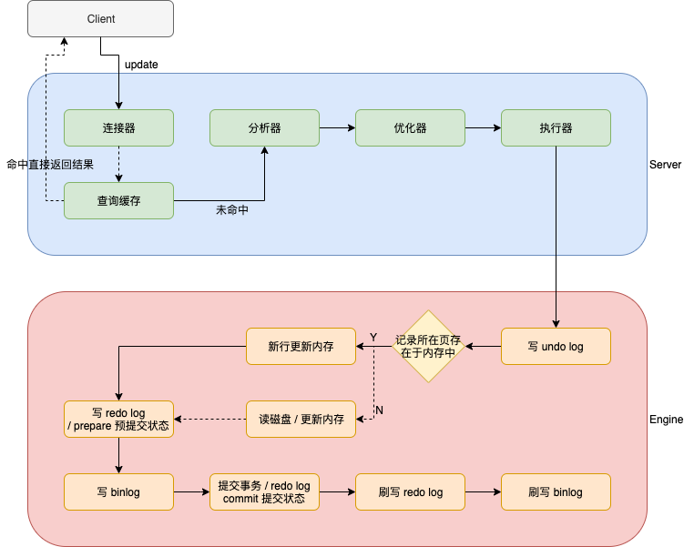

# 关系数据库

## 数据库设计范式

- 第一范式（1NF）关系 R 属于第一范式，当且仅当R中的每一个属性A的值域只包含原子项

  **消除重复数据**，即每一列都是不可再分的基本数据项；每个列都是原子的。

- 第二范式（2NF）在满足 1NF 的基础上，消除非主属性对码的部分函数依赖

  **消除部分依赖**，表中没有列只与主键的部分相关，即每一行都被主键唯一标识；每个列都有主键。

- 第三范式（3NF）在满足 2NF 的基础上，消除非主属性对码的传递函数依赖

  **消除传递依赖**，消除表中列不依赖主键，而是依赖表中的非主键列的情况，即没有列是与主键不相关的。从表只引用主表的主键，即表中每列都和主键相关。

- BC 范式（BCNF）在满足 3NF 的基础上，消除主属性对码的部分和传递函数依赖

- 第四范式（4NF）消除非平凡的多值依赖

- 第五范式（5NF）消除一些不合适的连接依赖


## 结构化查询语言

- 数据查询语言（DQL Data Query Language）其语句也称为“数据检索语句”，用以从表中获得数据，确定数据怎样在应用程序给出。保留字 SELECT 是 DQL（也是所有 SQL）用得最多的动词，其他 DQL 常用的保留字有 WHERE，ORDER BY，GROUP BY 和 HAVING。这些 DQL 保留字常与其它类型的 SQL 语句一起使用。
- 数据操作语言（DML Data Manipulation Language）其语句包括动词 INSERT、UPDATE 和 DELETE。它们分别用于添加、修改和删除。
- 事务控制语言（TCL）它的语句能确保被 DML 语句影响的表的所有行及时得以更新。包括COMMIT（提交）命令、SAVEPOINT（保存点）命令、ROLLBACK（回滚）命令。
- 数据控制语言（DCL）它的语句通过 GRANT 或 REVOKE 实现权限控制，确定单个用户和用户组对数据库对象的访问。某些 RDBMS 可用 GRANT 或 REVOKE 控制对表单个列的访问。
- 数据定义语言（DDL）其语句包括动词 CREATE, ALTER 和 DROP。在数据库中创建新表或修改、删除表（CREAT TABLE 或 DROP TABLE）；为表加入索引等。
- 指针控制语言（CCL）它的语句像 DECLARE CURSOR，FETCH INTO 和 UPDATE WHERE CURRENT 用于对一个或多个表单独行的操作。


## 数据库设计优化

- 如何恰当选择引擎

  myisam 适用于对读写性能要求高，但对数据一致性要求低的场景

  innodb 支持行锁，事务

  memory 临时表

- 库表如何命名

  有意义

- 如何选择恰当数据类型

  **明确、尽量小**

-  文件、图片是否要存入到数据库

  建议存放结构化数据；读多写少的数据也可

- 时间日期的存储问题

  存放时间戳，int或long类型或string类型

- 数值的精度问题

  字符串存放，应用负责转换

- 是否使用外键、触发器

  不建议，应用保证。性能高

- 是否可以冗余字段

  高效查询可以适当冗余

- 是否使用游标、变量、视图、自定义函数、存储过程

  不建议，维护、调试成本高，移植性差

- 自增主键的使用问题

  分布式不建议

- 能够在线修改表结构（DDL 操作）

  不建议，会锁表。备份也会锁表，尽量在无业务处理时操作

- 逻辑删除还是物理删除

  重要数据需要审计，增加字段表示逻辑删除

- 要不要加 create_time，update_time 时间戳

  建议，增量复制

- 数据库碎片问题

  插入和删除都会导致碎片，优化压缩

- 如何快速导入导出、备份数据

  批量导入导出内建命令

  批量导入时先删除索引、外键，导入数据后，再添加


# MySQL

## 存储

### 独占模式

公共数据文件

- 日志组文件：ib_logfile0和ib_logfile1
- 二进制日志文件，记录主数据库服务器的 DDL 和 DML 操作：默认文件名为 “主机名-bin.num”

- 二进制日志索引文件：主机名-bin.index

在MySQL数据目录下，每一个数据库都是一个文件目录

- 表结构文件：*.frm

- 独占表空间文件：*.ibd

- 字符集和排序规则文件：db.opt

### 共享模式

innodb_file_per_table=1

- 数据都在 ibdata1中


## 执行流程

update记录执行流程




- 连接器：管理连接，权限验证
- 分析器：词法分析、语法分析
- 优化器：索引确定，执行计划生成
- 执行器：和引擎交互，返回结果

- undo log：用于回滚，崩溃恢复，MVCC；存储回滚段指针和事务id，通过回滚段指针找到对应undo log记录，通过事务id判断记录的可见性
- 记录所在页存在于内存中
  - 存在
    - 唯一索引：找到数据，判断数据冲突与否，更新内存
    - 普通索引：找到数据，更新内存
  - 不存在
    - 唯一索引：将数据页从磁盘读入内存，判断数据冲突与否，更新内存
    - 普通索引：在change buffer更新记录，change buffer异步将更新同步到磁盘，通过change buffer降低磁盘IO次数
- redo log：WAL 用于事务崩溃恢复，以及将随机写变成顺序写，提过性能
- binlog：用于备份，主从同步
- 刷写 redo log：处于commit-prepare阶段
- 刷写 binlog：处于commit-commit阶段


## 执行引擎

| 存储引擎 | 存储限制 | 事务 | 索引 | 锁的粒度 | 数据压缩 | 外键 |
| -------- | -------- | ---- | ---- | -------- | -------- | ---- |
| myisam   | 256TB    | -    | 支持 | 表锁     | 支持     | -    |
| innodb   | 64TB     | 支持 | 支持 | 行锁     | -        | 支持 |
| memory   | 有       | -    | 支持 | 表锁     | -        | -    |
| archive  | 无       | -    | -    | 行锁     | 支持     | -    |

- myisam 适用于对读写性能要求高，但对数据一致性要求低的场景。


## SQL语句的执行顺序

### 语法

```mysql
SELECT
    [ALL | DISTINCT | DISTINCTROW ]
    [HIGH_PRIORITY]
    [STRAIGHT_JOIN]
    [SQL_SMALL_RESULT] [SQL_BIG_RESULT] [SQL_BUFFER_RESULT]
    [SQL_CACHE | SQL_NO_CACHE] [SQL_CALC_FOUND_ROWS]
    select_expr [, select_expr] ...
    [into_option]
    [FROM table_references
      [PARTITION partition_list]]
    [WHERE where_condition]
    [GROUP BY {col_name | expr | position}
      [ASC | DESC], ... [WITH ROLLUP]]
    [HAVING where_condition]
    [ORDER BY {col_name | expr | position}
      [ASC | DESC], ...]
    [LIMIT {[offset,] row_count | row_count OFFSET offset}]
    [PROCEDURE procedure_name(argument_list)]
    [into_option]
    [FOR UPDATE | LOCK IN SHARE MODE]

into_option: {
    INTO OUTFILE 'file_name'
        [CHARACTER SET charset_name]
        export_options
  | INTO DUMPFILE 'file_name'
  | INTO var_name [, var_name] ...
}
```

### 执行顺序

1. from
2. on
   - 先on过滤条件之后，才会join生成临时表
3. join
4. where
   - 临时表生成之后，根据限制条件从临时表中筛选
   - 在分组（聚集函数）之前筛选数据
5. group by
   - 分组之后，执行聚集函数
6. having
   - 聚合函数执行之后对分组数据进一步筛选，同group by一起使用，不可单独使用
7. select
   - 如果有group by使用的话，select查询的字段可能是group by后跟的分组字段，也有可能是对字段聚合函数计算的结果
8. distinct
9. order by
   - group by和orderby可以实现组内排序，即 `group by A,B order by A,B`
10. limit


## 索引原理

数据是**按页来分块**的，假设当一个数据被用到时，其附近的数据通常也会被马上使用。

InnoDB使用B+Tree实现聚集索引。

B+Tree 所有叶子节点才有指向数据的指针。非叶子节点就是纯索引数据和主键。每个叶子节点都有指向下一个叶子节点的连接。<font color=red>非叶子节点存放在内存中</font>，B-Tree中每个节点包含的数据的指针会带来额外的内存占用，减少了放入内存的非叶子节点数；B+Tree则尽可能多地将非叶子节点放入内存。

- 主键索引：叶子节点存放的是key值和数据，叶子节点加载到内存后，数据一起加载，即找到叶子节点的key，就找到了数据；
- 辅助索引：叶子节点存放的是ke值和对应记录的主键值，使用辅助索引查询，首先检索辅助索引获取主键，然后用主键在主键索引中检索获取记录。


**单表不建议超过2000万数据。**

InnoDB存储引擎最小存储单元页（Page），一个页的大小是16K。idb文件大小始终是16的倍数。

- 存放数据：记录按主键排序存放到不同的页中
- 存放<font color=red>键值+指针</font>

在B+Tree中叶子节点存放数据，非叶子节点存放键值+指针。每个节点是一页。索引组织表通过非叶子节点的二分查找法以及指针确定数据在哪个页中，进而在去数据页中查找到需要的数据。每张表的**根页**位置在表空间文件中是固定的，即page number=3的页。

假设：每页大小16K，每条记录占1K大小，主键为Bigint类型占8字节，指针占6字节。

- 每一页约存放 ( 16 * 1024 ) / ( 8 + 6 ) = 1170 指向数据页的指针。
- 数据页存放16/1=16条记录

B+Tree高为2，数据记录条数 1170 * 16 = 18720

B+Tree高为3，数据记录条数 1170 * 1170 * 16 = 21902400

所以在InnoDB中B+树高度一般为1-3层，它就能满足千万级的数据存储。在查找数据时一次页的查找代表一次IO， 所以通过主键索引查询通常只需要1-3次IO操作即可查找到数据。

