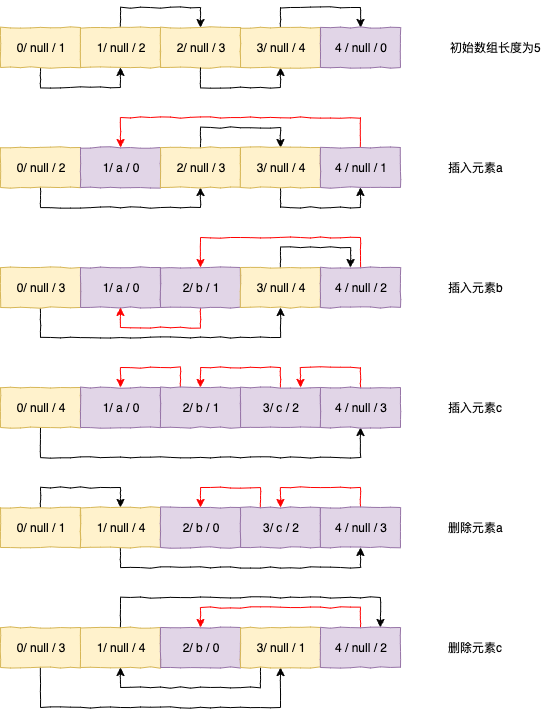
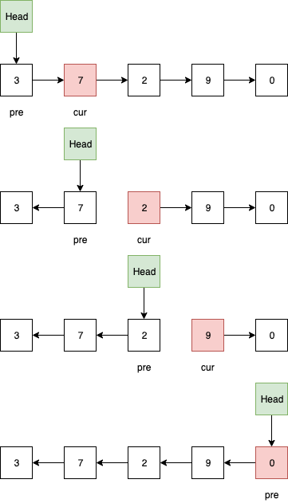
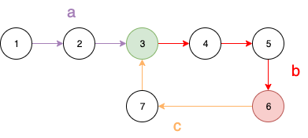

# 线性表

## 链表

### 静态链表

基于数组实现，元素包括value和cursor，其中cursor指向数组中的任意一个元素的索引位置。实现的思路是创建两条虚拟链表，一条是备用链表，作用是连接未使用的空间；另一条是数据链表，作用是连接数据链表的各个节点。

- 数组的第一个元素保留，作为备用链表的头节点；数组的最后一个元素保留，作为数据链表的头结点
- 数据链表是否为空，判断数据链表的头结点，即数组的最后一个元素的curse是否等于0，为0则数据链表为空
- 数据链表是否为满，假设底层实现的数组不支持动态扩充，判断备用链表的头结点是否指向数组的最后一个元素，即curse等于n-1，则数据链表为满





### 单链表反转

- `cur` 指向待反转节点，`pre` 指向待反转节点的前驱节点

- 反转过程

  ```java
  head.next = cur;
  cur = cur.next;
  head.next.next = pre;
  pre = head.next;
  ```

  



### 链表中环的检测

- 判断链表是否存在环

  通过快指针和慢指针算法检测。首先快指针和慢指针都指向第一个节点，快指针走两步，慢指针走一步。如果有环，快指针会先进入环，慢指针后进入环，快指针逐渐靠近慢指针并在环上的某一点相遇，而不会跳过慢指针。

  - 证明（数学归纳法）

    慢指针和快指针相差步数为n，则：

    1. 当n=1时，慢指针向前走一步，快指针向前走两步，刚好相遇，即 `x=1(相差步数)+1（慢指针走一步）-2（快指针走两步）=0`
    2. 当n=2时，慢指针向前走一步，快指针向前走两步，之后快指针比慢指针落后一步，即 `x=2+1-2=1`，转换为1
    3. 假设当n=k时(k>=1)成立
    4. 则当n=k+1时，`x=k+1+1-2=k` ，转换为3；因此，可以证明当n>=1时，结论成立。


- 如果存在环，求环的长度

  慢指针从相遇节点开始向前走，直到再次到达相遇节点绕环一周，即为环的长度。


- 如果存在环，求环的入口

  
  a长度是从第一个节点到环入口节点的长度；b长度是从环入口节点到快慢指针相遇节点的长度；c长度是从相遇节点到环入口节点的长度，因为快指针先进入环，而慢指针后进入环，快指针追上慢指针至少绕环一周；a的长度等于c的长度。

  - 证明

    当快指针和慢指针在环内相遇

    - 慢指针走的长度s=a+b

    - 快指针走的长度f=a+(b+c)*n+b，其中b+c是环的长度，n是快指针已经绕环圈数

    - 因为快指针走的长度是慢指针的2倍，所以 2s=f，即 

      `2(a+b)=a+(b+c)*n+b`  =>

      `a=(b+c)*n-b`  =>

      `a=(b+c)*(n-1)+(b+c)*1-b`  =>

      `a=(b+c)*(n-1)+c`

    结论
    
    - 当n=1时，a=c；即A指针从第一个节点开始走，B指针从相遇节点开始走，当他们相遇时，刚好是入口节点
    - 当n>1时，即A指针从第一个节点开始走，B指针从相遇节点开始走，绕环n-1周后，再从相遇节点走c步后，当他们相遇时，刚好是入口节点


# 排序

| 算法     | 稳定                      | 原地排序                  | 最优时间复杂度 | 最差时间复杂度 | 平均时间复杂度 | 基于比较 |
| -------- | ------------------------- | ------------------------- | -------------- | -------------- | -------------- | -------- |
| 冒泡排序 | 是                        | 是                        | O(n)           | O(n^2)         | O(n^2)         | 是       |
| 选择排序 | <font color=red>否</font> | 是                        | O(n^2)         | O(n^2)         | O(n^2)         | 是       |
| 插入排序 | 是                        | 是                        | O(n)           | O(n^2)         | O(n^2)         | 是       |
| 归并排序 | 是                        | <font color=red>否</font> | O(nlogn)       | O(nlogn)       | O(nlogn)       | 是       |
| 快速排序 | <font color=red>否</font> | 是                        | O(nlogn)       | O(n^2)         | O(nlogn)       | 是       |
| 计数排序 | 是                        | 否                        | O(n)           | O(n)           | O(n)           | 否       |
| 桶排序   | 是                        | 否                        | O(n)           | O(nlogn)       | O(n)           | 否       |
| 基数排序 | 是                        | 否                        | O(n)           | O(n)           | O(n)           | 否       |

算法简介

- 冒泡排序：相邻两个元素比较，若无序，则交换，直到待比较元素的最后一个；有序性从右到左
- 选择排序：选择数组中一个最小的元素，和第一个元素交换；有序性从左到右
- 插入排序：假设第一个元素有序，逐个遍历后续元素，插入到前边有序子序列中；有序性从左到右
- 归并排序：把无序数组划分为左右两个等长部分，假设左右两个数组有序，则借助临时数组将左右两个有序数组合并为一个有序数组；若左右两个部分无序，则递归继续划分，直到左右两部分有序，再合并；有序性从部分到整体
- 快速排序：无序数组中选择任意一个元素为中轴，小于中轴的置换到左边，大于中轴的置换到右边，假设左右两个部分有序，则排序完成；否则，继续在左边数组和右边数组，分别选取中轴进行分区；有序性从部分到整体
- 计数排序：**待排序数组中的元素在一个小范围内**
  - 对待排序数组中的元素累加计数
  - 计数数组元素和前一个值累加，计算某一个元素前边有多少个元素占位
  - 根据计数数组占位，对待排序数组排序
- 桶排序：**计数排序的特例，当待排序数组元素范围很大时，开辟范围大小的计数数组开销很大**
  - 确定每个桶的范围区间 O(N)
  - 将待排序数组元素装入桶中，每个桶保持有序性 O(N)
  - 每个桶中的元素快速排序，之后逐个桶遍历其中元素即可获得有序数组，N个元素，共有M个桶，假设桶中元素均匀，每个桶内元素k排序使用快速排序方法，则
    - 一个桶：kO(logk)，k=N/M => N/M O(logN/M) 
    - M个桶：M*N/M O(logN/M) => N O(logN/M) => O(NlogN-NlogM)
  - 时间复杂度
    - 当M为1时，即只有一个桶：O(N)+O(N)+O(NlogN) => O(NlogN)
    - 当M和N相同时，即每一个元素对应一个桶：O(N)+O(N) => O(N)
    - 因此桶排序的关键是需要数据分布均匀，且桶的数量接近待排序总数
- 基数排序：当数据量非常大时，无法通过比较排序，也不适用于计数排序（范围过大）；不适用于桶排序（桶的数量有限）；可以通过计数排序的改进版基数排序
  - 从低位到高位进行计数排序，并且每一位排序必须遵循稳定性