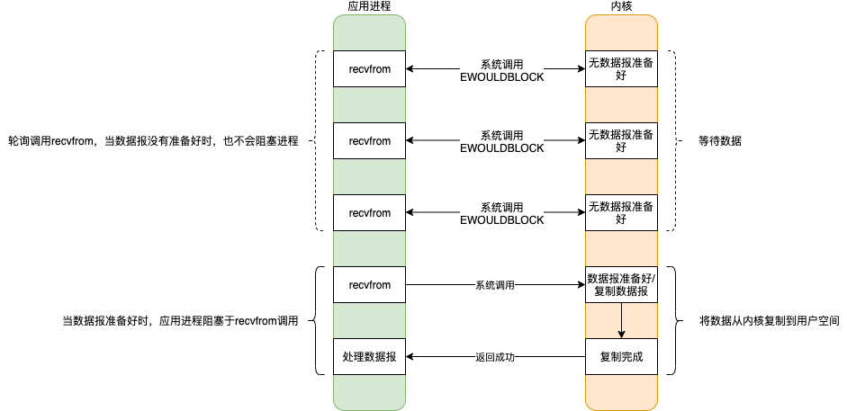
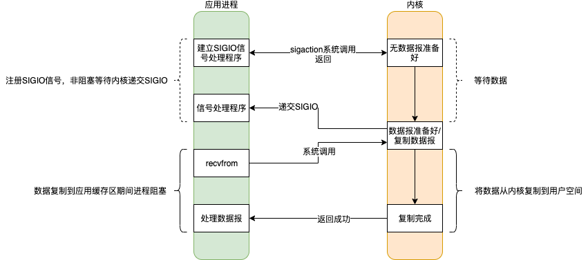
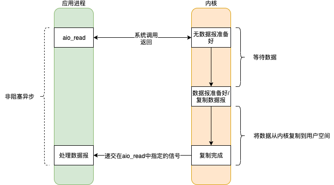
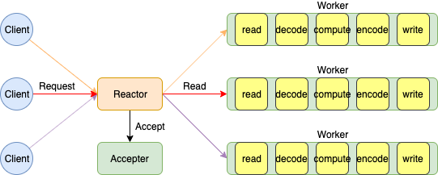

# 通信模式

## IO模型

|          | 阻塞                         | 非阻塞                         |
| -------- | ---------------------------- | ------------------------------ |
| **同步** | 阻塞I/O模型、I/O多路复用模型 | 非阻塞I/O模型、信号驱动I/O模型 |
| **异步** |                              | 异步I/O模型                    |

四种状态指的是应用进程同内核的通讯过程

- 阻塞 / 非阻塞 指的是等待内核准备数据，应用进程是否阻塞；即发起请求是否阻塞
- 同步 / 异步 指的是内核准备好数据后，将数据由内核缓冲区复制到用户空间的进程缓存区过程，由应用进程主动触发获取数据，还是被动通知；即读写数据是否阻塞

<font color=red>阻塞程度：阻塞I/O > 非阻塞I/O > I/O多路复用模型 > 信号驱动I/O > 异步I/O ，效率由低到高。</font>


**Java对于IO模型的支持**

- < 1.4 Java的IO模型只支持阻塞式IO（Blocking IO），简称为BIO 
- = 1.4 Java的IO模型支持了I/O多路复用模型，相对于之前的IO模型，这是一个新的模型，所以称之为NIO（New IO）
- = 1.7 Java对NIO包进行了升级，支持了异步I/O（Asynchronous IO），简称为AIO


### 阻塞IO（blocking I/O）


<font color=red>应用进程一次recvfrom指令调用，内核的两个阶段 **准备数据** 和 **复制数据** 都被阻塞。</font>


### 非阻塞IO（noblocking I/O）



应用进程多次recvfrom指令调用，当内核没有准备好数据时，不会阻塞，而是返回一个Error。当内核准备好数据时，此时应用进程的recvfrom指令调用被阻塞，直到数据拷贝到应用进程的缓冲区。


### IO多路复用（I/O multiplexing）


IO复用同非阻塞IO本质一样，但其利用了新的select系统调用，由内核负责查询是否准备好数据的轮询操作。看似比非阻塞IO还多了一个select指令调用开销，但是可以同时处理多个网络连接的IO。<font color=red>Server端优化的终极目标：Server端使用尽量少的线程，来处理尽量多的Client请求。</font>

当用户进程调用了select指令，应用进程会被阻塞；而同时，内核会“监视”所有select负责的socket，当任何一个socket中的数据准备好时，select就会返回。此时应用进程再调用recvfrom指令。

同多线程 + blocking I/O相比，select可以同时处理多个网络连接

- <font color=red>多路复用的优势不是为了处理连接更快，而是为了支持更多的连接。</font>比如网络连接是长连接或IO阻塞时间长的话，多线程 + blocking I/O的方式会大量使用线程资源，在任务未完成之前或Client未关闭前，无法将空闲线程归还到线程池中，可能的结果就是导致大量连接请求无法及时响应；而多路复用则可以使用单进程就可以同时处理多个链接请求。
- 当链接数不是很大，多线程 + blocking I/O的方式性能会更好一些，因为只有一次系统调用；而多路复用是两次系统调用。

**对于一次读取数据请求分为两个阶段：数据准备和数据复制。对于数据准备的时间是不确定性的，因为客户端什么时候发送数据不确定，而对于数据复制的时间是有限的。多路复用就是利于一个监视线程监听多个连接是否完成数据准备，当某一个连接完成数据准备，select恢复，将任务分配给一个工作线程处理，而工作线程读取数据，内核数据复制阻塞的时间是非常小的，从而使得工作任务大部分时间可以充分利用CPU进行计算工作，而不是阻塞等待IO完成浪费CPU资源**。


### 信号驱动IO（signal blocking I/O）




### 异步IO（asynchronous I/O）




## 内核指令调用实践

**内核需要自我保护不可直接访问，同时还需要对外提供服务支持。应用通过向CPU发送中断指令来访问内核函数。CPU收到应用的中断指令后，会查询中断向量表，然后调用对应的内核回调函数。晶振会定时向CPU发送中断指令，从而使多线程轮换，但会产生线程上下文切换成本。**


- 准备基础环境

  ```shell
  # 下载镜像
  docker pull centos:7
  
  # 启动镜像
  # 添加 --cap-add=SYS_PTRACE =解决=》 Can't attach to the process: ptrace(PTRACE_ATTACH, ..) failed for 253: Operation not permitted
  docker run --cap-add=SYS_PTRACE --name develop -it \
  -v /Users/yangxiaoyu/work/test/javadatas/exchange:/exchange \
  -d centos:7 /bin/bash
  
  # 进入环境
  docker exec -it develop /bin/bash
  
  # 内核指令追踪
  yum -y install strace
  
  # netcat
  yum -y install nc
  
  # 网络追踪 netstat
  yum -y install net-tools
  ```


- Jdk1.5环境

  [官方jdk下载地址](https://www.oracle.com/java/technologies/oracle-java-archive-downloads.html)

  ```shell
  # 安装jdk5
  sh jdk-1_5_0_22-linux-amd64.bin
  
  # 设置环境变量
  vi /etc/profile
  export JAVA_HOME=/exchange/jdk1.5.0_22
  export PATH=:$JAVA_HOME/bin:$PATH
  
  # 立即生效
  source /etc/profile
  
  # 验证
  java -version
  ```


- Jdk1.8环境

  ```shell
  # 安装jdk8
  tar -xzvf jdk-8u271-linux-x64.tar.gz
  
  # 设置环境变量
  vi /etc/profile
  export JAVA_HOME=/exchange/jdk1.8.0_271
  export PATH=:$JAVA_HOME/bin:$PATH
  
  # 立即生效
  source /etc/profile
  
  # 验证
  java -version
  ```

  

### BIO

#### 单线程

基于jdk5运行程序

```shell
# jdk5 编译
javac com/sciatta/dev/java/example/io/server/BIO.java

# -ff            follow forks with output into separate files
# -o file        send trace output to FILE instead of stderr
strace -ff -o bio java com.sciatta.dev.java.example.io.server.BIO
```

分析日志 `tail -F bio.570`

```shell
# 创建fd3
socket(AF_INET, SOCK_STREAM, IPPROTO_IP) = 3
# 绑定端口
bind(3, {sa_family=AF_INET, sin_port=htons(8888), sin_addr=inet_addr("0.0.0.0")}, 16) = 0
# 监听
listen(3, 50)
# accept阻塞
accept(3,

# 客户端建立连接，创建fd5
accept(3, {sa_family=AF_INET, sin_port=htons(57358), sin_addr=inet_addr("127.0.0.1")}, [16]) = 5
# recvfrom阻塞
recvfrom(5,

# 客户端发送请求数据
recvfrom(5, "hello\n", 8192, 0, NULL, NULL) = 6
# 关闭客户端连接
close(5)
# accept阻塞
accept(3,
```

总结

- BIO模式下，服务端在等待客户端连接时调用accept阻塞，当有客户端连接时，调用recvfrom阻塞。如果是单线程模式下，阻塞于recvfrom，<font color=red>此时服务端无法接受其他客户端请求</font>
- 为了改进使得服务端接受更多的客户端请求，采用线程池模式，当accept接受到客户端socket后，将socket交给线程池处理与客户端的读写请求，而服务端主线程则继续调用accept，响应客户端请求


#### 多线程改进版

基于jdk8运行程序

```shell
strace -ff -o Bootstrap java -cp bifrost-core-0.1.0-SNAPSHOT.jar com.sciatta.bifrost.core.Bootstrap
```

分析日志

```shell
# 创建ServerSocket监听
socket(AF_INET, SOCK_STREAM, IPPROTO_IP) = 6
bind(6, {sa_family=AF_INET, sin_port=htons(8888), sin_addr=inet_addr("0.0.0.0")}, 16) = 0
listen(6, 50)
# poll阻塞 同步IO多路复用
poll([{fd=6, events=POLLIN|POLLERR}], 1, -1

# 接收到客户端连接，客户端socket fd 7
poll([{fd=6, events=POLLIN|POLLERR}], 1, -1) = 1 ([{fd=6, revents=POLLIN}])
accept(6, {sa_family=AF_INET, sin_port=htons(57364), sin_addr=inet_addr("127.0.0.1")}, [16]) = 7
# 马上阻塞
poll([{fd=6, events=POLLIN|POLLERR}], 1, -1

# 客户端请求递交给新的线程处理；创建线程（Linux是进程） fd 888
clone(child_stack=0x7f9b89c8cfb0, flags=CLONE_VM|CLONE_FS|CLONE_FILES|CLONE_SIGHAND|CLONE_THREAD|CLONE_SYSVSEM|CLONE_SETTLS|CLONE_PARENT_SETTID|CLONE_CHILD_CLEARTID, parent_tidptr=0x7f9b89c8d9d0, tls=0x7f9b89c8d700, child_tidptr=0x7f9b89c8d9d0) = 888

# 读请求阻塞
recvfrom(7,
# 收到读请求
recvfrom(7, "1234567\n", 8192, 0, NULL, NULL) = 8

# 关闭客户端连接
close(7)
```

总结

- jkd8采用的是poll+accept模式处理客户端连接
- 在Linux环境下，java创建的线程就是创建一个子进程，处理读请求仍然是调用recvfrom函数
- <font color=red>虽然可以处理一定数量的客户端请求，但创建过多的系统进程，会导致内存浪费，CPU轮询上下文切换，以及系统本身对进程数量的限制，都导致了系统资源的浪费。因此需要使用比较少的线程来处理更多的客户端连接请求</font>


### NIO

基于jdk8运行程序

```shell
strace -ff -o Bootstrap java -cp bifrost-core-0.1.0-SNAPSHOT.jar com.sciatta.bifrost.core.Bootstrap
```

分析日志

``` shell
# 创建server socket fd5，绑定端口，监听
socket(AF_INET, SOCK_STREAM, IPPROTO_IP) = 5
bind(5, {sa_family=AF_INET, sin_port=htons(8888), sin_addr=inet_addr("0.0.0.0")}, 16) = 0
listen(5, 50)
# 设置为非阻塞模式
fcntl(5, F_SETFL, O_RDWR|O_NONBLOCK)    = 0
    
# 循环 返回-1，表示没有客户端连接，不阻塞
accept(5, 0x7feffc09fbe0, [16])         = -1 EAGAIN (Resource temporarily unavailable)

# 接收到客户端连接 fd7
accept(5, {sa_family=AF_INET, sin_port=htons(57464), sin_addr=inet_addr("127.0.0.1")}, [16]) = 7
# 设置为非阻塞模式
fcntl(7, F_SETFL, O_RDWR|O_NONBLOCK)    = 0

# 读取数据
read(7, "GET / HTTP/1.1\r\nUser-Agent: curl"..., 1024) = 78

# 关闭客户端连接
close(7)                                = 0
```

总结

- accept为非阻塞模式，单一线程就可以实现同时处理客户端连接请求和读写数据
- <font color=red>NIO模式会不断调用内核函数，浪费系统资源，用户态、内核态切换</font>


### MIO

基于jdk8运行程序

```shell
strace -ff -o Bootstrap java -cp bifrost-core-0.1.0-SNAPSHOT.jar com.sciatta.bifrost.core.Bootstrap
```

分析日志

```shell
# 创建server socket fd5，绑定端口，监听，设置为非阻塞
socket(AF_INET, SOCK_STREAM, IPPROTO_IP) = 5
bind(5, {sa_family=AF_INET, sin_port=htons(8888), sin_addr=inet_addr("0.0.0.0")}, 16) = 0
listen(5, 50)
fcntl(5, F_SETFL, O_RDWR|O_NONBLOCK)    = 0

# 内核创建空间fd9，放置缓存注册的fd
epoll_create(256)                       = 9
# 注册fd5
epoll_ctl(9, EPOLL_CTL_ADD, 5, {EPOLLIN, {u32=5, u64=139728171040773}}) = 0
# 阻塞等待事件
epoll_wait(9,

# 收到accept事件，创建fd10
epoll_wait(9, [{EPOLLIN, {u32=5, u64=139728171040773}}], 8192, -1) = 1
accept(5, {sa_family=AF_INET, sin_port=htons(57472), sin_addr=inet_addr("127.0.0.1")}, [16]) = 10
fcntl(10, F_SETFL, O_RDWR|O_NONBLOCK)   = 0
# 注册fd10
epoll_ctl(9, EPOLL_CTL_ADD, 10, {EPOLLIN, {u32=10, u64=139728171040778}}) = 0

# 阻塞等待事件
epoll_wait(9,

# 收到read事件
read(10, "GET / HTTP/1.1\r\nUser-Agent: curl"..., 1024) = 78
# 关闭连接
close(10)
```

总结

- 单一线程就可以实现同时处理客户端连接请求和读写数据，select可以配置为阻塞模式等待客户端事件
- 多路复用
  - select 限制fd数量是1024，同步IO多路复用
  - poll 对fd没有限制，同步IO多路复用，每次调用需要传入检测的fd（1）来确认是否IO准备就绪，同时内核会遍历这些fd（2）
  - epoll
    - epoll_create、epoll_ctl、epoll_wait
    - <font color=red>每次调用不需要传入检测的fd，因为事先已经注册到内核空间中，同时也不需要遍历检测的所有fd，内核基于事件通知机制告知监听的哪一个fd准备就绪</font>


# NIO

## java NIO

### 核心概念

- Channel

  Channel的数据可以读到Buffer中，Buffer中的数据也可以写入到Channel。

  - FileChannel

    基于File，不支持非阻塞模式

  - DatagramChannel

    基于UDP

  - SocketChannel

    基于TCP

  - ServerSocketChannel

    监听TCP连接

  Channel和Stream的区别

  - Channel是双向的读写；而Stream是单向的，要么读，要么写
  - Channel支持异步读写
  - Channel的读写需借助Buffer

- Buffer

  Buffer覆盖了可以通过IO发送的基本数据类型。

  - ByteBuffer
  - CharBuffer
  - DoubleBuffer
  - FloatBuffer
  - IntBuffer
  - LongBuffer
  - ShortBuffer

- Selector

  <font color=red>一个Selector支持一个单一的线程处理多个Channel</font>。适用于应用包含许多连接，但每个连接的流量都很少的场景。为了监听一个Channel，需要向Selector注册。

  - 线程上下文切换代价高
  - 线程需要占用系统资源（内存）

  注册的Channel必须是**非阻塞**模式。


### Buffer

#### Capacity, Position 和 Limit

- flip 切换为读模式
  - 初始处于写模式，capacity和limit指向Buffer最大容量，position指向0位置
  - 每put数据一次，position下标下移一位；即position总是指向待插入数据位置
  - `flip` 切换为读模式，limit指向原position位置，表示最大可读取位置，position指向0位置，表示起始可读取位置


- rewind 重读数据
  - 切换为读模式读取数据后，`rewind` 可重读已经读取过的数据，即将position指向0位置，limit不变


- clear 清空Buffer
  - 切换为写模式，`clear` 只是重置标志位，内部数据不会操作；即将position指向0位置，limit指向capacity位置


- compact
  - 由读模式切换为写模式，未读元素前置到0位置开始，position指向未读元素的最后一个元素之后，limit指向capacity位置


- mark & reset
  - 读模式下 `mark` 记录当前position位置，之后继续向后读取；`reset` 会重新将position指向 `mark` 标记的位置，可重新读取标记位置之后的数据


### Selector

- channel必须是非阻塞，才能使用selector
- SelectionKey可供监听的四种事件
  - OP_CONNECT Channel连接Server成功（客户端）
  - OP_ACCEPT ServerSocketChannel接收到一个客户端请求（服务端）
  - OP_READ 数据准备好可读
  - OP_WRITE Channel准备好可以用于写数据
- channel向selector注册，并添加感兴趣的事件 `selectionKey.attach(theObject);`，可以向返回的SelectionKey对象附加有用的对象；在selector触发事件后，可以通过 `selector.selectedKeys()` 获得同register时返回一致的SelectionKey，然后可以通过 `Object attachedObj = selectionKey.attachment();` 使用注册时附加的对象
- `select()`
  - `int select()` selector阻塞，直到注册的一个channel的事件准备好
  - `int select(long timeout)` 阻塞，指定超时时间
  - `int selectNow()` 不阻塞，立即返回，不管channel是否准备好
- selector不会主动移除处理过的channel，需要手动移除

```java
// 创建一个selector
Selector selector = Selector.open();

// channel必须是非阻塞，才能使用selector
channel.configureBlocking(false);

// channel向selector注册，并添加感兴趣的事件
// 可以向返回的SelectionKey对象附加有用的对象，在selector触发事件后，可以使用附加的对象 selectionKey.attach(theObject);
SelectionKey key = channel.register(selector, SelectionKey.OP_READ);

while(true) {
	// 准备监听事件，readyChannels有多少个channel准备好
  int readyChannels = selector.selectNow();

  if(readyChannels == 0) continue;

  // 访问准备好的channel，同register时返回的SelectionKey一致
  Set<SelectionKey> selectedKeys = selector.selectedKeys();

  Iterator<SelectionKey> keyIterator = selectedKeys.iterator();
	// 迭代准备好的channel
  while(keyIterator.hasNext()) {

    SelectionKey key = keyIterator.next();
    Channel channel = key.channel();	// 可以转换为需要的实际channel，如 ServerSocketChannel or SocketChannel 

    if(key.isAcceptable()) {
        // a connection was accepted by a ServerSocketChannel.

    } else if (key.isConnectable()) {
        // a connection was established with a remote server.

    } else if (key.isReadable()) {
        // a channel is ready for reading

    } else if (key.isWritable()) {
        // a channel is ready for writing
    }

    // selector不会主动移除处理过的channel，需要手动移除
    keyIterator.remove();
  }
}
```


### Channel

#### FileChannel

- FileChannel不能设置为非阻塞模式


#### SocketChannel 和ServerSocketChannel

- SocketChannel
  - 可以设置SocketChannel为非阻塞模式，异步模式调用 `connect()`, `read()` 和 `write()` 
  - 非阻塞模式下，配合selector使用，由selector监听注册的channel事件是否准备好
- ServerSocketChannel
  - 阻塞模式 `ServerSocketChannel.accept()` 类似于 `SocketChannel.accept()` 
  - 非阻塞模式 `serverSocketChannel.configureBlocking(false);` 方法 `ServerSocketChannel.accept()` 会立即返回


## Reactor模型

- Reactor包装Selector绑定一个线程，同时接收**连接请求**和**读请求**

- 主Reactor包装Selector绑定一个线程，负责接收**连接请求**；从Reactor包装Selector绑定一个线程，负责接收**读请求**


### 单Reactor单线程模型




### 单Reactor多线程模型


### 主从Reactor模型


