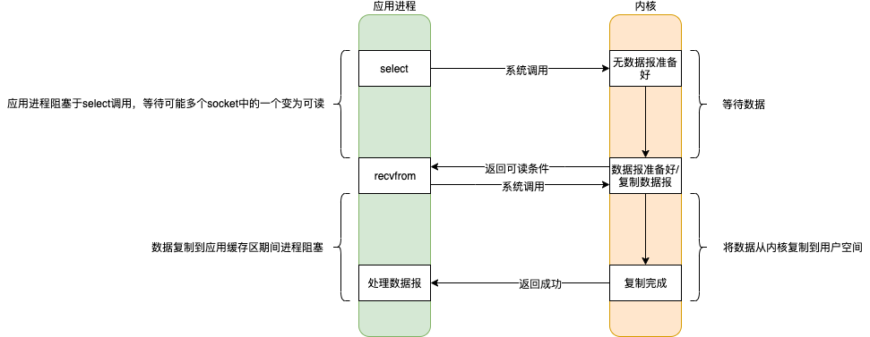
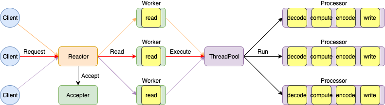
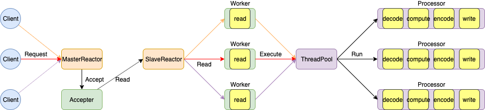

# IO模型

|          | 阻塞                         | 非阻塞                         |
| -------- | ---------------------------- | ------------------------------ |
| **同步** | 阻塞I/O模型、I/O多路复用模型 | 非阻塞I/O模型、信号驱动I/O模型 |
| **异步** |                              | 异步I/O模型                    |

四种状态指的是应用进程同内核的通讯过程

- 阻塞 / 非阻塞 指的是等待内核准备数据，应用进程是否阻塞；即发起请求是否阻塞
- 同步 / 异步 指的是内核准备好数据后，将数据由内核缓冲区复制到用户空间的进程缓存区过程，由应用进程主动触发获取数据，还是被动通知；即读写数据是否阻塞

阻塞程度：阻塞I/O > 非阻塞I/O > I/O多路复用模型 > 信号驱动I/O > 异步I/O ，效率由低到高。

**Java对于IO模型的支持**

- < 1.4 Java的IO模型只支持阻塞式IO（Blocking IO），简称为BIO 
- = 1.4 Java的IO模型支持了I/O多路复用模型，相对于之前的IO模型，这是一个新的模型，所以称之为NIO（New IO）
- = 1.7 Java对NIO包进行了升级，支持了异步I/O（Asynchronous IO），简称为AIO

## 阻塞IO（blocking I/O）

应用进程一次recvfrom指令调用，内核的两个阶段 **准备数据** 和 **复制数据** 都被阻塞。

## 非阻塞IO（noblocking I/O）

应用进程多次recvfrom指令调用，当内核没有准备好数据时，不会阻塞，而是返回一个Error。当内核准备好数据时，此时应用进程的recvfrom指令调用被阻塞，直到数据拷贝到应用进程的缓冲区。

## IO多路复用（I/O multiplexing）

IO复用同非阻塞IO本质一样，但其利用了新的select系统调用，由内核负责查询是否准备好数据的轮询操作。看似比非阻塞IO还多了一个select指令调用开销，但是可以同时处理多个网络连接的IO。Server端优化的终极目标：Server端使用尽量少的线程，来处理尽量多的Client请求。

当用户进程调用了select指令，应用进程会被阻塞；而同时，内核会“监视”所有select负责的socket，当任何一个socket中的数据准备好时，select就会返回。此时应用进程再调用recvfrom指令。

同多线程 + blocking I/O相比，select可以同时处理多个网络连接

- 多路复用的优势不是为了处理连接更快，而是为了支持更多的连接。比如网络连接是长连接或IO阻塞时间长的话，多线程 + blocking I/O的方式会大量使用线程资源，在任务未完成之前或Client未关闭前，无法将空闲线程归还到线程池中，可能的结果就是导致大量连接请求无法及时响应；而多路复用则可以使用单进程就可以同时处理多个链接请求。
- 当链接数不是很大，多线程 + blocking I/O的方式性能会更好一些，因为只有一次系统调用；而多路复用是两次系统调用。

**对于一次读取数据请求分为两个阶段：数据准备和数据复制。对于数据准备的时间是不确定性的，因为客户端什么时候发送数据不确定，而对于数据复制的时间是有限的。多路复用就是利于一个监视线程监听多个连接是否完成数据准备，当某一个连接完成数据准备，select恢复，将任务分配给一个工作线程处理，而工作线程读取数据，内核数据复制阻塞的时间是非常小的，从而使得工作任务大部分时间可以充分利用CPU进行计算工作，而不是阻塞等待IO完成浪费CPU资源**。

## 信号驱动IO（signal blocking I/O）

## 异步IO（asynchronous I/O）

# NIO

## java NIO

### 核心概念

- Channel

  Channel的数据可以读到Buffer中，Buffer中的数据也可以写入到Channel。

  - FileChannel

    基于File

  - DatagramChannel

    基于UDP

  - SocketChannel

    基于TCP

  - ServerSocketChannel

    监听TCP连接

  Channel和Stream的区别

  - Channel是双向的读写；而Stream是单向的，要么读，要么写
  - Channel支持异步读写
  - Channel的读写需借助Buffer

- Buffer

  Buffer覆盖了可以通过IO发送的基本数据类型。

  - ByteBuffer
  - CharBuffer
  - DoubleBuffer
  - FloatBuffer
  - IntBuffer
  - LongBuffer
  - ShortBuffer

- Selector

  一个Selector支持一个单一的线程处理多个Channel。适用于应用包含许多连接，但每个连接的流量都很少的场景。为了监听一个Channel，需要向Selector注册。

### Buffer

#### Capacity, Position 和 Limit

- flip 切换为读模式
  - 初始处于写模式，capacity和limit指向Buffer最大容量，position指向0位置
  - 每put数据一次，position下标下移一位；即position总是指向待插入数据位置
  - `flip` 切换为读模式，limit指向原position位置，表示最大可读取位置，position指向0位置，表示起始可读取位置

- rewind 重读数据
  - 切换为读模式读取数据后，`rewind` 可重读已经读取过的数据，即将position指向0位置，limit不变

- clear 清空Buffer
  - 切换为写模式，`clear` 只是重置标志位，内部数据不会操作；即将position指向0位置，limit指向capacity位置

- compact
  - 由读模式切换为写模式，未读元素前置到0位置开始，position指向未读元素的最后一个元素之后，limit指向capacity位置

- mark & reset
  - 读模式下 `mark` 记录当前position位置，之后继续向后读取；`reset` 会重新将position指向 `mark` 标记的位置，可重新读取标记位置之后的数据

## Reactor模型

### 单Reactor单线程模型

### 单Reactor多线程模型

### 主从Reactor模型

## Netty

### Netty运行原理

### Netty优化

- 不要阻塞 EventLoop

- 系统参数优化
  `ulimit -a` 增大最大进程数

  `/proc/sys/net/ipv4/tcp_fin_timeout`, `TcpTimedWaitDelay` 缩短TIME_WAIT等待时间

- 缓冲区优化
  `SO_RCVBUF` 接收缓冲区

  `SO_SNDBUF` 发送缓冲区

  `SO_BACKLOG` 保持连接状态

  `REUSEXXX` 重用端口

- 心跳频率周期优化
  心跳机制与断线重连

- 内存 与 ByteBuffer 优化
  DirectBuffer与HeapBuffer 映射堆外内存，零拷贝

- 其他优化

  ioRatio

  Watermark

  TrafficShaping 流控

### 网络程序优化

- 粘包与拆包

  对报文没有指定长度，没有结束符。客户端和服务端要约定报文传递规则。

- 网络拥堵与Nagle算法优化 TCP_NODELAY

  MTU: Maxitum Transmission Unit 最大传输单元 1500Byte

  MSS: Maxitum Segment Size 最大分段大小 1460Byte，其中TCP头20Byte，IP头20Byte

  如果网络上按字节发送，都要带40Byte头，传输不经济划算，其次会带来网络拥堵。

  优化条件

  - 启用Nagle算法（默认），关闭TCP_NODELAY，缓冲区满或达到超时才发送数据包，减少网络传输数据包，适用于并发高、数据量大的场景
  - 禁用Nagle算法，启动TCP_NODELAY。适用于对延迟敏感、数据量小的场景，如SSH会话

- 连接优化

  TCP建立连接（3次握手）

  1. `Client -> Server` SYN（你在吗？）

  2. `Server -> Client` ACK（我在！） + SYN（你在吗？）

     Client收到ACK后，状态变为ESTABLISHED

  3. `Client -> Server` ACK（我在！）

     Server收到ACK后，状态变为ESTABLISHED

  TCP关闭连接（4次挥手）

  1. `Client -> Server` FIN（我要离开！）

  2. `Server -> Client` ACK（第一次确认！）

     Server状态变为CLOSE_WAIT

  3. `Server -> Client` FIN（我要离开！） + ACK（第二次确认！）

     Client状态变为TIME_WAIT，**需要等待2MSL后**，状态变为CLOSED

  4. `Client -> Server` ACK（确认！）

     Server状态变为CLOSED

  优化条件

  1. 缩短2MSL等待周期
  2. 开启端口复用

