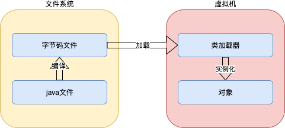
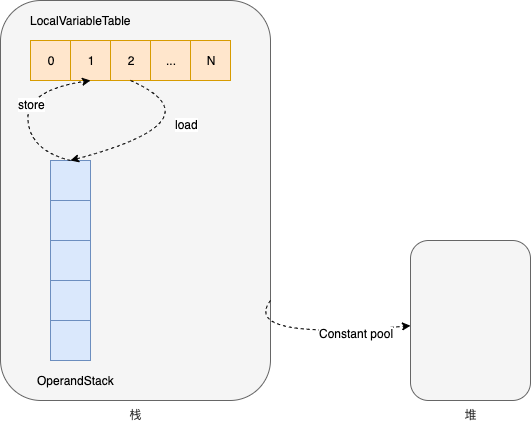
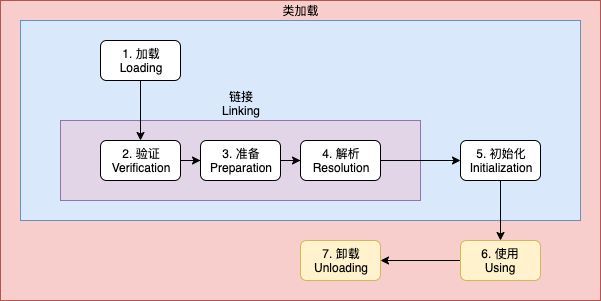
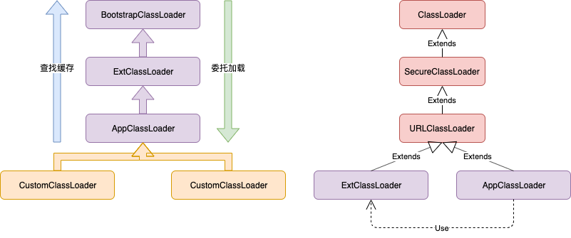
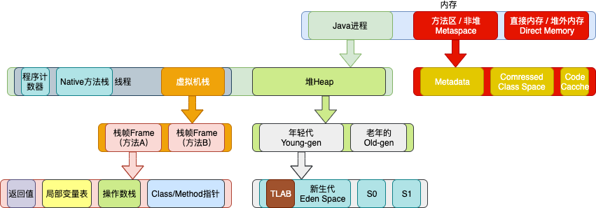
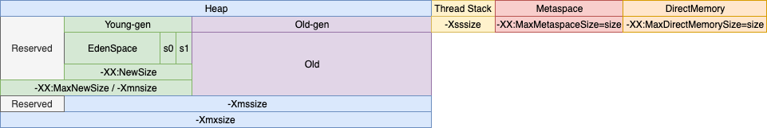
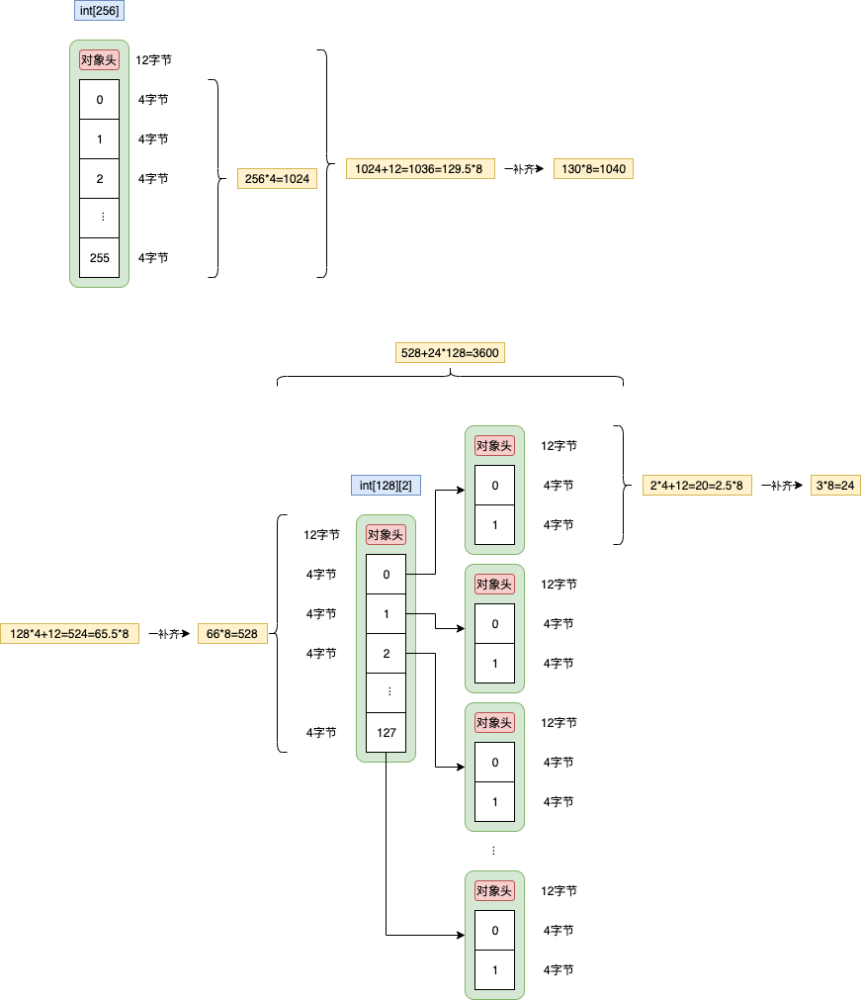

# 概述

Java是一种面向对象、静态类型、编译执行，有 VM/GC 和运行时、跨平台的高级语言。




# 字节码

Java bytecode由<font color=red>单字节指令</font>组成，理论上最多支持256个操作码（opcode）。实际Java只使用了200左右的操作码。还有一些操作码则保留给调试操作。

- 栈操作指令，包括与局部变量交互的指令
- 程序流程控制指令
- 对象操作指令，包括方法调用指令
- 算术运算及类型转换指令


## 字节码运行时结构

JVM是一台基于**栈**的计算机器。每个线程都有一个独属于自己的线程栈，用于存储栈帧。每一次方法调用，JVM都会自动创建一个栈帧。栈帧由操作数栈，局部变量表以及一个Class引用组成。Class引用指向当前方法在运行时常量池中对应的Class。

- 所有指令的起点都是操作数栈，在其上进行运算，临时结果继续入栈；而最终结果可以保存在本地变量表中，用于其他指令读取。




## 字节码分析

### HelloByteCode

- 源码

  ```java
  public class HelloByteCode {
      public static void main(String[] args) {
          HelloByteCode helloByteCode = new HelloByteCode();
      }
  }
  ```


- 分析

  ```shell
  # 反编译 HelloByteCode.class
  javap -c -verbose HelloByteCode 
  
  # 输出
  Classfile /Users/yangxiaoyu/work/bigdata/project/hadoop-dev/hadoop-java/hadoop-java-jvm/target/classes/com/sciatta/hadoop/java/jvm/bytecode/HelloByteCode.class
    Last modified 2020-10-18; size 499 bytes
    MD5 checksum 39bee97c80c36566884eb74e401f2321
    Compiled from "HelloByteCode.java"
  public class com.sciatta.hadoop.java.jvm.bytecode.HelloByteCode
    minor version: 0
    major version: 52
    flags: ACC_PUBLIC, ACC_SUPER
  Constant pool:
     #1 = Methodref          #4.#19         // java/lang/Object."<init>":()V
     #2 = Class              #20            // com/sciatta/hadoop/java/jvm/bytecode/HelloByteCode
     #3 = Methodref          #2.#19         // com/sciatta/hadoop/java/jvm/bytecode/HelloByteCode."<init>":()V
     #4 = Class              #21            // java/lang/Object
     #5 = Utf8               <init>
     #6 = Utf8               ()V
     #7 = Utf8               Code
     #8 = Utf8               LineNumberTable
     #9 = Utf8               LocalVariableTable
    #10 = Utf8               this
    #11 = Utf8               Lcom/sciatta/hadoop/java/jvm/bytecode/HelloByteCode;
    #12 = Utf8               main
    #13 = Utf8               ([Ljava/lang/String;)V
    #14 = Utf8               args
    #15 = Utf8               [Ljava/lang/String;
    #16 = Utf8               helloByteCode
    #17 = Utf8               SourceFile
    #18 = Utf8               HelloByteCode.java
    #19 = NameAndType        #5:#6          // "<init>":()V
    #20 = Utf8               com/sciatta/hadoop/java/jvm/bytecode/HelloByteCode
    #21 = Utf8               java/lang/Object
  {
    public com.sciatta.hadoop.java.jvm.bytecode.HelloByteCode();
      descriptor: ()V
      flags: ACC_PUBLIC
      Code:
        stack=1, locals=1, args_size=1
        	 # 4、从本地变量表中拿出第0个元素，this引用入栈
        	 # -> this
           0: aload_0
           # 5、this出栈，调用父类的初始化方法
           # ->
           1: invokespecial #1                  // Method java/lang/Object."<init>":()V
           # 6、调用结束，没有返回值；方法结束时，操作数栈必须为空
           # ->
           4: return
        LineNumberTable:
          line 8: 0
        LocalVariableTable:
          Start  Length  Slot  Name   Signature
              0       5     0  this   Lcom/sciatta/hadoop/java/jvm/bytecode/HelloByteCode;
  
    public static void main(java.lang.String[]);
      descriptor: ([Ljava/lang/String;)V
      flags: ACC_PUBLIC, ACC_STATIC
      Code:
        stack=2, locals=2, args_size=1
           # 1、在堆中为HelloByteCode分配内存空间，其引用入栈
           # -> ref
           0: new           #2                  // class com/sciatta/hadoop/java/jvm/bytecode/HelloByteCode
           # 2、复制栈顶元素
           # -> ref ref
           3: dup
           # 3、ref 出栈，调用该实例的初始化方法，为HelloByteCode构造新的栈帧
           # -> ref
           4: invokespecial #3                  // Method "<init>":()V
           # 7、ref 出栈，保存引用到本地变量表中第1个元素
           # ->
           7: astore_1
           # 8、调用结束
           # ->
           8: return
        LineNumberTable:
          line 10: 0
          line 11: 8
        LocalVariableTable:
          Start  Length  Slot  Name   Signature
              0       9     0  args   [Ljava/lang/String;
              8       1     1 helloByteCode   Lcom/sciatta/hadoop/java/jvm/bytecode/HelloByteCode;
  }
  ```


### MovingAverage

- 源码

  ```java
  public class MovingAverage {
      private int count = 0;
      private double sum = 0.0D;
  
      public void submit(double value) {
          this.count++;
          sum += value;
      }
  
      public double getAvg() {
          if (0 == count) return sum;
          return sum / count;
      }
  
      public static void main(String[] args) {
          MovingAverage movingAverage = new MovingAverage();
          int num1 = 1;
          int num2 = 2;
          movingAverage.submit(num1);
          movingAverage.submit(num2);
          double avg = movingAverage.getAvg();
      }
  }
  ```


- 分析

  ```shell
  # 反编译
  javap -c -verbose MovingAverage
  
  # 输出
  Classfile /Users/yangxiaoyu/work/bigdata/project/hadoop-dev/hadoop-java/hadoop-java-jvm/target/classes/com/sciatta/hadoop/java/jvm/bytecode/MovingAverage.class
    Last modified 2020-10-18; size 930 bytes
    MD5 checksum 6f577201cd5747c22b3ae11db0aba16d
    Compiled from "MovingAverage.java"
  public class com.sciatta.hadoop.java.jvm.bytecode.MovingAverage
    minor version: 0
    major version: 52
    flags: ACC_PUBLIC, ACC_SUPER
  Constant pool:
     #1 = Methodref          #8.#36         // java/lang/Object."<init>":()V
     #2 = Fieldref           #4.#37         // com/sciatta/hadoop/java/jvm/bytecode/MovingAverage.count:I
     #3 = Fieldref           #4.#38         // com/sciatta/hadoop/java/jvm/bytecode/MovingAverage.sum:D
     #4 = Class              #39            // com/sciatta/hadoop/java/jvm/bytecode/MovingAverage
     #5 = Methodref          #4.#36         // com/sciatta/hadoop/java/jvm/bytecode/MovingAverage."<init>":()V
     #6 = Methodref          #4.#40         // com/sciatta/hadoop/java/jvm/bytecode/MovingAverage.submit:(D)V
     #7 = Methodref          #4.#41         // com/sciatta/hadoop/java/jvm/bytecode/MovingAverage.getAvg:()D
     #8 = Class              #42            // java/lang/Object
     #9 = Utf8               count
    #10 = Utf8               I
    #11 = Utf8               sum
    #12 = Utf8               D
    #13 = Utf8               <init>
    #14 = Utf8               ()V
    #15 = Utf8               Code
    #16 = Utf8               LineNumberTable
    #17 = Utf8               LocalVariableTable
    #18 = Utf8               this
    #19 = Utf8               Lcom/sciatta/hadoop/java/jvm/bytecode/MovingAverage;
    #20 = Utf8               submit
    #21 = Utf8               (D)V
    #22 = Utf8               value
    #23 = Utf8               getAvg
    #24 = Utf8               ()D
    #25 = Utf8               StackMapTable
    #26 = Utf8               main
    #27 = Utf8               ([Ljava/lang/String;)V
    #28 = Utf8               args
    #29 = Utf8               [Ljava/lang/String;
    #30 = Utf8               movingAverage
    #31 = Utf8               num1
    #32 = Utf8               num2
    #33 = Utf8               avg
    #34 = Utf8               SourceFile
    #35 = Utf8               MovingAverage.java
    #36 = NameAndType        #13:#14        // "<init>":()V
    #37 = NameAndType        #9:#10         // count:I
    #38 = NameAndType        #11:#12        // sum:D
    #39 = Utf8               com/sciatta/hadoop/java/jvm/bytecode/MovingAverage
    #40 = NameAndType        #20:#21        // submit:(D)V
    #41 = NameAndType        #23:#24        // getAvg:()D
    #42 = Utf8               java/lang/Object
  {
    public com.sciatta.hadoop.java.jvm.bytecode.MovingAverage();
      descriptor: ()V
      flags: ACC_PUBLIC
      Code:
        stack=3, locals=1, args_size=1
        	 # -> this
           0: aload_0
           # ->
           1: invokespecial #1                  // Method java/lang/Object."<init>":()V
           # -> this
           4: aload_0
           # -> this 0
           5: iconst_0
           # 栈顶的两个元素一起出栈，设置对象的值
           # ->
           6: putfield      #2                  // Field count:I
           # -> this
           9: aload_0
          # -> this 0
          10: dconst_0
          # ->
          11: putfield      #3                  // Field sum:D
          # ->
          14: return
        LineNumberTable:
          line 8: 0
          line 9: 4
          line 10: 9
        LocalVariableTable:
          Start  Length  Slot  Name   Signature
              0      15     0  this   Lcom/sciatta/hadoop/java/jvm/bytecode/MovingAverage;
  
    public void submit(double);
      descriptor: (D)V
      flags: ACC_PUBLIC
      Code:
        stack=5, locals=3, args_size=2
        	 # -> this
           0: aload_0
           # -> this this
           1: dup
           # -> this value
           2: getfield      #2                  // Field count:I
           # -> this value 1
           5: iconst_1
           # -> this result
           6: iadd
           # ->
           7: putfield      #2                  // Field count:I
          10: aload_0
          11: dup
          12: getfield      #3                  // Field sum:D
          15: dload_1
          16: dadd
          17: putfield      #3                  // Field sum:D
          20: return
        LineNumberTable:
          line 13: 0
          line 14: 10
          line 15: 20
        LocalVariableTable:
          Start  Length  Slot  Name   Signature
              0      21     0  this   Lcom/sciatta/hadoop/java/jvm/bytecode/MovingAverage;
              0      21     1 value   D
  
    public double getAvg();
      descriptor: ()D
      flags: ACC_PUBLIC
      Code:
        stack=4, locals=1, args_size=1
           0: iconst_0
           1: aload_0
           2: getfield      #2                  // Field count:I
           5: if_icmpne     13
           8: aload_0
           9: getfield      #3                  // Field sum:D
          12: dreturn
          13: aload_0
          14: getfield      #3                  // Field sum:D
          17: aload_0
          18: getfield      #2                  // Field count:I
          21: i2d
          22: ddiv
          23: dreturn
        LineNumberTable:
          line 18: 0
          line 19: 13
        LocalVariableTable:
          Start  Length  Slot  Name   Signature
              0      24     0  this   Lcom/sciatta/hadoop/java/jvm/bytecode/MovingAverage;
        StackMapTable: number_of_entries = 1
          frame_type = 13 /* same */
  
    public static void main(java.lang.String[]);
      descriptor: ([Ljava/lang/String;)V
      flags: ACC_PUBLIC, ACC_STATIC
      Code:
        stack=3, locals=6, args_size=1
        	 # -> ref
           0: new           #4                  // class com/sciatta/hadoop/java/jvm/bytecode/MovingAverage
           # -> ref ref
           3: dup
           # -> ref
           4: invokespecial #5                  // Method "<init>":()V
           # ->
           7: astore_1
           # -> 1
           8: iconst_1
           # -> 
           9: istore_2
          # -> 2
          10: iconst_2
          # ->
          11: istore_3
          # -> ref
          12: aload_1
          # -> ref 1
          13: iload_2
          # 取出栈顶整数1，转换成double后，再压入栈
          # -> ref 1
          14: i2d
          # 从ref开始全部出栈
          # ->
          15: invokevirtual #6                  // Method submit:(D)V
          18: aload_1
          19: iload_3
          20: i2d
          21: invokevirtual #6                  // Method submit:(D)V
          24: aload_1
          25: invokevirtual #7                  // Method getAvg:()D
          28: dstore        4
          30: return
        LineNumberTable:
          line 23: 0
          line 24: 8
          line 25: 10
          line 26: 12
          line 27: 18
          line 28: 24
          line 29: 30
        LocalVariableTable:
          Start  Length  Slot  Name   Signature
              0      31     0  args   [Ljava/lang/String;
              8      23     1 movingAverage   Lcom/sciatta/hadoop/java/jvm/bytecode/MovingAverage;
             10      21     2  num1   I
             12      19     3  num2   I
             30       1     4   avg   D
  }
  SourceFile: "MovingAverage.java"
  ```


### ForLoop

- 源码

  ```java
  public class ForLoop {
      public static void main(String[] args) {
          int[] numbers = {1, 2, 3};
          MovingAverage movingAverage = new MovingAverage();
  
          for (int number : numbers) {
              movingAverage.submit(number);
          }
  
          double avg = movingAverage.getAvg();
      }
  }
  ```

  

- 分析

  ```shell
  javap -c -verbose ForLoop 
  
  # output
  Classfile /Users/yangxiaoyu/work/bigdata/project/hadoop-dev/hadoop-java/hadoop-java-jvm/target/classes/com/sciatta/hadoop/java/jvm/bytecode/ForLoop.class
    Last modified 2020-10-18; size 844 bytes
    MD5 checksum 3d7b2aa7f6295d94dcc4821eb793e1f4
    Compiled from "ForLoop.java"
  public class com.sciatta.hadoop.java.jvm.bytecode.ForLoop
    minor version: 0
    major version: 52
    flags: ACC_PUBLIC, ACC_SUPER
  Constant pool:
     #1 = Methodref          #7.#33         // java/lang/Object."<init>":()V
     #2 = Class              #34            // com/sciatta/hadoop/java/jvm/bytecode/MovingAverage
     #3 = Methodref          #2.#33         // com/sciatta/hadoop/java/jvm/bytecode/MovingAverage."<init>":()V
     #4 = Methodref          #2.#35         // com/sciatta/hadoop/java/jvm/bytecode/MovingAverage.submit:(D)V
     #5 = Methodref          #2.#36         // com/sciatta/hadoop/java/jvm/bytecode/MovingAverage.getAvg:()D
     #6 = Class              #37            // com/sciatta/hadoop/java/jvm/bytecode/ForLoop
     #7 = Class              #38            // java/lang/Object
     #8 = Utf8               <init>
     #9 = Utf8               ()V
    #10 = Utf8               Code
    #11 = Utf8               LineNumberTable
    #12 = Utf8               LocalVariableTable
    #13 = Utf8               this
    #14 = Utf8               Lcom/sciatta/hadoop/java/jvm/bytecode/ForLoop;
    #15 = Utf8               main
    #16 = Utf8               ([Ljava/lang/String;)V
    #17 = Utf8               number
    #18 = Utf8               I
    #19 = Utf8               args
    #20 = Utf8               [Ljava/lang/String;
    #21 = Utf8               numbers
    #22 = Utf8               [I
    #23 = Utf8               movingAverage
    #24 = Utf8               Lcom/sciatta/hadoop/java/jvm/bytecode/MovingAverage;
    #25 = Utf8               avg
    #26 = Utf8               D
    #27 = Utf8               StackMapTable
    #28 = Class              #20            // "[Ljava/lang/String;"
    #29 = Class              #22            // "[I"
    #30 = Class              #34            // com/sciatta/hadoop/java/jvm/bytecode/MovingAverage
    #31 = Utf8               SourceFile
    #32 = Utf8               ForLoop.java
    #33 = NameAndType        #8:#9          // "<init>":()V
    #34 = Utf8               com/sciatta/hadoop/java/jvm/bytecode/MovingAverage
    #35 = NameAndType        #39:#40        // submit:(D)V
    #36 = NameAndType        #41:#42        // getAvg:()D
    #37 = Utf8               com/sciatta/hadoop/java/jvm/bytecode/ForLoop
    #38 = Utf8               java/lang/Object
    #39 = Utf8               submit
    #40 = Utf8               (D)V
    #41 = Utf8               getAvg
    #42 = Utf8               ()D
  {
    public com.sciatta.hadoop.java.jvm.bytecode.ForLoop();
      descriptor: ()V
      flags: ACC_PUBLIC
      Code:
        stack=1, locals=1, args_size=1
           0: aload_0
           1: invokespecial #1                  // Method java/lang/Object."<init>":()V
           4: return
        LineNumberTable:
          line 8: 0
        LocalVariableTable:
          Start  Length  Slot  Name   Signature
              0       5     0  this   Lcom/sciatta/hadoop/java/jvm/bytecode/ForLoop;
  
    public static void main(java.lang.String[]);
      descriptor: ([Ljava/lang/String;)V
      flags: ACC_PUBLIC, ACC_STATIC
      Code:
        stack=4, locals=7, args_size=1
        	 # -> 3
           0: iconst_3
           # -> arrayref
           1: newarray       int
           # -> arrayref arrayref
           3: dup
           # -> arrayref arrayref 0
           4: iconst_0
           # -> arrayref arrayref 0 1
           5: iconst_1
           # 在数组array指定index保存value
           # -> arrayref
           6: iastore
           7: dup
           8: iconst_1
           9: iconst_2
          10: iastore
          11: dup
          12: iconst_2
          13: iconst_3
          # -> arrayref
          14: iastore
          # ->
          15: astore_1
          16: new           #2                  // class com/sciatta/hadoop/java/jvm/bytecode/MovingAverage
          19: dup
          20: invokespecial #3                  // Method com/sciatta/hadoop/java/jvm/bytecode/MovingAverage."<init>":()V
          23: astore_2
          # -> arrayref
          24: aload_1
          # ->
          25: astore_3
          # -> arrayref
          26: aload_3
          # 数组长度入栈
          # -> 3
          27: arraylength
          # ->
          28: istore        4
          # -> 0
          30: iconst_0
          # ->
          31: istore        5
          # -> 0
          33: iload         5
          # -> 0 3
          35: iload         4
          # 取出两个操作数 v1=0 v2=3 如果 v1>=v2 则指令跳转到指定index 59位置执行；否则执行后续指令
          # ->
          37: if_icmpge     59
          # -> 每次都取出堆中的数组，线程不安全
          # -> arrayref
          40: aload_3
          # -> arrayref 0
          41: iload         5
          # -> 弹出数组和索引，取值后入栈
          # -> 1
          43: iaload
          # ->
          44: istore        6
          # -> maref
          46: aload_2
          # -> maref 1
          47: iload         6
          # -> maref 1.0
          49: i2d
          # ->
          50: invokevirtual #4                  // Method com/sciatta/hadoop/java/jvm/bytecode/MovingAverage.submit:(D)V
          # 数组index=5加1
          # ->
          53: iinc          5, 1
          # 调整到33，继续执行
          56: goto          33
          59: aload_2
          60: invokevirtual #5                  // Method com/sciatta/hadoop/java/jvm/bytecode/MovingAverage.getAvg:()D
          63: dstore_3
          64: return
        LineNumberTable:
          line 10: 0
          line 11: 16
          line 13: 24
          line 14: 46
          line 13: 53
          line 17: 59
          line 18: 64
        LocalVariableTable:
          Start  Length  Slot  Name   Signature
             46       7     6 number   I
              0      65     0  args   [Ljava/lang/String;
             16      49     1 numbers   [I
             24      41     2 movingAverage   Lcom/sciatta/hadoop/java/jvm/bytecode/MovingAverage;
             64       1     3   avg   D
        StackMapTable: number_of_entries = 2
          frame_type = 255 /* full_frame */
            offset_delta = 33
            locals = [ class "[Ljava/lang/String;", class "[I", class com/sciatta/hadoop/java/jvm/bytecode/MovingAverage, class "[I", int, int ]
            stack = []
          frame_type = 248 /* chop */
            offset_delta = 25
  }
  SourceFile: "ForLoop.java"
  ```

  

# 类加载器

## 类的声明周期



1. 加载：找Class文件
2. 验证：验证格式、依赖
3. 准备：静态字段、方法表
4. 解析：符号解析为引用
5. 初始化：静态变量、静态代码块
6. 使用
7. 卸载


## 类的加载时机

**在首次主动使用时初始化**

1. 当虚拟机启动时，初始化用户指定的主类，就是启动执行main方法所在的类
2. 当遇到用以新建目标类实例的new指令时，初始化new指令的目标类，就是new一个类的时候要初始化；
3. 当遇到调用静态方法的指令时，初始化该静态方法所在的类；
4. 当遇到访问静态字段的指令时，初始化该静态字段所在的类；
5. 子类的初始化会触发父类的初始化；
6. 如果一个接口定义了default方法，那么直接实现或者间接实现该接口的类的初始化，会触发该接口的初始化；
7. 使用反射API对某个类进行反射调用时，初始化这个类，反射调用要么是已经有实例了，要么是静态方法，都需要初始化；
8. 当初次调用MethodHandle实例时，初始化该MethodHandle指向的方法所在的类。

**不会初始化（可能会加载）**

1. 通过子类引用父类的静态字段，只会触发父类的初始化，而不会触发子类的初始化；
2. 定义对象数组，不会触发该类的初始化；
3. 常量在编译期间会存入调用类的常量池中，本质上没有直接引用定义常量的类，不会触发定义常量所在的类；
4. 通过类名获取Class对象，不会触发类的初始化，Hello.class不会让Hello类初始化；
5. 通过Class.forName加载指定类时，如果指定参数initialize为false时，也不会触发类初始化，其实这个参数是告诉虚拟机，是否对类进行初始化。Class.forName("jvm.Hello")默认会加载Hello类；
6. 通过ClassLoader默认的loadClass方法，也不会触发初始化动作。（加载，但不初始化）。


## 三类类加载器

- **BootstrapClassLoader** 启动类加载器，其是JVM核心的一部分，由native code实现，没有java引用。当某一个ClassLoader的parent为null时，其parent就是BootstrapClassLoader；加载目录 `$JAVA_HOME/jre/lib` 和 `$JAVA_HOME/jre/classes` ，可以通过 `-Xbootclasspath` 指定路径
- **ExtClassLoader** 扩展类加载器，加载目录 `$JAVA_HOME/jre/lib/ext` 
  - 添加引用类放到JDK的lib/ext下
  - 或 `-Djava.ext.dirs` 指定路径
- **AppClassLoader** 应用类加载器，加载目录默认是 `.` 当前目录
  - class文件放到当前路径下
  - 或 `-classpath` 或 `-cp` 指定路径




`sun.misc.Launcher` JVM的入口类，构造函数负责初始化类加载器的层次结构

1. 加载ExtClassLoader，其继承URLClassLoader，但注意ExtClassLoader的parent ClassLoader是null
2. 加载AppClassLoader，其继承URLClassLoader，AppClassLoader的parent ClassLoader是ExtClassLoader；设置为**当前线程**的上下文类加载器


**双亲委托**

1. 当加载一个class时，首先从指定ClassLoader中查找，如AppClassLoader的缓存中查找，若找到则直接返回；否则，向上查找父ClassLoader，如ExtClassLoader和BootstrapClassLoader的缓存
2. 若缓存中没有找到，则自上至下委托给父ClassLoader查找class
3. 所有class延迟加载


## 添加引用类的方式

1. 放到 JDK 的 lib/ext 下，或 -Djava.ext.dirs
2. java -cp / classpath，或 class 文件放到当前路径
3. 自定义ClassLoader加载
4. 拿到当前执行类的ClassLoader，反射调用 addUrl 方法添加 Jar 或路径（JDK9无效）


# 内存模型

## 内存结构

- 每个线程都只能访问自己的线程栈
- 每个线程不能访问（看不见）其他线程的局部变量
- <font color=red>所有**原生类型**（指基本类型：byte、short、int、long、float、double、char 和 boolean）的局部变量都存储在线程栈中</font>，因此对其他线程是不可见的
- 线程可以将一个原生变量值的副本传给另一个线程，但不能共享原生局部变量本身
- <font color=red>堆内存中包含java代码中创建的所有对象，不管是哪个线程创建的。其中也包括包装类型（如 Byte、Integer、Long等）</font>
- 不管是创建一个对象并将其赋值给局部变量（栈中局部变量槽位保存的是对象的引用地址），还是赋值给另一个对象的成员变量，创建的对象都会保存到堆内存中
- <font color=red>对象的成员变量与对象本身一起存储在堆上，不管成员变量的类型是原始数值，还是对象引用</font>
- <font color=red>类的静态变量和类定义一样都保存在堆中</font>

总结

- 方法中使用的原生数据类型和对象引用地址在栈上储存；对象、对象成员、类定义、静态变量在堆上
- 堆内存又称“共享堆”，堆中的所有对象，可以被线程访问，只要拿到对象的引用地址
- 如果一个线程可以访问某个对象时，也就可以访问该对象的成员变量
- 如果两个线程同时调用某个对象的同一方法，它们都可以访问到这个对象的成员变量，但每个线程的局部变量副本是独立的（各有各的局部变量表）


## 内存整体结构




- 程序计数器 Program Counter Register

  - 线程独有
  - 记录字节码运行位置

- 虚拟机栈

  - 线程独有
  - 调用Java方法，都会创建栈帧

- 本地方法栈 Native Method Stack

  - 线程独有
  - 调用Native方法

- 堆

  - 线程共享
  - TLAB（Thread Local Allocation Buffer）为各个线程预先分配一块内存，可在其上创建对象，减少多线程创建对象时的同步锁定或CAS，提高性能
  - <font color=red>字符串常量池</font>，jdk6在永久代，jdk7移入堆中
    - 字符串常量池里的内容是在类加载完成，经过验证，**准备阶段之后在堆中生成字符串对象实例，然后将该字符串对象实例的引用值存到string pool中**。在HotSpot VM里实现的string pool功能的是一个StringTable类，它是一个哈希表，里面存的是驻留字符串（也就是我们常说的用双引号括起来的）的引用（而不是驻留字符串实例本身），也就是说在堆中的某些字符串实例被这个StringTable引用之后就等同被赋予了“驻留字符串”的身份。这个StringTable在每个HotSpot VM的实例只有一份，被所有的类共享。
    - 可以通过 `String.intern()` 方法将字符串置入字符串常量池
      - 双引号括起来的字符串置入字符串常量池
      - 变量和new字符串实例不会置入字符串常量池

- 方法区（非堆）

  - 线程共享

  - 方法区保存类型信息、常量、静态变量、即时编译代码缓存，其中常量包括**字符串常量池**，**class文件常量池**和**运行时常量池**；

    在HotSpot VM中

    - jdk1.6的方法区实现是永久代
    - jdk1.7的方法区实现是永久代+堆，将字符串常量池和静态变量迁移到堆中
    - jdk1.8的方法区实现是MetaSpace+堆，用MetaSpace代替永久代，其是一块**本地内存**，不受jdk本身内存限制
      - 当类加载到内存中后，JVM会将<font color=red>class文件常量池</font>中的内容存放到<font color=red>运行时常量池</font>中，由此可知，运行时常量池也是每个类都有一个。class文件常量池中存的是字面量和符号引用，也就是说他们存的并不是对象的实例，而是对象的符号引用值。而经过解析（resolve）之后，也就是把符号引用替换为直接引用，**解析的过程会去查询字符串常量池**StringTable，以保证运行时常量池所引用的字符串与**字符串常量池**中所引用的是一致的。
        - 字面量包括：文本字符串、声明final的常量值、基本数据类型的值
        - 符号引用包括：类完全限定名、字段名称和描述符、方法名称和描述符

- 直接内存（堆外内存） Direct Memory

  - 本地内存


# JVM启动参数

具体Java8启动参数说明可以查看 https://docs.oracle.com/javase/8/docs/technotes/tools/unix/java.html 


## 内存参数关系




# GC原理

## 一般原理

### 对象是否可用

- 引用计数

  无法解决循环引用的问题

- 可达性分析

  判断对象是否可达。通过一系列“GC Roots”对象作为起点进行搜索，如果“GC Roots”和一个对象没有可达路径，则该对象是不可达的。对于跨代引用，比如在老年代中没有“GC Roots”引用，但在年轻代中有引用关系，这一类关系记录在RememberSet中。<font color=red>注意此阶段暂停的时间，与堆内存的大小，对象的总数没有直接关系，而是由存活对象的数量决定。所以增加堆内存的大小并不会直接影响标记阶段占用的时间</font>。

  以下对象被认为是“GC Roots”对象：

  1. 当前正在执行的方法里的局部变量和输入参数

  2. 活动线程

  3. 所有类的静态字段

  4. JNI引用

  判断对象是否可回收：
  
  1. 可达性分析
  2. 当对象没有重写finalize()方法或finalize()方法被调用过，JVM认为该对象不可以被救活，因此需要回收该对象


### 垃圾回收算法

- Mark-Sweep（标记清除）

  算法：标记阶段标记出所有要回收的对象；清除阶段清除被标记对象的空间。

  优缺点：实现简单，容易产生碎片。

- Mark-Copy（标记复制）

  算法：将可用内存划分为大小相等的两块，每次只使用其中的一块。当进行垃圾回收时，把其中存活的对象全部复制到另一块中，然后把已使用的空间一次清除。（遍历“GC Roots”的过程就可以向另一块复制）

  优缺点：不容易产生碎片；当有大量存活对象时，复制效率低；只可使用一半内存，空间利用率低。

- Mark-Compact（标记整理）

  算法：先标记存活对象，然后把存活对象向一边移动，然后清理边界以外的内存（先遍历“GC Roots”标记存活对象，然后再向一边移动；遍历的过程不可移动，否则可能会替换未遍历的对象）。

  优缺点：不容易产生碎片；内存利用率高；存活对象少且较分散时，移动次数多，效率低

- <font color=red>分代收集算法</font>

  分代假设

  1. 大部分新生对象很快无用，朝生夕灭
2. 存活较长时间的对象，可能存活更长时间
  3. 跨代引用对于同代引用仅占极少数
  
  算法
  
  1. 由于新生代每次垃圾回收都要回收大部分对象（朝生夕灭），因此采用Mark-Copy算法。新生代分成一块较大的Eden空间和两块较小的Survivor空间。每次只使用Eden和其中一块Survivor空间。当垃圾回收时，把存活对象放到未使用的Survivor空间，清空Eden和之前使用过的Survivor空间。
  2. 由于老年代每次只回收少量对象（存活更长时间），因此采用Mark-Compact算法。


### 垃圾回收过程

**Minor GC / Young GC**

新生代GC

1. 新创建对象被分配到Eden，两个Survivor是空的
2. 当Eden空间第一次被**填满**了，触发Minor GC；将Eden标记存活的对象复制到S0，对象的age+1，然后清空Eden
3. 接着下一次Eden空间被填满了，触发Minor GC；此时是将Eden标记存活的对象复制到S1，对象的age+1；同时，S0存活的对象也会复制到S1，对象的age+1。最后将Eden和S0全部清空。注意，此时S1中包括S0和Eden的存活对象，他们的age是不相同的
4. Minor GC不断重复，S0和S1的角色也会随之切换。
5. 在一次Minor GC后，当对象的age（基本是Survivor区的对象）达到某一个阈值，则此对象会从年轻代晋升到老年代，同时对象的age+1。之后，会有源源不断的对象晋升到老年代。


**Major GC / Old GC**

老年代GC

CMS有单独收集老年代的行为


**Mixed GC**

混合GC

收集新生代和部分老年代，G1GC


**Full GC**

整堆GC，收集整个堆和方法区

1. 如果创建一个大对象，Eden区放不下这个大对象，会直接保存在老年代，如果老年代空间也不足，就会触发Full GC。

2. 如果有持久代空间的话，系统当中需要加载的类，调用的方法很多，同时持久代当中没有足够的空间，就触发一次Full GC。
3. 在发生Minor GC之前，虚拟机会先检查老年代最大可用的连续空间是否大于新生代所有对象总空间。如果这个条件成立，那么Minor GC可以确保是安全的。如果不成立，则虚拟机会查看HandlerPromotionFailure设置（**jdk 6 update 24 之后不判断此参数**）是否允许担保失败。如果允许，那么会继续检查老年代最大可用的连续空间是否大于历次晋升到老年代对象的平均大小。如果大于，将尝试着进行一次Monitor GC，尽管这次GC是有风险的。如果小于，或者HandlerPromotionFailure设置不允许冒险（**老年代空间分配担保**），那这时也要改为进行一次Full GC
4. promotion failure发生在Young GC，如果Survivor区当中存活对象的年龄达到了设定值，会就将Survivor区当中的对象拷贝到老年代，如果老年代的空间不足，就会发生promotion failure， 接下去就会发生Full GC。
5. 显式调用System.gc。但不会马上触发Full GC。


## 常用GC

### GC分类

#### 串行GC（Serial GC）/ ParNewGC

**`-XX:+UseSerialGC`**

Serial + Serial Old

串行GC对年轻代使用Mark-Copy算法，对老年代使用Mark-Compact算法。两者都是**单线程（STW+单线程）**的垃圾收集器，不能进行并行处理，所以都会触发STW（全线暂停），停止所有应用线程。因此这种GC算法无法利用多核CPU，不管多少CPU内核，JVM GC时，只能使用单个核心。

CPU利用率高，暂停时间长。适用于几百MB堆内存的JVM，而且是单核CPU比较有用。


**`-XX:+UseParNewGC`**

ParNew + Serial Old

改进版本的**多线程**Serial GC，可以配合CMS使用。当使用 `-XX:+UseConcMarkSweepGC` 时，该选项自动可用。


#### 并行GC（Parallel GC）

<font color=red>可控吞吐量</font>

**`-XX:+UseParallelGC`**（<font color=red>JDK8默认；注意如果是单核线程会退化为Mark Sweep Compact GC</font>）

**`-XX:+UseParallelOldGC`** 

**`-XX:+UseParallelGC -XX:+UseParallelOldGC`** 

以上等价

Parallel Scavenge + Parallel Old


年轻代和老年代的垃圾回收都会触发STW事件。年轻代使用Mark-Copy算法；老年代使用Mark-Sweep-Compact算法。`-XX:ParallelGCThreads=threads` 来指定GC线程数，<font color=red>默认值是CPU核数（因为是STW，GC多线程处理）</font>。

并行垃圾收集器使用于多核服务器，主要目标是增加吞吐量（应用程序线程用时占程序总用时的比例）。因为对系统资源的有效使用，能达到更高的吞吐量。

- GC期间，所有CPU**并行（STW+多线程）**清理，总暂停时间更短
- 在两次GC周期的间隔期，**没有GC线程运行**，不会消耗任何系统资源


#### 并发CMS GC

<font color=red>响应时间优先，但不可控，可能会退化为Serial Old</font>

Mostly Concurrency Mark and Sweep Garbage Collector

**`-XX:+UseConcMarkSweepGC`**

**`-XX:+UseParNewGC -XX:+UseConcMarkSweepGC`**

以上等价

ParNew + CMS + Serial Old（备用）

对年轻代采用并行STW方式的Mark-Copy算法；对老年代使用**并发（NO ALL STW+多线程）**的Mark-Sweep算法。**设计目标是避免老年代垃圾收集时出现长时间卡顿**：

1. 不对老年代进行整理，而是使用空闲列表来管理内存空间的回收
2. 在Mark-Sweep阶段的大部分工作和应用线程一起并发执行

<font color=red>默认情况下CMS使用的并发线程数等于CPU核心数的1/4（因为是NO ALL STW，GC和应用多线程同时处理，需要注意因为是并发，所以GC线程会和应用线程争抢CPU时间）</font>。如果服务器是多核CPU，并且主要调优的目标是降低GC停顿导致的系统延迟，则使用CMS是明智选择。CMS也有一些缺点，其中最大的问题是老年代碎片问题，在某些情况下GC会造成不可预测的暂停时间，特别是堆内存较大的情况下。

六个阶段

1. Initial Mark 初始标记（<font color=red>STW</font>）：只标记与“GC ROOTS”连接的根对象（所以速度非常快）
2. Concurrent Mark 并发标记：并发标记遍历老年代所有存活对象
3. Concurrent Preclean 并发预清理：前一阶段并发处理，所以标记完成后，仍然可能会出现引用变化，所以用卡片标记“脏”区
4. Final Remark 最终标记（<font color=red>STW</font>）：对“脏“区做最后修正，完成老年代所有存活对象的标记
5. Concurrent Sweep 并发清除：删除不再使用的对象，回收占用的内存空间
6. Concurrent Reset 并发重置：重置CMS算法相关的内部数据，为下一次GC循环做准备


#### G1 GC

Garbage First <font color=red>延迟可控，可预测停顿时间</font>

**`-XX:+UseG1GC`**（JDK9默认） 

`-XX:G1NewSizePercent` 初始年轻代占整个Heap的大小，默认5%

`-XX:G1MaxNewSizePercent` 最大年轻代占整个Heap的大小，默认60%

`-XX:G1HeapRegionSize` 按照平均堆的大小 `(MinHeapSize+MaxHeapSize)/2` 划分为2048个目标区块，取同最小RegionSize比较的最大值，但必须满足有效范围1MB~32MB，即不能小于1MB

`-XX:ParallelGCThreads=n` 设置STW阶段并行的worker线程数量。

- 如果逻辑处理器小于等于8，则默认值n等于逻辑处理器的数量
- 如果逻辑处理器大于8，则默认值n等于处理器数量的 `5/8+3`。在大多数情况下都是比较合理的值。
- 如果是高配置的SPARC系统，则默认值n大约等于逻辑处理器的 `5/16`

`-XX:ConcGCThreads` 并发标记的GC线程数。默认是 `ParallelGCThreads` 的1/4。


-XX:MaxGCPauseMillis=50	预期G1每次执行GC操作的暂停时间，单位是毫秒，默认200毫秒

-XX:+InitiatingHeapOccupancyPercent（IHOP）	G1内部并行回收循环启动的阈值，默认为java heap的45%

-XX:G1HeapWastePercent	G1停止回收的最小内存大小。默认是堆大小的5%

-XX:G1ReservePercent	G1为了保留一些空间用于年代之间的提升。默认是堆大小的10%

-XX:+GCTimeRation	计算花在java应用线程上和花在gc线程上的时间比例，默认是9，同新生代内存的分配比例一致。这个参数的主要目的是使得用户可以控制花在应用上的时间。公式 `100/1+GCTimeRation` ，如果值是9，则10%的时间会花在GC工作上。Parallel的默认值是99，表示1%的时间用在GC上，因为Parallel GC贯穿整个GC，而G1根据region划分，不需要对全局性扫描整个内存堆


**G1 GC的设计目标是将STW停顿的时间和分布，变成可预期且可配置的**。

G1 GC有其特定实现：

1. 堆不再分成年轻代和老年代。而是划分多个（通常是2048个）存放对象的小块堆（region）区域。每个小块，可能一会被定义成Eden区，一会被指定为Survivor区，或Old区。逻辑上，所有的Eden区和Survivor区合起来就是年轻代，所有的Old区合起来就是老年代。G1不必每次都收集整个堆空间，可以增量的方式来处理。<font color=red>原则上不能指定G1 GC的年轻代大小</font>。
2. 在并发阶段估算每个小堆块存活对象的总和。回收原则是，垃圾最多的小块会被优先收集。


处理步骤

1. 年轻代模式转移暂停

   G1会通过前面一段时间的运行情况来不断调整自己的回收策略和行为，以此保证比较稳定控制暂停时间。在应用程序刚启动时，G1还未执行过（not-yet-executed）并发阶段，也就没有获得任何额外的信息，处于初始的 fully-young 模式。在年轻代空间用满之后，应用线程被暂停，年轻代堆区中的存活对象被复制到存活区，如果还没有存活区，则选择任意一部分空闲的小堆区用作存活区。

2. Concurrent Marking（并发标记）

   G1收集器的很多概念建立在CMS的基础上。G1的并发标记通过 **Snapshot-At-The-Beginning（开始时快照）** 的方式，在标记阶段开始时记下所有的存活对象。即使在标记的同时又有一些变成了垃圾，通过对象的存活信息可以构建出每个小堆区的存活状态，以便回收集能高效地进行选择。

   这些信息在接下来的阶段会用来执行老年代区域的垃圾收集。在两种情况下是完全地并发执行的：

   一、如果在标记阶段确定某个小堆区只包含垃圾；

   二、在STW转移暂停期间，同时包含垃圾和存活对象的老年代小堆区。

   当堆内存的总体使用比例达到一定数值时，就会触发并发标记。默认值为 `45%` ，但也可以通过JVM参数 **`InitiatingHeapOccupancyPercent`** 来设置。和CMS一样，G1的并发标记也是由多个阶段组成，其中一些是完全并发的，还有一些阶段需要暂停应用线程。

   **阶段 1：Initial Mark（初始标记）**此阶段标记所有从GC root 直接可达的对象。在CMS中需要一次STW暂停，但G1里面通常是在转移暂停的同时处理这些事情，所以它的开销是很小的。

   **阶段 2：Root Region Scan（Root区扫描）**此阶段标记所有从”根区域“可达的存活对象。 根区域包括：非空的区域，以及在标记过程中不得不收集的区域。因为在并发标记的过程中迁移对象会造成很多麻烦，所以此阶段必须在下一次转移暂停之前完成。如果必须启动转移暂停，则会先要求根区域扫描中止，等它完成才能继续扫描。

   **阶段 3：Concurrent Mark（并发标记）** 此阶段非常类似于CMS：它只是遍历对象图，并在一个特殊的位图中标记能访问到的对象。为了确保标记开始时的快照准确性，所有应用线程并发对对象图执行的引用更新，G1 要求放弃前面阶段为了标记目的而引用的过时引用。

   这是通过使用 `Pre-Write` 屏障来实现的。Pre-Write屏障的作用是：G1在进行并发标记时，如果程序将对象的某个属性做了变更，就会在 log buffers 中存储之前的引用。

   **阶段 4：Remark（再次标记）** 和CMS类似，这也是一次STW停顿，以完成标记过程。对于G1，它短暂地停止应用线程，停止并发更新日志的写入，处理其中的少量信息，并标记所有在并发标记开始时未被标记的存活对象。这一阶段也执行某些额外的清理。

   **阶段 5：Cleanup（清理）** 最后这个小阶段为即将到来的转移阶段做准备，统计小堆区中所有存活的对象，并将小堆区进行排序，以提升GC的效率。此阶段也为下一次标记执行所有必需的整理工作（house-keeping activities）维护并发标记的内部状态。

   注意所有不包含存活对象的小堆区在此阶段都被回收了。有一部分是并发的，例如空堆区的回收，还有大部分的存活率计算，此阶段也需要一个短暂的STW暂停，以不受应用线程的影响来完成作业。

3. Evacuation Pause：Mixed （混合模式转移暂停）

   并发标记完成之后，G1将执行一次混合收集（mixed collection），不只清理年轻代，还将一部分老年代区域也加入到 collection set 中。混合模式转移暂停（Evacuation pause）不一定紧跟着并发标记阶段。有很多规则和历史数据会影响混合模式的启动时机。比如，假若在老年代中可以并发地腾出很多的小堆区，就没有必要启动混合模式。因此，在并发标记与混合转移暂停之间，很可能会存在多次 fully-young 转移暂停。添加到回收集的老年代小堆区的具体数字及其顺序，也是基于许多规则来判定的。 其中包括指定的软实时性能指标，存活性以及在并发标记期间收集的GC效率等数据，外加一些可配置的JVM选项。混合收集的过程，很大程度上和前面的 fully-young gc 是一样的。


G1GC回收器

- YoungGC

  YoungGC并不是说现有的Eden区放满了就会马上触发，G1会计算下现在Eden区回收大概要多久时间，如果回收时间远远小于参数 -XX:MaxGCPauseMills 设定的值，那么增加年轻代的region，继续给新对象存放，不会马上做YoungGC，直到下一次Eden区放满，G1计算回收时间接近参数 -XX:MaxGCPauseMills 设定的值，那么就会触发YoungGC

- MixedGC

  不是FullGC，老年代的堆占有率达到参数(-XX:InitiatingHeapOccupancyPercen)设定的值则触发，回收所有的Young和部分Old（根据期望的GC停顿时间确定old区垃圾收集的优先顺序）以及大对象区，正常情况G1的垃圾收集是先做MixedGC，主要使用复制算法，需要把各个region中存活的对象拷贝到别的region里去，拷贝过程中如果发现没有足够的空region能够承载拷贝对象就会触发一次Full GC

- Full GC

  停止系统程序，然后采用单线程进行标记、清理和压缩整理，用来空闲出来一批Region来供下一次MixedGC使用，这个过程是非常耗时的。


注意事项

特别需要注意，<font color=red>某些情况G1触发Full GC，这时会退化使用Serial收集器来完成垃圾的清理工作</font>，即使用单线程完成GC工作，GC暂停时间将达到秒级。

1. 并发模式失败

   G1启动标记周期，但在Mix GC之前，老年代被填满，这时G1会放弃标记周期。

   解决：增加堆大小，或者调整周期（如增加线程数 -XX:ConcGCThreads）。

2. 晋升失败

   没有足够的内存供存活对象或晋升对象使用，由此出发Full GC

   解决：

   - 增加-XX:G1ReservePercent预留内存量，并相应增大总的堆大小
   - 减少-XX:+InitiatingHeapOccupancyPercent提前启动标记线程周期
   - 增加-XX:ConcGCThreads增加并行标记线程的数目

3. 巨型对象分配失败

   当巨型对象找不到合适的空间进行分配时，就会触发Full GC

   解决：增加堆内存或增大-XX:G1HeapRegionSize


#### ZGC / Shenandoad GC

-XX:+UnlockExperimentalVMOptions **-XX:+UseZGC** -Xmx16g

通过着色指针和读屏障，实现几乎全部的并发执行，几毫秒级别的延迟，线性可扩展。

- GC最大停顿时间不超过10ms

- 堆内存支持范围广，几百Mb，大至4TB的从超大堆内存（JDK13升至16TB）

- 与G1相比，应用吞吐量下降不超过15%
- 当前只支持Linux x64平台，JDK15后支持MacOs和Windows系统


-XX:+UnlockExperimentalVMOptions **-XX:+UseShenandoahGC** -Xmx16g

G1的改进版本，跟ZGC类似。

设计为GC线程与应用线程并发执行，通过实现垃圾回收过程的并发处理，改善停顿时间，使得GC执行线程能够在业务处理线程运行过程中进行堆压缩、标记和整理，从而消除绝大部分的暂停时间。


### GC适用场景

- 串行GC `UseSerialGC`
  - 对单核、小内存（100M）、停顿无要求的客户端应用适用
- 并行GC `UseParallelGC`
  - 对多核、内存较大（4G）、吞吐量优先、停顿不敏感的后台批处理服务适用
- 并发GC `UseConcMarkSweepGC`
  - 对多核、内存较大（4G）、响应时间优先的高频交易系统适用
  - 但由于CMS不压缩整理，导致内存不连续，在内存较大情况下会导致GC停顿时间较长，延迟不可控
- 改进版并发GC `G1GC`
  - 对多核、内存很大（8G）、响应时间优先且可控的高频交易系统适用
  - 但并发模式失败、晋升失败、分配巨型对象失败等情况，会触发Full GC，此时会退化使用Serial收集器单线程来完成垃圾的清理工作，此过程非常耗时应尽量避免


### 常用GC组合

- Serial + Serial Old 实现单线程低延迟垃圾回收机制
- ParNew + CMS 实现多线程低延迟垃圾回收机制
- Parallel Scavenge + Parallel Old 多线程高吞吐量垃圾回收机制（CPU资源都用来最大程度处理业务）
- G1 GC 堆内存较大，整体平均GC时间可控


### GC参数占比

| 参数             | 并行GC占比          | G1GC                                                         |
| ---------------- | ------------------- | ------------------------------------------------------------ |
| MinHeapSize      | 物理内存1/64        | 物理内存1/64                                                 |
| MaxHeapSize      | 物理内存1/4         | 物理内存1/4                                                  |
| NewSize          | MinHeapSize/3       | MinHeapSize*5%                                               |
| MaxNewSize       | MaxHeapSize/3       | MaxHeapSize*60%                                              |
| OldSize          | NewSize*2           |                                                              |
| NewRatio=2       | new:old=1:2         |                                                              |
| SurvivorRatio=8  | survivor:eden=1:1:8 |                                                              |
| G1HeapRegionSize |                     | max((MinHeapSize+MaxHeapSize)/2/2048, 1)<br />注：2048是目标region数量，1是最小RegionSize |


## 内存分配与回收实战

### 对象优先分配到Eden区

- 新生代10M，老年代10M，eden8M，so和s1各1M
- a1，a2，a3，共6M，优先分配到Eden区，当存入a4时，内存大小不满足，触发minor GC；a1，a2，a3仍在使用，因此要复制到s0中，但s0只有1M放不下，只好通过**分配担保机制**将a1，a2，a3提前晋升到老年代，然后Eden存入a4

```java
// -XX:+UseSerialGC -Xms20m -Xmx20m -Xmn10m -XX:+PrintGCDetails -XX:SurvivorRatio=8
public class MinorGC {
    public static final int _1M = 1024 * 1024;    // 1MB
    
    public static void main(String[] args) {
        byte[] a1, a2, a3, a4;  // 字节数组->大对象
        
        a1 = new byte[2 * _1M];
        a2 = new byte[2 * _1M];
        a3 = new byte[2 * _1M];
    
        a4 = new byte[4 * _1M]; // young gc
    }
}
```

```shell
# gc时的内存快照
[GC (Allocation Failure) [DefNew: 7570K->380K(9216K), 0.0055710 secs] 7570K->6524K(19456K), 0.0056127 secs] [Times: user=0.00 sys=0.00, real=0.00 secs] 
# 最后程序的内存快照
Heap
 def new generation   total 9216K, used 4640K [0x00000007bec00000, 0x00000007bf600000, 0x00000007bf600000)
 # eden 52% -> a4
  eden space 8192K,  52% used [0x00000007bec00000, 0x00000007bf0290f0, 0x00000007bf400000)
  from space 1024K,  37% used [0x00000007bf500000, 0x00000007bf55f0e0, 0x00000007bf600000)
  to   space 1024K,   0% used [0x00000007bf400000, 0x00000007bf400000, 0x00000007bf500000)
 tenured generation   total 10240K, used 6144K [0x00000007bf600000, 0x00000007c0000000, 0x00000007c0000000)
 # old 60% -> a1, a2, a3
   the space 10240K,  60% used [0x00000007bf600000, 0x00000007bfc00030, 0x00000007bfc00200, 0x00000007c0000000)
 Metaspace       used 2964K, capacity 4496K, committed 4864K, reserved 1056768K
  class space    used 326K, capacity 388K, committed 512K, reserved 1048576K
```


### 大对象直接进入老年代

```java
// -XX:+UseSerialGC -Xms20m -Xmx20m -Xmn10m -XX:+PrintGCDetails -XX:SurvivorRatio=8 -XX:PretenureSizeThreshold=3145728
public class BigObjectToOld {
    public static void main(String[] args) {
        byte[] a1 = new byte[MinorGC._1M * 4];  // -XX:PretenureSizeThreshold=3145728 大于此值，直接晋升老年代
    }
}
```

```shell
Heap
 def new generation   total 9216K, used 1590K [0x00000007bec00000, 0x00000007bf600000, 0x00000007bf600000)
  eden space 8192K,  19% used [0x00000007bec00000, 0x00000007bed8d8f0, 0x00000007bf400000)
  from space 1024K,   0% used [0x00000007bf400000, 0x00000007bf400000, 0x00000007bf500000)
  to   space 1024K,   0% used [0x00000007bf500000, 0x00000007bf500000, 0x00000007bf600000)
 tenured generation   total 10240K, used 4096K [0x00000007bf600000, 0x00000007c0000000, 0x00000007c0000000)
 # 直接进入老年代
   the space 10240K,  40% used [0x00000007bf600000, 0x00000007bfa00010, 0x00000007bfa00200, 0x00000007c0000000)
 Metaspace       used 2944K, capacity 4496K, committed 4864K, reserved 1056768K
  class space    used 320K, capacity 388K, committed 512K, reserved 1048576K
```


### 长期存活对象进入老年代

- 第一次young gc，a1的年龄为1，进入s0
- 第二次young gc，a1的年龄为2，超过了MaxTenuringThreshold阈值，晋升到老年代

```java
// -XX:+UseSerialGC -Xms20m -Xmx20m -Xmn10m -XX:+PrintGCDetails -XX:SurvivorRatio=8 -XX:MaxTenuringThreshold=1 -XX:+PrintTenuringDistribution
public class ToOld {
    public static void main(String[] args) {
        byte[] a1, a2, a3;
        // 注意：如果Survivor中相同年龄对象的大小之和大于Survivor空间的一半，则大于等于该年龄的对象直接晋升，MaxTenuringThreshold不起作用
        a1 = new byte[MinorGC._1M / 8];
        
        a2 = new byte[4 * MinorGC._1M];
        a2 = null;
        a3 = new byte[4 * MinorGC._1M]; // eden 8m，a1（0->1），第一次gc
        
        a3 = null;
        a3 = new byte[4 * MinorGC._1M]; // 第二次gc，a1（1->2）晋升到old
    }
}
```

```shell
# 第一次minor gc，只剩下a1
[GC (Allocation Failure) [DefNew
Desired survivor size 524288 bytes, new threshold 1 (max 1)
- age   1:     529960 bytes,     529960 total
: 5979K->517K(9216K), 0.0016938 secs] 5979K->517K(19456K), 0.0017407 secs] [Times: user=0.00 sys=0.00, real=0.00 secs] 
# 第二次minor gc，新生代清空，a1晋升到老年代
[GC (Allocation Failure) [DefNew
Desired survivor size 524288 bytes, new threshold 1 (max 1)
- age   1:        576 bytes,        576 total
: 4697K->0K(9216K), 0.0018345 secs] 4697K->502K(19456K), 0.0018639 secs] [Times: user=0.00 sys=0.00, real=0.01 secs] 
Heap
 def new generation   total 9216K, used 4234K [0x00000007bec00000, 0x00000007bf600000, 0x00000007bf600000)
  eden space 8192K,  51% used [0x00000007bec00000, 0x00000007bf022748, 0x00000007bf400000)
  from space 1024K,   0% used [0x00000007bf400000, 0x00000007bf400240, 0x00000007bf500000)
  to   space 1024K,   0% used [0x00000007bf500000, 0x00000007bf500000, 0x00000007bf600000)
 tenured generation   total 10240K, used 502K [0x00000007bf600000, 0x00000007c0000000, 0x00000007c0000000)
   the space 10240K,   4% used [0x00000007bf600000, 0x00000007bf67d9b0, 0x00000007bf67da00, 0x00000007c0000000)
 Metaspace       used 3068K, capacity 4496K, committed 4864K, reserved 1056768K
  class space    used 335K, capacity 388K, committed 512K, reserved 1048576K
```

```shell
# 当 -XX:MaxTenuringThreshold=15
# age增加，没有晋升
[GC (Allocation Failure) [DefNew
Desired survivor size 524288 bytes, new threshold 15 (max 15)
- age   1:     520552 bytes,     520552 total
: 5650K->508K(9216K), 0.0017342 secs] 5650K->508K(19456K), 0.0017717 secs] [Times: user=0.00 sys=0.00, real=0.00 secs] 
[GC (Allocation Failure) [DefNew
Desired survivor size 524288 bytes, new threshold 15 (max 15)
- age   2:     505320 bytes,     505320 total
: 4604K->493K(9216K), 0.0011549 secs] 4604K->493K(19456K), 0.0011774 secs] [Times: user=0.00 sys=0.00, real=0.00 secs] 
Heap
 def new generation   total 9216K, used 4917K [0x00000007bec00000, 0x00000007bf600000, 0x00000007bf600000)
  eden space 8192K,  54% used [0x00000007bec00000, 0x00000007bf052060, 0x00000007bf400000)
  from space 1024K,  48% used [0x00000007bf400000, 0x00000007bf47b5e8, 0x00000007bf500000)
  to   space 1024K,   0% used [0x00000007bf500000, 0x00000007bf500000, 0x00000007bf600000)
 tenured generation   total 10240K, used 0K [0x00000007bf600000, 0x00000007c0000000, 0x00000007c0000000)
   the space 10240K,   0% used [0x00000007bf600000, 0x00000007bf600000, 0x00000007bf600200, 0x00000007c0000000)
 Metaspace       used 2970K, capacity 4496K, committed 4864K, reserved 1056768K
  class space    used 327K, capacity 388K, committed 512K, reserved 1048576K
```


# 内存分析调优

## 占用大小

### 对象头和对象引用

在64位JVM中，对象头占用12byte，但需要以8字节（64bit）对齐，因此一个空类的实例至少占用16字节。

在32位JVM中，对象头占用8byte，以4字节对齐。

通常在32位JVM，以及内存小于 -Xmx32G 的64位JVM上（默认开启指针压缩），一个引用占的内存默认是4字节。

### 包装类型

比原生数据类型消耗的内存多。如：

- Integer：int占用4字节；而Integer是对象需要占用16字节，比原生对象多占用 ` (16-4)/4=300%` 的内存空间
- Long：long占用8字节；而Long是对象需要占用16字节，比原生对象多占用 `(16-8)/8=100%` 的内存空间 

### 数组

一维数组 int[256] 占用1040字节，二维数组 int\[128\]\[2\] 占用3600字节，每一个独立的数组都是一个对象。里面的有效存储空间是一样的，但3600比1040多了246%的额外开销。



### 字符串

String对象的空间随着内部字符数组的增长而增长。String类的对象有24个字节的额外开销。


## 异常

- OutOfMemoryError：Java heap space
  - 创建新的对象时，堆内存的空间不足以存放新创建的对象
  - 超出预期的访问量/数据量（应用设计时，机器有容量限制）
  - 内存泄露
- OutOfMemoryError：PermGen space/OutOfMemoryError：Metaspace
  - 加载到内存中的class数量太多或体积太大，超过了PermGen的大小
- OutOfMemoryError：Unable to create new native thread
  - 程序创建的线程数量达到上限值的异常信息


## 分析调优

### 高分配速率（High Allocation Rate）

分配速率表示单位时间内分配的内存量。通常使用MB/sec作为单位。上一次垃圾收集之后，与下一次GC开始之前的**年轻代使用量**，两者的差值除以时间，就是分配速率。

分配速率过高就会严重影响程序的性能，在JVM中可能会导致巨大的GC开销。最终效果是，影响Minor GC的次数和时间，进而影响吞吐量。

解决

- 在某些情况下，只要增加年轻代大小即可降低分配速率过高所造成的影响。增加年轻代空间并不会降低分配速率，但会减少GC的频率。如果每次GC后只有少量对象存活，minor GC 的暂停时间就不会明显增加。


### 过早提升（Premature Promotion）

提升效率用于衡量单位时间内从年轻代提升到老年代的数据量。一般使用MB/sec作为单位。

JVM会将长时间存活的对象从年轻代提升到老年代。根据分代假设，可能存在一种情况，老年代中不仅有存活时间长的对象，也可能存在存活时间短的对象。即对象存活的时间还不够长时就被提升到了老年代。Major GC不是为了频繁回收而设计的，但Major GC若需要清除生命短暂的对象，就会导致GC暂停时间过长，会严重影响系统的吞吐量。

过早提升表现

- 短时间内频繁 Full GC
- 每次 Full GC 后老年代的使用率都很低，在10~20%以下
- 提升速率接近分配速率

解决

- 增加年轻代大小或增加堆内存，Full GC的次数会减少，只是会对minor GC的持续时间产生影响
- 减少每次批处理的数量（业务层面）
- 优化数据结构，减少内存消耗


## 测试分析

### 开启GC日志

#### 串行

java -XX:+UseSerialGC -Xms512m -Xmx512m -Xloggc:gc.serial.log -XX:+PrintGCDetails -XX:+PrintGCDateStamps -cp hadoop-java-jvm-1.0-SNAPSHOT.jar com.sciatta.hadoop.java.jvm.gc.GCLogAnalysis 1 2000 100000

```shell
# young GC 
# gc前 young（152288/157248=97%）heap(471606/506816=93%)
# gc后 young（13862/157248=9%） heap（345388/506816=68%）
# gc后 old增长 (152288-13862)-(471606-345388)=12208k
2020-10-27T13:55:19.387+0800: 0.583: [GC (Allocation Failure) 2020-10-27T13:55:19.387+0800: 0.583: [DefNew: 152288K->13862K(157248K), 0.0045260 secs] 471606K->345388K(506816K), 0.0045902 secs] [Times: user=0.00 sys=0.00, real=0.00 secs]

# full GC
# gc前 young(153638/157248=98%) old(331525/349568=95%) heap(485164/506816=96%)
# gc后 young(153638/157248=98%) old(211353/349568=60%) heap(211353/506816=42%)
2020-10-27T13:55:19.406+0800: 0.601: [GC (Allocation Failure) 2020-10-27T13:55:19.406+0800: 0.602: [DefNew: 153638K->153638K(157248K), 0.0000137 secs]2020-10-27T13:55:19.406+0800: 0.602: [Tenured: 331525K->211353K(349568K), 0.0258594 secs] 485164K->211353K(506816K), [Metaspace: 3460K->3460K(1056768K)], 0.0259484 secs] [Times: user=0.03 sys=0.00, real=0.02 secs]
```

#### 并行

java -XX:+UseParallelGC -Xms512m -Xmx512m -Xloggc:gc.parallel.log -XX:+PrintGCDetails -XX:+PrintGCDateStamps -cp hadoop-java-jvm-1.0-SNAPSHOT.jar com.sciatta.hadoop.java.jvm.gc.GCLogAnalysis 1 2000 100000

```shell
# young GC 
# gc前 young（131584/153088=86%）heap(131584/502784=26%)
# gc后 young（14196/153088=9%） heap（14196/502784=3%）
2020-10-27T14:15:01.204+0800: 0.152: [GC (Allocation Failure) [PSYoungGen: 131584K->14196K(153088K)] 131584K->14196K(502784K), 0.0043789 secs] [Times: user=0.00 sys=0.00, real=0.00 secs]

# full GC
# gc前 young(13711/150016=9%) old(335470/349696=96%) heap(349181/499712=70%)
# gc后 young(0/150016=0%) old(193021/349696=55%) heap(193021/499712=39%)
2020-10-27T14:15:01.767+0800: 0.715: [Full GC (Ergonomics) [PSYoungGen: 13711K->0K(150016K)] [ParOldGen: 335470K->193021K(349696K)] 349181K->193021K(499712K), [Metaspace: 3459K->3459K(1056768K)], 0.0297430 secs] [Times: user=0.05 sys=0.00, real=0.03 secs]
```

#### CMS

java -XX:+UseConcMarkSweepGC -Xms512m -Xmx512m -Xloggc:gc.cms.log -XX:+PrintGCDetails -XX:+PrintGCDateStamps -cp hadoop-java-jvm-1.0-SNAPSHOT.jar com.sciatta.hadoop.java.jvm.gc.GCLogAnalysis 1 2000 100000

```shell
# young GC
# gc前 young（136168/153344=89%）heap(136168/507264=27%)
# gc后 young（14049/153344=9%） heap（14049/507264=3%）
2020-10-27T17:44:16.836+0800: 0.126: [GC (Allocation Failure) 2020-10-27T17:44:16.836+0800: 0.126: [ParNew: 136168K->14049K(153344K), 0.0043274 secs] 136168K->14049K(507264K), 0.0044123 secs] [Times: user=0.01 sys=0.00, real=0.00 secs]

# full GC
# Initial Mark
# old(182341/353920=52%) heap(202089/507264=40%)
2020-10-27T17:44:17.114+0800: 0.404: [GC (CMS Initial Mark) [1 CMS-initial-mark: 182341K(353920K)] 202089K(507264K), 0.0004290 secs] [Times: user=0.00 sys=0.00, real=0.00 secs]
2020-10-27T17:44:17.114+0800: 0.405: [CMS-concurrent-mark-start]
2020-10-27T17:44:17.118+0800: 0.408: [CMS-concurrent-mark: 0.004/0.004 secs] [Times: user=0.01 sys=0.00, real=0.01 secs]
2020-10-27T17:44:17.118+0800: 0.408: [CMS-concurrent-preclean-start]
2020-10-27T17:44:17.119+0800: 0.409: [CMS-concurrent-preclean: 0.001/0.001 secs] [Times: user=0.00 sys=0.00, real=0.00 secs]
2020-10-27T17:44:17.119+0800: 0.409: [CMS-concurrent-abortable-preclean-start]
2020-10-27T17:44:17.372+0800: 0.662: [CMS-concurrent-abortable-preclean: 0.016/0.253 secs] [Times: user=0.32 sys=0.04, real=0.25 secs]
# Final Remark
# young(62599/153344=41%) old(344192/353920=97%) heap(406791/507264=80%)
2020-10-27T17:44:17.377+0800: 0.667: [GC (CMS Final Remark) [YG occupancy: 62599 K (153344 K)]2020-10-27T17:44:17.377+0800: 0.667: [Rescan (parallel) , 0.0005818 secs]2020-10-27T17:44:17.377+0800: 0.668: [weak refs processing, 0.0000108 secs]2020-10-27T17:44:17.377+0800: 0.668: [class unloading, 0.0002870 secs]2020-10-27T17:44:17.378+0800: 0.668: [scrub symbol table, 0.0003714 secs]2020-10-27T17:44:17.378+0800: 0.668: [scrub string table, 0.0001691 secs][1 CMS-remark: 344192K(353920K)] 406791K(507264K), 0.0015126 secs] [Times: user=0.00 sys=0.00, real=0.00 secs]
2020-10-27T17:44:17.378+0800: 0.669: [CMS-concurrent-sweep-start]
2020-10-27T17:44:17.379+0800: 0.670: [CMS-concurrent-sweep: 0.001/0.001 secs] [Times: user=0.00 sys=0.00, real=0.00 secs]
2020-10-27T17:44:17.379+0800: 0.670: [CMS-concurrent-reset-start]
2020-10-27T17:44:17.381+0800: 0.671: [CMS-concurrent-reset: 0.001/0.001 secs] [Times: user=0.00 sys=0.00, real=0.00 secs]
```

#### G1

java -XX:+UseG1GC -Xms512m -Xmx512m -Xloggc:gc.g1.log -XX:+PrintGC -XX:+PrintGCDateStamps -cp hadoop-java-jvm-1.0-SNAPSHOT.jar com.sciatta.hadoop.java.jvm.gc.GCLogAnalysis 1 2000 100000

```shell
2020-10-27T23:13:22.295+0800: 0.126: [GC pause (G1 Evacuation Pause) (young) 60M->9179K(1024M), 0.0045457 secs]

2020-10-27T23:13:23.020+0800: 0.851: [GC pause (G1 Evacuation Pause) (mixed) 808M->665M(1024M), 0.0036246 secs]
```


### 压测工具

使用压测工具 `wrk` 或 `sb`

测试命令 `wrk -t8 -c40 -d30s http://localhost:8088/api/hello`

