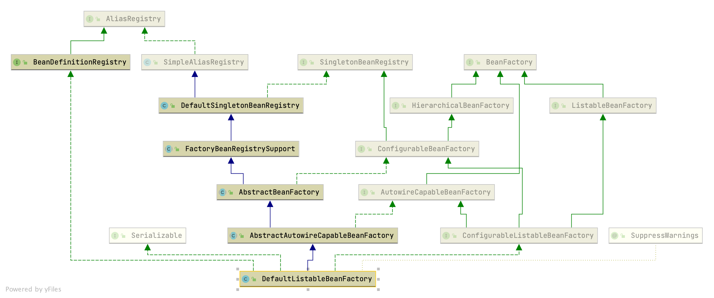
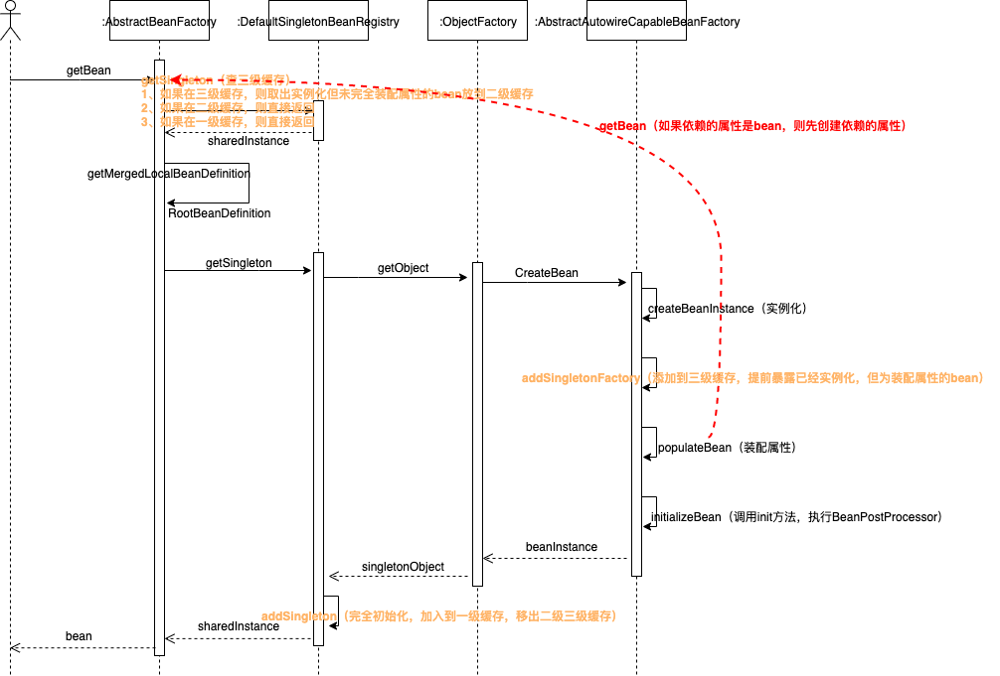
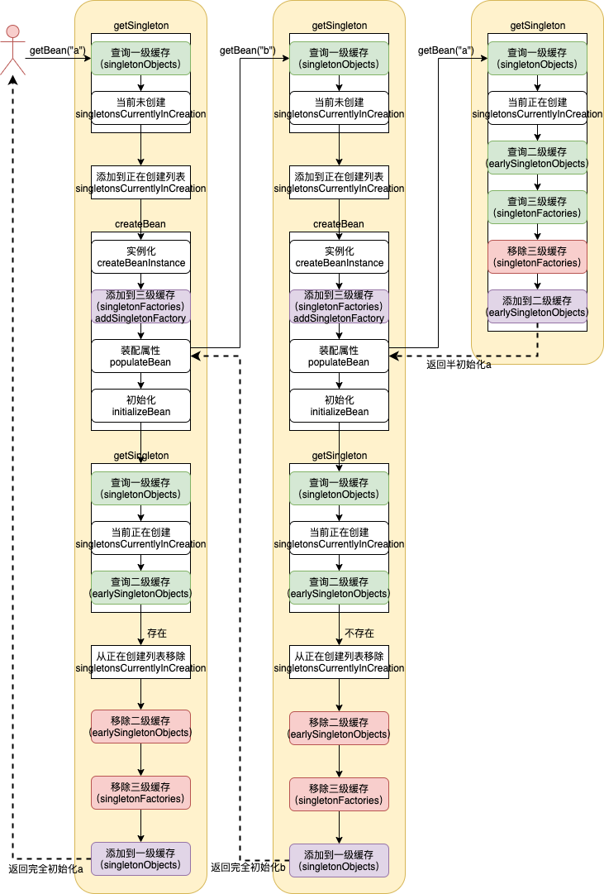
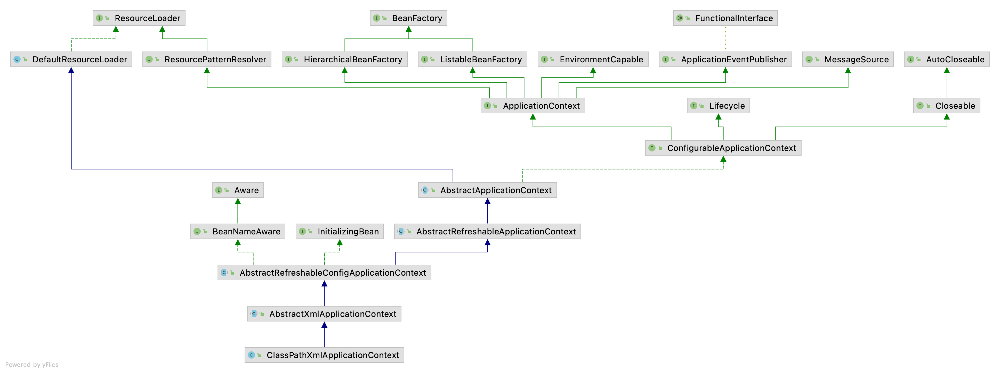

# 源码编译

## 下载源码

初始下载

- `https://github.com/spring-projects/spring-framework` fork项目
- `git clone git@github.com:yxyyyt/spring-framework.git` 下载源码到本地
- `git remote -v` 查看远程分支
- `git remote add upstream https://github.com/spring-projects/spring-framework` 关联上游分支
- `git checkout -b 5.0.x-notes remotes/origin/5.0.x` 以远程分支为基础创建新分支

从上游分支获取更新（上游分支名称改变）

- `git fetch upstream`
- `git checkout main`
- `git rebase upstream/main`
- `git push origin main` 
- `git branch -d master` 删除本地分支（github默认分支需要提前更新，如master更新为main）
- `git push origin -d master` 删除远程分支


## 编译

- `gradlew :spring-oxm:compileTestJava` 下载jar，时间较长

- `open | spring-framework` idea打开项目，下载jar，时间较长

  - 如果下载缓慢修改spring-framework/build.gradle，`gradle | spring | Reload Gradle Project`

    ```groovy
    repositories {
    		mavenCentral()
    		maven { url "https://repo.spring.io/libs-spring-framework-build" }
        maven { url "http://maven.aliyun.com/nexus/content/groups/public/" }
    	}
    ```

  - 构建完成后 git Rollback 恢复build.gradle

- 如果加载到后面发现 spring-aspects 模块依赖报错，spring-aspects 右键 | unload module


# spring-beans

## 核心类




- `SimpleAliasRegistry` 维护容器中Bean的别名，使用map作为alias的缓存
  - 实现了AliasRegistry接口，定义对别名的增删改操作
- `DefaultSingletonBeanRegistry` 
  - SingletonBeanRegistry接口定义对单例的注册和获取
  - 维护**singletonObjects**、**earlySingletonObjects**、**singletonFactories**、**singletonsCurrentlyInCreation**
  - getSingleton核心逻辑，支持singleton三级缓存
- `FactoryBeanRegistrySupport` 维护由FactoryBean导出的Bean
- `AbstractBeanFactory` 
  - BeanFactory接口，定义获取bean及bean的各种属性
  - HierarchicalBeanFactory继承BeanFactory接口，增加对Parent factory的支持
  - ConfigurableBeanFactory接口，提供配置Factory的各种方法
  - getBean核心逻辑
- `AbstractAutowireCapableBeanFactory` 
  - AutowireCapableBeanFactory接口，提供创建bean，自动注入，初始化，应用bean的后处理器
  - createBean核心逻辑
    - 调用构造函数实例化
    - 将ObjectFactory加入到三级缓存，此时Bean已实例化
    - 装配Bean属性
    - 调用init方法，执行BeanPostProcessor
    - 注册DisposableBean
  - 忽略依赖接口BeanNameAware，BeanFactoryAware，BeanClassLoaderAware
- `DefaultListableBeanFactory`  默认实现
  - BeanDefinitionRegistry接口，定义对BeanDefinition的增删改操作
  - ListableBeanFactory接口，根据各种条件获取bean的配置清单
  - ConfigurableListableBeanFactory接口，BeanFactory的配置清单，指定忽略类型和接口


## Bean加载

### 数据准备

#### 解析默认命名空间

委托给 <font color=red>`XmlBeanDefinitionReader`</font>，调用其loadBeanDefinitions方法

- 委托 `DefaultDocumentLoader` 读取，将Resource文件转换为Document
- 委托 `DefaultBeanDefinitionDocumentReader` 解析Document元素，逐个生成GenericBeanDefinition，并向BeanFactory注册BeanDefinition
  - 委托 `BeanDefinitionParserDelegate` 解析Document**默认命名空间**的元素，创建 **GenericBeanDefinition** 填充XML元数据，并包装为BeanDefinitionHolder
    - 有三类自定义元素：1、同beans同级的根节点；2、同bean同级的节点；3、bean的自定义属性，或自定义的嵌套元素，装饰bean节点
  - 委托 `BeanDefinitionReaderUtils` ，调用 `DefaultListableBeanFactory` 的registerBeanDefinition方法向BeanFactory注册BeanDefinition


#### 自定义标签解析

- 验证解析XML，生成Document对象

  - 由 `ResourceEntityResolver` 通过 publicId 和 SystemId 获取 XML 规约

    ```bash
    # URI
    http://www.sciatta.com/schema/user 
    # URL / systemId
    http://www.sciatta.com/schema/user/user.xsd
    ```

    - 查找 **META-INF/spring.schemas** 通过SystemId 获取**本地配置**

      ```properties
      http\://www.sciatta.com/schema/user/user.xsd=META-INF/user.xsd
      ```

- 分析Document解析自定义元素，生成BeanDefinition

  - 由  `BeanDefinitionParserDelegate` 解析自定义元素

    - `DefaultNamespaceHandlerResolver` 通过 URI 查找**META-INF/spring.handlers** 获取 NamespaceHandler **扩展实现**，并调用init方法注册自定义元素和与之对应的**解析器实现**用于后续解析元素

      ```properties
      http\://www.sciatta.com/schema/user=com.sciatta.spring.beans.tests.BeanFactoryTests.UserNamespaceHandler
      ```

    - 调用 NamespaceHandler 解析自定义元素

      - 委托 `BeanDefinitionParser` 自定义解析器解析元素


### 注册

- 调用 `DefaultListableBeanFactory` 的registerBeanDefinition方法注册BeanDefinition
  - 对GenericBeanDefinition作必要的验证，如有Override方法，必须要有factoryMethodName
  - 在**beanDefinitionMap**缓存中注册GenericBeanDefinition
- 调用 `DefaultListableBeanFactory` 的registerAlias方法注册bean的别名


## Bean获取

### 核心流程




###三级缓存

A引用B，B引用A，形成循环依赖

- 循环调用（方法）不支持
- 循环依赖
  - 构造器不支持
  - setter支持


三级缓存

- 一级缓存 `singletonObjects` 缓存完全初始化的bean
- 二级缓存 `earlySingletonObjects` 缓存未完全填充属性的bean，解决循环依赖问题
- 三级缓存 `singletonFactories` 缓存可以获取未完全填充属性bean的ObjectFactory，前提是bean已经实例化，解决循环依赖问题




# spring-context

## 核心类




## 核心流程

分析ClassPathXmlApplicationContext创建核心流程。


### 环境准备

- 调用 `initPropertySources` 初始化自定义属性源
  - 可以调用 `getEnvironment()` 获取Environment，调用customizePropertySources方法初始化自定义属性源
  - 可以调用 `getEnvironment()` 获取Environment，调用setRequiredProperties方法设置必须检验环境变量
- 调用 `getEnvironment().validateRequiredProperties()` 校验必须存在的环境变量，若不存在，提前抛出异常


### 加载BeanFactory

- 创建DefaultListableBeanFactory，委托XmlBeanDefinitionReader**加载所有BeanDefinition**，然后将beanFactory赋值给ApplicationContext的私有变量持有


### 扩展BeanFactory

- SPEL支持
- 注册自定义属性编辑器
  - 调用BeanFactory的addPropertyEditorRegistrar方法，为BeanFactory增加ResourceEditorRegistrar，其重要的方法就是registerCustomEditors方法，可以注册自定义属性编辑器
    - 在Bean实例化后，会调用BeanFactory的registerCustomEditors，会遍历所有ResourceEditorRegistrar，批量向PropertyEditorRegistry（BeanWrapperImpl）注册PropertyEditor
    - 会遍历customEditors向PropertyEditorRegistry注册PropertyEditor
  - 扩展自定义属性编辑器，在配置文件中注册CustomEditorConfigurer，其实现了**BeanFactoryPostProcessor**接口
    - 向propertyEditorRegistrars注入自定义PropertyEditorRegistrar
    - 向customEditors注入自定义PropertyEditor
- 注册ApplicationContextAwareProcessor，其实现了**BeanPostProcessor**接口，若Bean实现了Aware相关的接口，则为其注入相应的Bean，如实现了ApplicationContextAware接口，为Bean注入applicationContext
- 设置忽略自动装配接口，会在ApplicationContextAwareProcessor中设置
- 设置自动装配接口
- 向BeanFactory注册环境变量相关Bean


### 自定义扩展BeanFactory

- postProcessBeanFactory方法可以由子类实现


### 激活BeanFactoryPostProcessor

- 通过硬编码或配置文件方式**获取**BeanFactoryPostProcessor，并通过**调用**其方法实现自定义BeanDefinition
- BeanFactoryPost包括硬编码和配置文件两种设置方式
  - 硬编码按照注册顺序执行
  - 配置文件按照实现排序接口排序，实现了PriorityOrdered优先于实现了Ordered先执行，实现了Ordered优先于没有实现排序接口的先执行
  - 硬编码执行优先于配置文件方式
- BeanDefinitionRegistryPostProcessor继承BeanFactoryPostProcessor
  - BeanDefinitionRegistryPostProcessor类优先于BeanFactoryPostProcessor类执行
  - postProcessBeanDefinitionRegistry方法先于postProcessBeanFactory方法执行


### 注册BeanPostProcessor

- 通过硬编码注册BeanPostProcessor，按照注册顺序执行
- 通过配置文件注册BeanPostProcessor
  - 按照实现排序接口排序，实现了PriorityOrdered优先于实现了Ordered先执行，实现了Ordered优先于没有实现排序接口的先执行
  - 注册MergedBeanDefinitionPostProcessor（继承BeanPostProcessor接口），如果之前已经注册，则移除，之后一律注册到list尾部
- 硬编码执行优先于配置文件方式


### 初始化消息资源

- bean的name规定为messageSource
  - 从配置文件获得
    - 一种实现ResourceBundleMessageSource，设置basenames
  - 未定义，提供默认实现DelegatingMessageSource，支持委托给parent获得message
- 通过ApplicationContext的getMessage方法获取消息，其委托给MessageSource实现类，其委托给ResourceBundle实现类，对于properties文件，实现类是PropertyResourceBundle


### 初始化ApplicationEventMulticaster和注册监听器

- 初始化ApplicationEventMulticaster
  - bean的name规定为applicationEventMulticaster
  - 从配置文件获得
  - 未定义，提供默认实现SimpleApplicationEventMulticaster
- 向ApplicationEventMulticaster注册监听器
  - 通过硬编码注册ApplicationListener
  - 通过配置文件注册listenerBeanName
- 通过ApplicationContext的publishEvent方法广播事件
  - 调用ApplicationEventMulticaster的multicastEvent方法
  - 遍历监听器，调用监听器的onApplicationEvent方法，由特定的监听器处理事件
    - 异步非阻塞调用，由线程池调用
    - 同步调用


### 实例化所有非延迟初始化单例Bean

- 调用BeanFactory的freezeConfiguration方法，冻结所有配置定义
- 调用BeanFactory的preInstantiateSingletons方法，实例化所有非延迟初始化的单例Bean


### 完成Refresh

- 初始化LifecycleProcessor
  - bean的name规定为lifecycleProcessor
  - 从配置文件获得，需要实现LifecycleProcessor接口
  - 未定义，提供默认实现DefaultLifecycleProcessor
- 刷新LifecycleProcessor
  - 获取实现Lifecycle或SmartLifecycle接口的Bean
  - 按节点启动Lifecycle
- 向ApplicationEventMulticaster发布ContextRefreshedEvent事件


# spring-aop

## 标签解析

- `spring-aop/resources/META-INF/spring.schemas` 是URL同本地xsd对应关系，用于验证aop标签

- `spring-aop/resources/META-INF/spring.handlers` 是URI同NamespaceHandler对应关系，org.springframework.aop.config.AopNamespaceHandler负责注册aop元素相应的解析器

  - <font color=red>`aspectj-autoproxy` 对应 AspectJAutoProxyBeanDefinitionParser</font>，目的是为了创建并注册AnnotationAwareAspectJAutoProxyCreator这个BeanPostProcessor，为Bean创建动态代理

    - 创建BeanDefinition

      name=org.springframework.aop.config.internalAutoProxyCreator

      class=**AnnotationAwareAspectJAutoProxyCreator**

    - 设置proxy-target-class和expose-proxy属性

    - 注册BeanDefinition


## 模型

- AnnotationAwareAspectJAutoProxyCreator对应ProxyConfig，包含多个Advisor
- Advisor对应Aspect，包含一个Pointcut，和一个与其对应的Advice
- Advice有的实现了MethodIntercept；如果没有实现，则需要相应的Adapter适配为MethodIntercept
- Joinpoint对应调用的目标方法，调用前会执行MethodInvocation内的MethodInterceptor拦截器链，MethodInvocation实现了责任链模式


## 创建AOP代理

###ApplicationContext注册AOP核心类

- **AnnotationAwareAspectJAutoProxyCreator**实现了BeanPostProcessor接口
- ApplicationContext初始化过程中，创建AnnotationAwareAspectJAutoProxyCreator类型的Bean，然后向BeanFactory注册BeanPostProcessor
  - 其实现了InstantiationAwareBeanPostProcessor接口，设置BeanFactory的**hasInstantiationAwareBeanPostProcessors**属性为true


### ApplicationContext实例化所有单例Bean

- AnnotationAwareAspectJAutoProxyCreator

  - Bean已经创建，从一级缓存中直接获取

- 待功能增强的业务类UserService创建代理

  - 在实例化前调用resolveBeforeInstantiation方法，参数hasInstantiationAwareBeanPostProcessors为true

    - 调用AnnotationAwareAspectJAutoProxyCreator的postProcessBeforeInstantiation方法

      1. 判断UserService是否是需要被代理

         如果是基础设施（Advice、Pointcut、Advisor、AopInfrastructureBean），或者有@Aspect注解，不需要被代理；

         <font color=red>找出所有的Advisor（包括配置文件Advisor和@Aspect注解包含的Advisor，会被缓存）</font>遍历，如果是AspectJPointcutAdvisor，并且所属advice的AspectName是BeanName，也不需要被代理。

      2. **TargetSourceCreator存在，才会在此处创建代理；否则，不会创建bean**

    - 如果bean创建成功了，则会执行注册的BeanPostProcessor的postProcessAfterInitialization方法；代理创建成功，返回；否则，继续走后续的doCreateBean创建流程

  - 实例化Bean包装为BeanWrapper

  - 装配Bean属性

  - 调用AnnotationAwareAspectJAutoProxyCreator的postProcessBeforeInitialization方法

    - 是的，什么都没有做

  - 调用init初始化方法

  - 调用AnnotationAwareAspectJAutoProxyCreator的postProcessAfterInitialization方法

    - 创建custom TargetSource，已经被代理过
    - 不需要被代理，直接返回
    - 如果是基础设施，或是AspectJPointcutAdvisor，不需要被代理，直接返回
    - 获取可以匹配bean的所有Advisor
      1. 在所有候选Advisor中，用Pointcut表达式匹配class的类和方法，只要类匹配，方法有一个匹配，则此Advisor为可以匹配bean的Advisor
      2. 在Advisor列表首添加DefaultPointcutAdvisor
    - **创建代理**
      - 构建ProxyFactory
      - 委托DefaultAopProxyFactory创建代理
        - 创建JdkDynamicAopProxy，基于JDK动态代理，<font color=red>实现了InvocationHandler接口</font>
          - 代理接口增加SpringProxy、Advised、DecoratingProxy
          - 委托java.lang.reflect.Proxy的newProxyInstance方法创建代理类
        - 创建ObjenesisCglibAopProxy

- @Aspect定义的UserServiceAspect

  - 在实例化前调用resolveBeforeInstantiation方法，参数hasInstantiationAwareBeanPostProcessors为true

    - 调用AnnotationAwareAspectJAutoProxyCreator的postProcessBeforeInstantiation方法

      1. 判断UserServiceAspect是否是需要被代理

         @Aspect注解是基础设施，**不需要被代理**

    - 继续走后续的doCreateBean创建流程

  - 实例化Bean包装为BeanWrapper

  - 装配Bean属性

  - 调用AnnotationAwareAspectJAutoProxyCreator的postProcessBeforeInitialization方法

  - 调用init初始化方法

  - 调用AnnotationAwareAspectJAutoProxyCreator的postProcessAfterInitialization方法

    - 不需要被代理，直接返回


### 调用代理对象的方法

- 调用JdkDynamicAopProxy的invoke方法，传入proxy，method，args
  - 遍历Advisor集合，判断是否和调用method匹配，如果匹配，从Advisor中获取Advice，Advice即MethodInterceptor（或适配为MethodInterceptor），即获取MethodInterceptor拦截器链
    - 如果Advice是MethodInterceptor的实例，则返回；包括：AspectJAfterAdvice，AspectJAroundAdvice
    - 否则，需要将Advice适配为相应的MethodInterceptor，包括：AfterReturningAdvice（适配为AfterReturningAdviceInterceptor），MethodBeforeAdvice（适配为MethodBeforeAdviceInterceptor），ThrowsAdvice（适配为ThrowsAdviceInterceptor）
  - 创建MethodInvocation，实现类是ReflectiveMethodInvocation（责任链模式，递归方式实现），调用proceed方法
    - 逐个调用MethodInterceptor


# spring-jdbc

## 更新操作

- 初始化JdbcTemplate，必须使用DataSource初始化
- 调用JdbcTemplate的**update**方法
  - 把参数封装为ArgumentPreparedStatementSetter
  - 把SQL封装为SimplePreparedStatementCreator
  - 执行execute核心模板方法
    - 从DataSource获取Connection
    - 通过SimplePreparedStatementCreator创建PreparedStatement
    - 设置PreparedStatement参数，设置FetchSize、MaxRows、QueryTimeout
    - <font color=red>调用PreparedStatementCallback回调扩展</font>
      - 通过ArgumentPreparedStatementSetter设置PreparedStatement参数
      - **调用PreparedStatement的executeUpdate执行SQL**
    - 处理PreparedStatement的Warning，默认只输出日志；否则，可以抛出SQLWarningException运行时异常
    - 关闭PreparedStatement
    - 关闭Connection


## 查询操作

- 调用JdbcTemplate的**query**方法
  - execute核心逻辑和调用update方法一致，区别被封装在了<font color=red>QueryStatementCallback回调扩展</font>中
    - **调用Statement的executeQuery执行SQL**
    - 返回的ResultSet由RowMapperResultSetExtractor解析，其封装了ResultSet的遍历过程
      - <font color=red>每一行记录由RowMapper负责解析</font>，RowMapper是客户端传入的回调扩展，封装了将单行记录转换为POJO的逻辑
    - 关闭ResultSet

