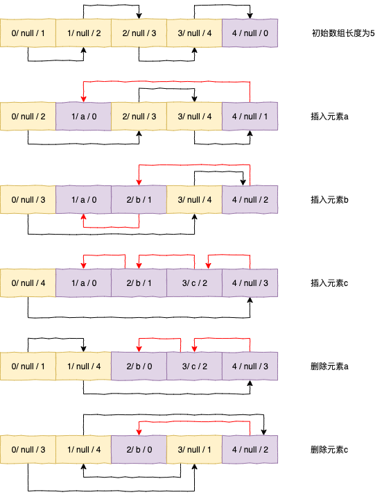
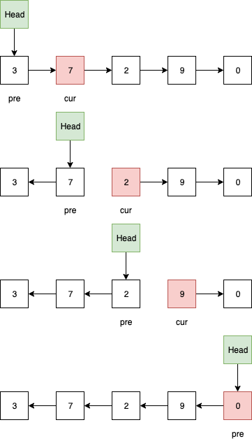

# 线性表

## 链表

### 静态链表

基于数组实现，元素包括value和cursor，其中cursor指向数组中的任意一个元素的索引位置。实现的思路是创建两条虚拟链表，一条是备用链表，作用是连接未使用的空间；另一条是链表，作用是连接链表的各个节点。

- 数组的第一个元素保留，作为备用链的头节点；数组的最后一个元素保留，作为链表的头结点
- 链表是否为空，判断链表的头结点，即数组的最后一个元素的curse是否等于0，为0则链表为空
- 链表是否为满，假设底层实现的数组不支持动态扩充，判断备用链表的头结点是否指向数组的最后一个元素，即curse等于n-1，则链表为满





### 单链表反转

- `cur` 指向待反转节点，`pre` 指向待反转节点的前驱节点

- 反转过程

  ```java
  head.next = cur;
  cur = cur.next;
  head.next.next = pre;
  pre = head.next;
  ```

  



### 链表中环的检测

