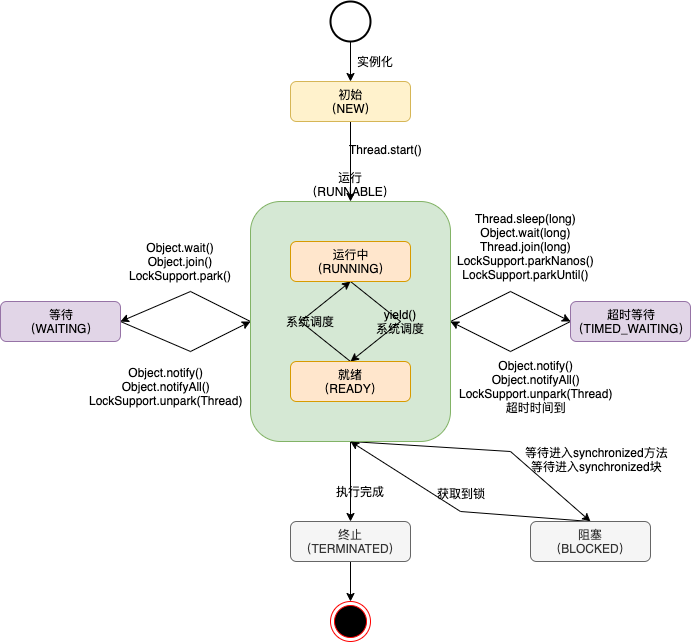

# 多线程基础

## 线程创建过程


## 线程状态




**线程状态**

- `Thread.sleep` <font color=red>当前线程调用此方法，释放CPU，不释放对象锁。作用：给其他线程执行机会的最佳方式。</font>
- `Thread.yield` 当前线程调用此方法，释放CPU，不释放对象锁。作用：让相同优先级的线程轮流执行，但并不保证一定会轮流执行。实际中无法一定保证yield达到让步目的，因为让步的线程还有可能被线程调度程序再次选中。yield不会导致阻塞。该方法与sleep类似，只是不能由用户指定暂停多长时间。
- `Object#join` 当前线程里调用其它线程 t 的 join 方法，当前线程进入WAITING/TIMED_WAITING 状态，当前线程不会释放已经持有的非t对象锁，但可以释放持有的t对象锁，相当于 `t.wait()`。线程 t 执行完毕或者 millis 时间到，当前线程进入就绪状态。
- `Object#wait` <font color=red>当前线程调用对象的wait方法，当前线程释放对象锁，进入等待队列。</font>依靠 notify/notifyAll 唤醒或者 wait(long timeout) 到timeout时间自动唤醒。
- `Object#notify` 唤醒在此对象监视器上等待的单个线程，选择是任意性的。notifyAll 唤醒在此对象监视器上等待的所有线程。


**中断和异常**

- 线程内部自己处理异常，不溢出到外层。

- 如果线程被 **Object.wait，Thread.join 和 Thread.sleep** 三种方法之一阻塞，此时调用该线程的interrupt() 方法，那么该线程将抛出一个 InterruptedException 中断异常（该线程必须事先预备好处理此异常），从而提早地终结被阻塞状态。如果线程没有被阻塞，这时调用interrupt() 将不起作用，直到执行到 wait()，sleep() 或 join() 时，才马上会抛出InterruptedException。

  **清除中断标志有两种情况：**

  - 遇到wait()，sleep() 或 join() 时，捕获异常，此时的中断标志被清除
  - Thread.interrupted，当中断时返回true，同时清除中断标志

- 如果是计算密集型的操作，可分段处理，每个片段检查状态是否需终止。


## 并发性质

### 原子性

原子操作，对基本数据类型的变量的读取和赋值操作是原子性操作，即这些操作是不可被中断的，要么执行，要么不执行。

### 可见性

对于可见性，Java 提供了 volatile 关键字来保证可见性。当一个共享变量被 volatile 修饰时，它会保证修改的值会立即被更新到主存，当有其他线程需要读取时，它会去内存中读取新值（**注意JVM的副本机制**）。另外，通过 synchronized 和 Lock 也能够保证可见性，synchronized 和 Lock 能保证同一时刻只有一个线程获取锁然后执行同步代码，并且在释放锁之前会将对变量的修改刷新到主存当中。

**volatile**

<font color=red>volatile 并不能保证原子性。</font>

- 读取：每次读取都强制从主内存刷数据

- 使用场景：单个线程写；多个线程读

- 原则：能不用就不用，不确定的时候也不用

- 替代方案：Atomic原子操作类

- 内存屏障

  ```java
  // 1和2不会重排到3后面
  // 4和5不会重排到3前面
  // 同时可以保证1和2的结果对3、4和5可见
  x=2; // 1
  y=0; // 2
  flag=true;	// 3 flag是volatile
  x=4; // 4
  y=-1 // 5
  ```

  

**synchronized**

同步块比同步方法更高效，尽量缩小同步范围，提高并发度。同步块中用于控制同步的对象，尽量用小对象，不使用this。


### 有序性

Java允许编译器和处理器对指令进行重排序，但是重排序过程不会影响到单线程程序的执行，却会影响到多线程并发执行的正确性。可以通过volatile关键字来保证一定的”有序性“（通过synchronized 和 Lock保证）。

happens-before原则（先行发生原则）：

1. 程序次序规则：一个线程内，按代码先后顺序
2. 锁定规则：一个unLock操作先行发生于后面对同一个锁的lock操作
3. Volatile变量规则：对同一个变量的写操作先行发生于后面对这个变量的读操作
4. 传递规则：如果操作A先行发生于操作B，而操作B又先行发生于操作C，则可以得出A先于C
5. 线程启动规则：Thread对象的start()方法先行与此线程的每一个动作
6. 线程中断规则：对线程interrupt()方法的调用先行发生于被中断线程的代码检测到中断事件的发生
7. 线程终结规则：线程中所有的操作都先行发生于线程的终止检测，通过Thread.join()方法（结束阻塞）、Thread.isAlive()的返回值检测到线程已经终止执行
8. 对象终结规则：一个对象的初始化完成先行发生于他的finalize()方法的开始


## ThreadLocal

- 线程本地变量
- 场景：每个线程一个副本
- <font color=red>不改方法签名静默传参</font>。可以看做是 Context 模式，减少显式传递参数
- **及时进行清理**，防止内存泄漏


# JUC基础

## 锁机制类

### 问题

synchronized 加锁；wait / notify 解锁/加锁

1. 同步块的阻塞无法中断（不能 Interruptibly） 
2. 同步块的阻塞无法控制超时（无法自动解锁）
3. 同步块无法异步处理锁（即不能立即知道是否可以拿到锁）
4. 同步块无法根据条件灵活的加锁解锁（即只能跟同步块范围一致）


### Lock更自由的锁

1. 使用方式灵活可控
2. 性能开销小
3. 锁工具包: java.util.concurrent.locks


### ReadWriteLock读写锁

ReadWriteLock管理一组锁，分别是一个读锁和一个写锁。<font color=red>写锁（独占锁），在写线程运行的时候，其他的读、写线程阻塞；读锁（共享锁），在没有写锁的时候，多个读线程可以同时持有读锁。通过锁分离，提高并发性</font>。所有读写锁的实现必须确保写操作对读操作的内存影响。每次只能有一个写线程，但是同时可以有多个线程并发地读数据。

<font color=red>ReadWriteLock 适用于读多写少的并发情况</font>。


### Condition

通过 Lock.newCondition()创建。可以看做是 Lock 对象上的信号。类似于 wait/notify，相应api为 await/signal。


### LockSupport锁当前线程

LockSupport 类似于 Thread 类的静态方法，专门用于处理本线程。<font color=red>阻塞当前线程，但不释放锁资源</font>。

unpark需要由其他线程调用，并且以被park的线程作为参数。因为一个被park的线程，无法自己唤醒自己，所以需要其他线程来唤醒。


### 锁的区分

- 可重入锁：同一线程可以重复获取同一个锁
- 公平锁 / 非公平锁
  - 没有获得锁的线程进入等待队列，等待时间久的线程（先入队列）优先获得锁，称为公平锁
  - 所有等待的线程都有机会获得锁，称为非公平锁
- 乐观锁 / 悲观锁
  - 先访问资源，若已被修改，则自旋重试。不上锁，称为乐观锁
  - 访问资源之前，先上锁，其他线程无法访问。修改后再释放锁，称为悲观锁


### 最佳实践

1. 永远只在更新对象的成员变量时加锁
2. 永远只在访问可变的成员变量时加锁
3. 永远不在调用其他对象的方法时加锁


<font color=red>最小使用锁</font>

1. 降低锁范围：锁定代码的范围/作用域
2. 细分锁粒度：将一个大锁，拆分成多个小锁


## 并发原子类

### 问题

sum++多线程安全问题。对于基础数据类型的并发补充实现，线程安全。


### Atomic工具类

1. java.util.concurrent.atomic

2. AtomicInteger

3. 无锁技术的底层实现

   1. volatile 保证读写操作都可见（注意不保证原子）
   2. 使用 CAS 指令，作为乐观锁实现，通过自旋重试保证写入。
      - Unsafe API - Compare-And-Swap
      - CPU 硬件指令支持: CAS 指令

4. 有锁 or 无锁？

   CAS 本质上没有使用锁。并发压力跟锁性能的关系：

   - 压力非常小，性能本身要求就不高，有锁、无锁差别不明显
   - 压力一般的情况下，无锁更快，大部分都一次写入

   - <font color=red>压力非常大时，自旋导致重试过多，资源消耗很大。有锁较好。</font>


### LongAdder

通过分段思想对原子类AtomicLong改进

1. AtomicInteger 和 AtomicLong 里的 value 是所有线程竞争读写的热点数据
2. 将单个 value 拆分成跟线程一样多的数组 Cell[]
3. 每个线程写自己的 Cell[i]++，最后对数组求和

多路归并思想

- 快排
- G1GC
- ConcurrentHashMap
- MapReduce


## 信号量工具类

### 问题

多个线程间的协作，可以通过 wait/notify、Lock/Condition，但如果需要更为精细化的控制，则实现起来非常复杂还容易出错。

更复杂的应用场景

- 我们需要控制实际并发访问资源的并发数量
- 我们需要多个线程在某个时间同时开始运行
- 我们需要指定数量线程到达某个状态再继续处理


### AQS

AbstractQueuedSynchronizer，即队列同步器。它是构建锁或者其他同步组件的基础（如Semaphore、CountDownLatch、ReentrantLock、ReentrantReadWriteLock），是JUC并发包中的核心基础组件。

- AbstractQueuedSynchronizer：抽象队列式的同步器
- 两种资源共享方式：独占 OR 共享，子类负责实现公平 OR 非公平


### Semaphore信号量

- 准入数量 N（限流）
- N =1 则等价于独占锁

Semaphore的本质是共享锁，限制同时访问锁的数量。


### CountdownLatch

场景：Master 线程等待 Worker 线程把任务执行完

类似于fork/join的多线程处理，master线程阻塞，等待多个slave线程并发执行完成后，再汇总统计结果。


### CyclicBarrier

场景：任务执行到一定阶段，等待其他任务对齐，对齐之后一起先下运行

与CountdownLatch区别

- CountdownLatch递减；CyclicBarrier递增
- CountdownLatch在主线程通过await阻塞，类似join；CyclicBarrier不在主线程阻塞，而是在被调用线程处通过await阻塞，等待所有线程对齐，**由最后一个进入barrier的线程执行barrierAction（Runnable）**
- 对于从阻塞状态恢复的线程，CountdownLatch不可重复利用，而CyclicBarrier可以reset重复利用（循环屏障）


## 线程池

线程池从功能上看，就是一个<font color=red>任务执行器</font>

### Excutor

执行者，顶层接口


### ExcutorService

接口 API

- shutdown()：停止接收新任务，原来的任务继续执行

- shutdownNow()：停止接收新任务，原来的任务停止执行

- awaitTermination(long timeOut, TimeUnit unit)：当前线程阻塞
- submit：有返回值，用 Future 封装，异常可以被catch
- execute方法：无返回值，无法cache异常


### ThreadFactory

线程工厂


### Excutors

工具类

- newSingleThreadExecutor
  创建一个单线程的线程池。这个线程池只有一个线程在工作，也就是相当于单线程串行执行所有任务。如果这个唯一的线程因为异常结束，那么会有一个新的线程来替代它。此线程池保证所有任务的执行顺序按照任务的提交顺序执行。

- newFixedThreadPool
  创建固定大小的线程池。每次提交一个任务就创建一个线程，直到线程达到线程池的最大大小。线程池的大小一旦达到最大值就会保持不变，如果某个线程因为执行异常而结束，那么线程池会补充一个新线程。

  <font color=red>先保证核心线程数处理任务，多余的任务置入队列，再多余的任务则新增线程处理直到达到最大线程数，再多余的任务可以根据丢弃策略处理。算法同时满足CPU密集和IO密集型任务处理。</font>

- newCachedThreadPool
  创建一个可缓存的线程池。如果线程池的大小超过了处理任务所需要的线程，那么就会回收部分空闲（60秒不执行任务）的线程，当任务数增加时，此线程池又可以智能的添加新线程来处理任务。此线程池不会对线程池大小做限制，线程池大小完全依赖于操作系统（或者说JVM）能够创建的最大线程大小。

  适用于大量可以快速处理的小任务，提高并发度。

- newScheduledThreadPool
  创建一个大小无限的线程池。此线程池支持定时以及周期性执行任务的需求。
  - `schedule` 延迟执行一次性任务
  - `scheduleAtFixedRate` 延迟+定时执行任务，period：本次开始时间-上次开始时间
  - `scheduleWithFixedDelay` 延迟+定时执行任务，period：本次开始时间-上次结束时间


### ThreadPoolExecutor

具体线程池实现类

```java
public ThreadPoolExecutor(int corePoolSize,
                              int maximumPoolSize,
                              long keepAliveTime,
                              TimeUnit unit,
                              BlockingQueue<Runnable> workQueue,
                              ThreadFactory threadFactory,
                              RejectedExecutionHandler handler)
```

**线程池参数**

- corePoolSize 线程池中线程的数量，即使是空闲状态
- maximumPoolSize 线程池中允许的最大线程数量
- keepAliveTime 当线程池中的线程数量超过了corePoolSize，多余的线程在结束前等待任务的最大时间
- unit keepAliveTime参数的时间单位
- BlockingQueue 缓存队列
  1. ArrayBlockingQueue：规定大小的 BlockingQueue，其构造必须指定大小。其所含的对象是 FIFO 顺序排序的
  2. LinkedBlockingQueue：大小不固定的 BlockingQueue，若其构造时指定大小，生成的 BlockingQueue 有大小限制，不指定大小，其大小由 Integer.MAX_VALUE 来决定。其所含的对象是 FIFO 顺序排序的
  3. PriorityBlockingQueue：类似于 LinkedBlockingQueue，但是其所含对象的排序不是 FIFO，而是依据对象的自然顺序或者构造函数的 Comparator 决定
  4. SynchronizedQueue：特殊的 BlockingQueue，对其的操作必须是放和取交替完成
- ThreadFactory 创建自定义新线程
- RejectedExecutionHandler 拒绝策略
  1. ThreadPoolExecutor.AbortPolicy：丢弃任务并抛出 RejectedExecutionException 异常（**默认**）
  2. ThreadPoolExecutor.DiscardPolicy：丢弃任务，但是不抛出异常
  3. ThreadPoolExecutor.DiscardOldestPolicy：丢弃队列最前面的任务，然后重新提交被拒绝的任务
  4. ThreadPoolExecutor.CallerRunsPolicy：由调用线程（提交任务的线程）处理该任务

**线程池方法**

- `execute(Runnable command)` 方法逻辑

  - 当前线程数小于corePoolSize时，创建工作线程（延迟创建）
  - 当前线程数大于等于corePoolSize时，保存在阻塞队列中
  - 阻塞队列容量满，则继续创建工作线程，直到maximumPoolSize
  - 当线程数大于等于maximumPoolSize时，多余任务执行拒绝策略处理器

  <font color=red>当大于等于corePoolSize时，任务首先保存在阻塞队列中。适用于CPU密集型任务，因为队列中的任务可以被快速获取和执行不至于大量积压任务，并且创建大量的线程没有用，频繁切换线程上下文会导致性能下降。之后，创建工作线程直到满足maximumPoolSize，适用于IO密集型任务，当线程处理IO时可以释放CPU资源，多余的线程可以充分打满CPU提高利用率。</font>


### Callable/Future/FutureTask/CompletableFuture

- Callable可返回结果、可抛出异常的<font color=red>任务</font>；Runnable没有返回结果、不会抛出异常。任务是由线程执行的基本单元
- Future接口，表示一个异步计算<font color=red>结果</font>，提供检查计算是否完成、取消计算任务、获取计算结果
- FutureTask<font color=red>可取消的异步计算任务</font>。本质是一个供线程执行的任务，因为实现了Runnable接口；同时，其还实现了Future接口，因此可以异步获得计算结果
  - 被调用线程运行时，调用FutureTask的run方法，其委托调用Callable执行任务
  - 可以通过FutureTask异步获取任务执行结果
- CompletableFuture 异步、回调、组合


## 并发集合类

线程安全是写冲突和读写冲突导致的。最简单办法就是，读写都加锁。

- ArrayList 的方法都加上 synchronized -> Vector

- Collections.synchronizedList，强制将 List 的操作加上同步

- Arrays.asList，不允许添加删除，但是可以 set 替换元素

- Collections.unmodifiableList，不允许修改内容，包括添加删除和 set


### CopyOnWriteArrayList

<font color=red>读写分离，最终一致。容忍一定读取数据的滞后情况，但可以保证正确性。</font>

- 无锁并发读
- 写加锁
  - 将原容器拷贝一份，写操作作用在新副本上，需要加锁。此过程若有读操作，则会作用在原容器上
  - 操作完成后，将原容器引用指向新副本。切换过程，用volatile保证切换过程对读线程立即可见


### ConcurrentHashMap

- Java 7

  分段锁，默认16个Segment，降低锁粒度。

  - 根据哈希码高sshift位决定Segment数组的index
  - 根据哈希码决定HashEntry数组的index

- Java 8

  为进一步提高并发性，摒弃了分段锁的方案，而是直接使用一个大的数组。在链表长度到8 & 数组长度到64时，使用红黑树。


# 线程间协作与通信

- 线程间共享
  - static / 实例变量（堆内存）
  - Lock
  - synchronized
- 线程间协作
  - Thread#join
  - Object#wait / notify / notifyAll
  - Future / Callable
  - CountdownLatch
  - CyclicBarrier 