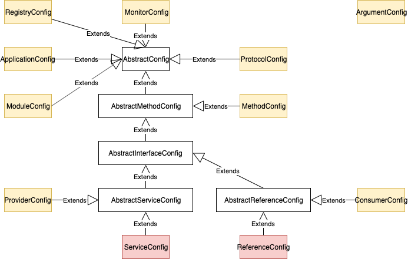

# 目标

以 dubbo 2.6.x 为基础版本学习，在阅读源码过程中达成如下目标：

- 理清核心设计架构
- 可任意扩展
- 成为dubbo的<font color=red>committer</font>


# 总览


- **dubbo-common 公共逻辑模块**：包括 Util 类和通用模型。
- **dubbo-remoting 远程通讯模块**：相当于 Dubbo 协议的实现，如果 RPC 用 RMI协议则不需要使用此包。
- **dubbo-rpc 远程调用模块**：抽象各种协议，以及动态代理，只包含一对一的调用，不关心集群的管理。
- **dubbo-cluster 集群模块**：将多个服务提供方伪装为一个提供方，包括：负载均衡，容错，路由等，集群的地址列表可以是静态配置的，也可以是由注册中心下发。
- **dubbo-registry 注册中心模块**：基于注册中心下发地址的集群方式，以及对各种注册中心的抽象。
- **dubbo-monitor 监控模块**：统计服务调用次数，调用时间的，调用链跟踪的服务。
- **dubbo-config 配置模块**：是 Dubbo 对外的 API，用户通过 Config 使用Dubbo，隐藏 Dubbo 所有细节。
- **dubbo-container 容器模块**：是一个 Standlone 的容器，以简单的 Main 加载 Spring 启动，因为服务通常不需要 Tomcat/JBoss 等 Web 容器的特性，没必要用 Web 容器去加载服务。


- dubbo-bom：dubbo项目本身的所有module依赖声明；dubbo-test和dubbo-demo模块的pom文件会导入
- dubbo-dependencies-bom：dubbo项目依赖第三方lib声明；dubbo-parent模块的pom文件会导入


# 灵活扩展

## JDK原生实现

- `ServiceLoader` 类负责<font color=red>服务发现</font>
- 解析类路径下以 `META-INF/services/` 作为前缀，接口名称作为文件名的文件，文件内部为实现类的完全限定类名，可以多行
- 首先查找已经被解析缓存的实现类，如果没有再去解析文件获取实现类
- 在解析文件过程中，由<font color=red>延迟加载</font>迭代器 `LazyIterator` 负责，目的是迭代过程中如果找到了所需要的实现就可以及时退出迭代过程，未迭代的实现类不会加载，加速了迭代，避免加载不需要的实现类
  - 符合接口名称的文件，逐个文件迭代
  - `Class.forName(cn, false, loader)` 延迟加载类文件到JVM，当 `initialize` 为false时，不会立即执行类的 `static` 块代码，只有类实例化的时候才会执行，也是为了加速遍历


## Dubbo的SPI机制

### 优势

- 延迟加载，通过服务名称明确获得实现类

  加载接口所有实现类的Class后缓存，可以通过服务名称获取服务，只需要实例化此服务Class的实例；而JDK每次查找实现时都需要逐个迭代实现类，然后实例化，可能会实例化大量不需要的服务实现

- 支持扩展的IOC，AOP增强


### 分析

- `ExtensionLoader` 类负责<font color=red>服务发现</font>，待查找实现的类必须是**接口**、必须有**@SPI**注解

  - 接口（扩展点）和 `ExtensionLoader` 一一对应

  - 通过 `ExtensionLoader` 获取 <font color=red>Extension</font>

    1. 加载**所有**扩展Class并缓存

    2. 实例化**特定**扩展并缓存，不需要的不必实例化

       - <font color=red>**支持IOC**</font>：通过 `AdaptiveExtensionFactory` 为特定扩展实例**查找**待注入所需依赖。 `AdaptiveExtensionFactory` 实现了扩展点 `ExtensionFactory` ，其也是一个@SPI扩展点，同样也需要获取扩展。

         1. 加载扩展 `SpiExtensionFactory` 基于SPI机制
         2. 加载Adaptive类型扩展，实现类上有@Adaptive注解 `AdaptiveExtensionFactory` ，**其作为 `ExtensionLoader` 内部的对象工厂**

         以set开头的方法为待注入扩展， `AdaptiveExtensionFactory` 委托 `SpiExtensionFactory` 获取指定扩展点的AdaptiveExtension为其注入，调用@Adaptive标注的方法时通过URL参数可以**动态**获得指定扩展实现并调用

       - <font color=red>**支持wrapper模式AOP增强扩展**</font>：在文件中配置的扩展实现扩展点，并包含以扩展点作为参数的构造函数，对每一个扩展实现功能增强

  - 通过 `ExtensionLoader` 获取 <font color=red>AdaptiveExtension</font>，一个扩展点只能有一个AdaptiveExtension

    - @Adaptive注解的扩展服务实现
    - @Adaptive注解的扩展点方法，为扩展点动态生成Adaptive类，只适配@Adaptive注解的方法，通过URL参数获得扩展名称动态获取target扩展

  - 通过 `ExtensionLoader` 获取 <font color=red>ActivateExtension</font> ，基于条件获取启用的扩展服务列表

    - @Activate注解的扩展服务实现
      - 传入参数Group和Activate的Group匹配
      - 传入参数URL的Parameters和Activate的Value匹配
      - 传入参数values和扩展名称匹配

- 服务发现目录，文件名称为接口名称，内部以 `key=value` 形式组成，key是服务名称，value是扩展服务的完全限定类名；# 后面是注释

  - `META-INF/dubbo/internal/`
  - `META-INF/dubbo/`
  - `META-INF/services/` 兼容Jdk原生SPI服务发现

- 注解

  - @SPI 注解在接口上
    - value属性，表示该接口的默认实现
  - @Adaptive 注解在接口的方法或实现类上
    - 注解位置
      - 类：已实现的适配器类，不提供具体业务支持。用来适配扩展点的其他扩展
      - 方法：动态生成适配器类，通过**URL**携带的参数，来选择对应的扩展实现
    - 参数value是string数组类型，表示可以通过多个元素依次查找实现类
  - @Activate 注解在实现类上，基于条件获取一组扩展
    - group 表示URL中的分组如果匹配的话就激活，可以设置多个
    - value 查找URL中如果含有该key值，存在就会激活
    - before 表示哪些扩展点需要在本扩展点的前面
    - after 表示哪些扩展点需要在本扩展点的后面
    - order 排序信息
  - @DisableInject 注解在接口的set方法上，不会自动注入扩展


# 服务导出

## 基于API

### 核心配置类



### 动态生成类源码

通过 `java -jar arthas-boot.jar --telnet-port 9998 --http-port -1` 测试

#### Protocol

`com.alibaba.dubbo.rpc.Protocol$Adaptive` Protocol适配器扩展服务

```java
package com.alibaba.dubbo.rpc;

import com.alibaba.dubbo.common.URL;
import com.alibaba.dubbo.common.extension.ExtensionLoader;
import com.alibaba.dubbo.rpc.Exporter;
import com.alibaba.dubbo.rpc.Invoker;
import com.alibaba.dubbo.rpc.Protocol;
import com.alibaba.dubbo.rpc.RpcException;

public class Protocol$Adaptive
implements Protocol {
    public Exporter export(Invoker invoker) throws RpcException {
        String string;
        if (invoker == null) {
            throw new IllegalArgumentException("com.alibaba.dubbo.rpc.Invoker argument == null");
        }
        if (invoker.getUrl() == null) {
            throw new IllegalArgumentException("com.alibaba.dubbo.rpc.Invoker argument getUrl() == null");
        }
        URL uRL = invoker.getUrl();
        String string2 = string = uRL.getProtocol() == null ? "dubbo" : uRL.getProtocol();
        if (string == null) {
            throw new IllegalStateException(new StringBuffer().append("Fail to get extension(com.alibaba.dubbo.rpc.Protocol) name from url(").append(uRL.toString()).append(") use keys([protocol])").toString());
        }
        Protocol protocol = ExtensionLoader.getExtensionLoader(Protocol.class).getExtension(string);
        return protocol.export(invoker);
    }

    public Invoker refer(Class class_, URL uRL) throws RpcException {
        String string;
        if (uRL == null) {
            throw new IllegalArgumentException("url == null");
        }
        URL uRL2 = uRL;
        String string2 = string = uRL2.getProtocol() == null ? "dubbo" : uRL2.getProtocol();
        if (string == null) {
            throw new IllegalStateException(new StringBuffer().append("Fail to get extension(com.alibaba.dubbo.rpc.Protocol) name from url(").append(uRL2.toString()).append(") use keys([protocol])").toString());
        }
        Protocol protocol = ExtensionLoader.getExtensionLoader(Protocol.class).getExtension(string);
        return protocol.refer(class_, uRL);
    }

    @Override
    public void destroy() {
        throw new UnsupportedOperationException("method public abstract void com.alibaba.dubbo.rpc.Protocol.destroy() of interface com.alibaba.dubbo.rpc.Protocol is not adaptive method!");
    }

    @Override
    public int getDefaultPort() {
        throw new UnsupportedOperationException("method public abstract int com.alibaba.dubbo.rpc.Protocol.getDefaultPort() of interface com.alibaba.dubbo.rpc.Protocol is not adaptive method!");
    }
}
```


#### ProxyFactory

`com.alibaba.dubbo.rpc.ProxyFactory$Adaptive` ProxyFactory适配器扩展服务

```java
package com.alibaba.dubbo.rpc;

import com.alibaba.dubbo.common.URL;
import com.alibaba.dubbo.common.extension.ExtensionLoader;
import com.alibaba.dubbo.rpc.Invoker;
import com.alibaba.dubbo.rpc.ProxyFactory;
import com.alibaba.dubbo.rpc.RpcException;

public class ProxyFactory$Adaptive
implements ProxyFactory {
    public Object getProxy(Invoker invoker) throws RpcException {
        if (invoker == null) {
            throw new IllegalArgumentException("com.alibaba.dubbo.rpc.Invoker argument == null");
        }
        if (invoker.getUrl() == null) {
            throw new IllegalArgumentException("com.alibaba.dubbo.rpc.Invoker argument getUrl() == null");
        }
        URL uRL = invoker.getUrl();
        String string = uRL.getParameter("proxy", "javassist");
        if (string == null) {
            throw new IllegalStateException(new StringBuffer().append("Fail to get extension(com.alibaba.dubbo.rpc.ProxyFactory) name from url(").append(uRL.toString()).append(") use keys([proxy])").toString());
        }
        ProxyFactory proxyFactory = ExtensionLoader.getExtensionLoader(ProxyFactory.class).getExtension(string);
        return proxyFactory.getProxy(invoker);
    }

    public Object getProxy(Invoker invoker, boolean bl) throws RpcException {
        if (invoker == null) {
            throw new IllegalArgumentException("com.alibaba.dubbo.rpc.Invoker argument == null");
        }
        if (invoker.getUrl() == null) {
            throw new IllegalArgumentException("com.alibaba.dubbo.rpc.Invoker argument getUrl() == null");
        }
        URL uRL = invoker.getUrl();
        String string = uRL.getParameter("proxy", "javassist");
        if (string == null) {
            throw new IllegalStateException(new StringBuffer().append("Fail to get extension(com.alibaba.dubbo.rpc.ProxyFactory) name from url(").append(uRL.toString()).append(") use keys([proxy])").toString());
        }
        ProxyFactory proxyFactory = ExtensionLoader.getExtensionLoader(ProxyFactory.class).getExtension(string);
        return proxyFactory.getProxy(invoker, bl);
    }

    public Invoker getInvoker(Object object, Class class_, URL uRL) throws RpcException {
        if (uRL == null) {
            throw new IllegalArgumentException("url == null");
        }
        URL uRL2 = uRL;
        String string = uRL2.getParameter("proxy", "javassist");
        if (string == null) {
            throw new IllegalStateException(new StringBuffer().append("Fail to get extension(com.alibaba.dubbo.rpc.ProxyFactory) name from url(").append(uRL2.toString()).append(") use keys([proxy])").toString());
        }
        ProxyFactory proxyFactory = ExtensionLoader.getExtensionLoader(ProxyFactory.class).getExtension(string);
        return proxyFactory.getInvoker(object, class_, uRL);
    }
}
```


#### RegistryFactory

`com.alibaba.dubbo.registry.RegistryFactory$Adaptive` RegistryFactory适配器扩展服务

```java
package com.alibaba.dubbo.registry;

import com.alibaba.dubbo.common.URL;
import com.alibaba.dubbo.common.extension.ExtensionLoader;
import com.alibaba.dubbo.registry.Registry;
import com.alibaba.dubbo.registry.RegistryFactory;

public class RegistryFactory$Adaptive
implements RegistryFactory {
    @Override
    public Registry getRegistry(URL uRL) {
        String string;
        if (uRL == null) {
            throw new IllegalArgumentException("url == null");
        }
        URL uRL2 = uRL;
        String string2 = string = uRL2.getProtocol() == null ? "dubbo" : uRL2.getProtocol();
        if (string == null) {
            throw new IllegalStateException(new StringBuffer().append("Fail to get extension(com.alibaba.dubbo.registry.RegistryFactory) name from url(").append(uRL2.toString()).append(") use keys([protocol])").toString());
        }
        RegistryFactory registryFactory = ExtensionLoader.getExtensionLoader(RegistryFactory.class).getExtension(string);
        return registryFactory.getRegistry(uRL);
    }
}
```


#### Wrapper

`com.alibaba.dubbo.common.bytecode.Wrapper0` 扩展点 `interface com.alibaba.dubbo.config.api.DemoService` 的代理Wrapper

- 被Wrapper缓存，后缀数字从0开始
- 此wrapper的目的是为了获取**扩展点**的所有方法
- 在发布时通过反射生成Wrapper，<font color=red>注意</font>在方法调用时不使用反射调用（性能低），而是通过javassist生成的静态方法调用

```java
package com.alibaba.dubbo.common.bytecode;

import com.alibaba.dubbo.common.bytecode.ClassGenerator;
import com.alibaba.dubbo.common.bytecode.NoSuchMethodException;
import com.alibaba.dubbo.common.bytecode.NoSuchPropertyException;
import com.alibaba.dubbo.common.bytecode.Wrapper;
import com.sciatta.dev.java.dubbo.api.Box;
import com.sciatta.dev.java.dubbo.api.DemoService;
import java.lang.reflect.InvocationTargetException;
import java.util.List;
import java.util.Map;

public class Wrapper0
extends Wrapper
implements ClassGenerator.DC {
    public static String[] pns;
    public static Map pts;
    public static String[] mns;
    public static String[] dmns;
    public static Class[] mts0;
    public static Class[] mts1;
    public static Class[] mts2;
    public static Class[] mts3;
    public static Class[] mts4;
    public static Class[] mts5;

    @Override
    public String[] getDeclaredMethodNames() {
        return dmns;
    }

    @Override
    public String[] getMethodNames() {
        return mns;
    }

    @Override
    public String[] getPropertyNames() {
        return pns;
    }

    public Class getPropertyType(String string) {
        return (Class)pts.get(string);
    }

    @Override
    public boolean hasProperty(String string) {
        return pts.containsKey(string);
    }

    @Override
    public Object getPropertyValue(Object object, String string) {
        DemoService demoService;
        try {
            demoService = (DemoService)object;
        }
        catch (Throwable throwable) {
            throw new IllegalArgumentException(throwable);
        }
        if (string.equals("box")) {
            return demoService.getBox();
        }
        throw new NoSuchPropertyException(new StringBuffer().append("Not found property \"").append(string).append("\" filed or setter method in class com.sciatta.dev.java.dubbo.api.DemoService.").toString());
    }

    @Override
    public void setPropertyValue(Object object, String string, Object object2) {
        DemoService demoService;
        try {
            demoService = (DemoService)object;
        }
        catch (Throwable throwable) {
            throw new IllegalArgumentException(throwable);
        }
        if (string.equals("box")) {
            demoService.setBox((Box)object2);
            return;
        }
        throw new NoSuchPropertyException(new StringBuffer().append("Not found property \"").append(string).append("\" filed or setter method in class com.sciatta.dev.java.dubbo.api.DemoService.").toString());
    }

    public Object invokeMethod(Object object, String string, Class[] arrclass, Object[] arrobject) throws InvocationTargetException {
        DemoService demoService;
        try {
            demoService = (DemoService)object;
        }
        catch (Throwable throwable) {
            throw new IllegalArgumentException(throwable);
        }
        try {
            if ("setBox".equals(string) && arrclass.length == 1) {
                demoService.setBox((Box)arrobject[0]);
                return null;
            }
            if ("sayName".equals(string) && arrclass.length == 1) {
                return demoService.sayName((String)arrobject[0]);
            }
            if ("getBox".equals(string) && arrclass.length == 0) {
                return demoService.getBox();
            }
            if ("throwDemoException".equals(string) && arrclass.length == 0) {
                demoService.throwDemoException();
                return null;
            }
            if ("getUsers".equals(string) && arrclass.length == 1) {
                return demoService.getUsers((List)arrobject[0]);
            }
            if ("echo".equals(string) && arrclass.length == 1) {
                return new Integer(demoService.echo(((Number)arrobject[0]).intValue()));
            }
        }
        catch (Throwable throwable) {
            throw new InvocationTargetException(throwable);
        }
        throw new NoSuchMethodException(new StringBuffer().append("Not found method \"").append(string).append("\" in class com.sciatta.dev.java.dubbo.api.DemoService.").toString());
    }
}
```


`com.alibaba.dubbo.common.bytecode.Wrapper1` 扩展 `class com.alibaba.dubbo.config.provider.impl.DemoServiceImpl` 的代理Wrapper

```java
package com.alibaba.dubbo.common.bytecode;

import com.alibaba.dubbo.common.bytecode.ClassGenerator;
import com.alibaba.dubbo.common.bytecode.NoSuchMethodException;
import com.alibaba.dubbo.common.bytecode.NoSuchPropertyException;
import com.alibaba.dubbo.common.bytecode.Wrapper;
import com.sciatta.dev.java.dubbo.api.Box;
import com.sciatta.dev.java.dubbo.api.provider.impl.DemoServiceImpl;
import java.lang.reflect.InvocationTargetException;
import java.util.List;
import java.util.Map;

public class Wrapper1
extends Wrapper
implements ClassGenerator.DC {
    public static String[] pns;
    public static Map pts;
    public static String[] mns;
    public static String[] dmns;
    public static Class[] mts0;
    public static Class[] mts1;
    public static Class[] mts2;
    public static Class[] mts3;
    public static Class[] mts4;
    public static Class[] mts5;

    @Override
    public String[] getPropertyNames() {
        return pns;
    }

    public Class getPropertyType(String string) {
        return (Class)pts.get(string);
    }

    @Override
    public boolean hasProperty(String string) {
        return pts.containsKey(string);
    }

    @Override
    public Object getPropertyValue(Object object, String string) {
        DemoServiceImpl demoServiceImpl;
        try {
            demoServiceImpl = (DemoServiceImpl)object;
        }
        catch (Throwable throwable) {
            throw new IllegalArgumentException(throwable);
        }
        if (string.equals("box")) {
            return demoServiceImpl.getBox();
        }
        throw new NoSuchPropertyException(new StringBuffer().append("Not found property \"").append(string).append("\" filed or setter method in class com.sciatta.dev.java.dubbo.api.provider.impl.DemoServiceImpl.").toString());
    }

    @Override
    public void setPropertyValue(Object object, String string, Object object2) {
        DemoServiceImpl demoServiceImpl;
        try {
            demoServiceImpl = (DemoServiceImpl)object;
        }
        catch (Throwable throwable) {
            throw new IllegalArgumentException(throwable);
        }
        if (string.equals("box")) {
            demoServiceImpl.setBox((Box)object2);
            return;
        }
        throw new NoSuchPropertyException(new StringBuffer().append("Not found property \"").append(string).append("\" filed or setter method in class com.sciatta.dev.java.dubbo.api.provider.impl.DemoServiceImpl.").toString());
    }

    public Object invokeMethod(Object object, String string, Class[] arrclass, Object[] arrobject) throws InvocationTargetException {
        DemoServiceImpl demoServiceImpl;
        try {
            demoServiceImpl = (DemoServiceImpl)object;
        }
        catch (Throwable throwable) {
            throw new IllegalArgumentException(throwable);
        }
        try {
            if ("setBox".equals(string) && arrclass.length == 1) {
                demoServiceImpl.setBox((Box)arrobject[0]);
                return null;
            }
            if ("getUsers".equals(string) && arrclass.length == 1) {
                return demoServiceImpl.getUsers((List)arrobject[0]);
            }
            if ("sayName".equals(string) && arrclass.length == 1) {
                return demoServiceImpl.sayName((String)arrobject[0]);
            }
            if ("getBox".equals(string) && arrclass.length == 0) {
                return demoServiceImpl.getBox();
            }
            if ("throwDemoException".equals(string) && arrclass.length == 0) {
                demoServiceImpl.throwDemoException();
                return null;
            }
            if ("echo".equals(string) && arrclass.length == 1) {
                return new Integer(demoServiceImpl.echo(((Number)arrobject[0]).intValue()));
            }
        }
        catch (Throwable throwable) {
            throw new InvocationTargetException(throwable);
        }
        throw new NoSuchMethodException(new StringBuffer().append("Not found method \"").append(string).append("\" in class com.sciatta.dev.java.dubbo.api.provider.impl.DemoServiceImpl.").toString());
    }

    @Override
    public String[] getMethodNames() {
        return mns;
    }

    @Override
    public String[] getDeclaredMethodNames() {
        return dmns;
    }
}
```


### ServiceConfig服务导出入口

ServiceConfig和导出服务一一对应。

#### 构造Config

- 注册中心地址 `multicast://224.5.6.7:1234`

#### 导出服务export

- 检查配置参数，组装URL

  - 为各个Config添加系统属性，优先级是：1、系统属性；2、初始值；3、属性文件

  - 遍历多个**RegistryConfig**转换为**Registry URL**

    <font color=red>替换协议为registry的目的是为了调用 `RegistryProtocol` 处理逻辑，运行时的协议改变可以灵活适配特定扩展实现</font>

    ```shell
    registry://224.5.6.7:1234/com.alibaba.dubbo.registry.RegistryService?application=test-protocol-random-port&dubbo=2.0.2&pid=22052&registry=multicast&timestamp=1612276172392
    ```

    

  - 根据Config生成**导出服务URL**

    - 创建扩展点wrapper为了获取方法名，为URL增加参数 `methods`；创建后wrapper被缓存

    ```shell
    dubbo://192.168.0.103:20880/com.alibaba.dubbo.config.api.DemoService?anyhost=true&application=test-protocol-random-port&bind.ip=192.168.0.103&bind.port=20880&dubbo=2.0.2&generic=false&interface=com.alibaba.dubbo.config.api.DemoService&methods=sayName,getUsers,echo,setBox,throwDemoException,getBox&pid=22911&side=provider&timestamp=1612317251346
    ```

    

- 导出服务，包含导出服务到本地 (JVM)，和导出服务到远程两个过程

  - 导出到本地

    - 如果协议不是injvm，则替换导出服务URL。替换协议为injvm、替换ip为127.0.0.1、替换Port为0

      ```shell
      injvm://127.0.0.1/com.alibaba.dubbo.config.api.DemoService?anyhost=true&application=test-protocol-random-port&bind.ip=192.168.0.103&bind.port=20880&dubbo=2.0.2&generic=false&interface=com.alibaba.dubbo.config.api.DemoService&methods=sayName,getUsers,echo,setBox,throwDemoException,getBox&pid=22911&side=provider&timestamp=1612317251346
      ```

    - 保存到本地 `StaticContext` ：接口名称 -> 服务实现Class

    - 调用**ProxyFactory**的 `<T> Invoker<T> getInvoker(T proxy, Class<T> type, URL url) throws RpcException;` 方法，默认扩展实现**JavassistProxyFactory**。返回invoker的匿名类实例，当被调用时，委托给wrapper代理调用真正的扩展服务

      - 为扩展生成代理wrapper。如果扩展没有$就用实现类的class，否则就用接口的class（已生成被缓存），生成wrapper代理

    - 调用**Protocol**的 `<T> Exporter<T> export(Invoker<T> invoker) throws RpcException;` 方法，通过URL协议获取扩展实现，默认扩展实现**DubboProtocol**，此处协议是injvm，因此取扩展实现**InjvmProtocol**。返回InjvmExporter，置入ServiceConfig缓存。

  - 导出到远程

    - 遍历**Registry URL**，向注册中心导出服务URL

      ```shell
      registry://224.5.6.7:1234/com.alibaba.dubbo.registry.RegistryService?application=test-protocol-random-port&dubbo=2.0.2&export=dubbo%3A%2F%2F192.168.0.103%3A20880%2Fcom.alibaba.dubbo.config.api.DemoService%3Fanyhost%3Dtrue%26application%3Dtest-protocol-random-port%26bind.ip%3D192.168.0.103%26bind.port%3D20880%26dubbo%3D2.0.2%26generic%3Dfalse%26interface%3Dcom.alibaba.dubbo.config.api.DemoService%26methods%3DsayName%2CgetUsers%2Cecho%2CsetBox%2CthrowDemoException%2CgetBox%26pid%3D22911%26side%3Dprovider%26timestamp%3D1612317251346&pid=22911&registry=multicast&timestamp=1612317251269
      ```

    - 调用**ProxyFactory**的 `<T> Invoker<T> getInvoker(T proxy, Class<T> type, URL url) throws RpcException;` 方法，默认扩展实现**JavassistProxyFactory**。返回invoker的匿名类实例，当被调用时，委托给wrapper代理调用真正的扩展服务
    
      - 使用实现类class的wrapper，已被缓存
    
    - 调用**Protocol**的 `<T> Exporter<T> export(Invoker<T> invoker) throws RpcException;` 方法，此处协议是registry，取扩展实现**RegistryProtocol**。返回DestroyableExporter，置入ServiceConfig缓存。
    
      - 启动本地服务
        - 通过registry URL中的export参数获取导出服务的URL，再由此协议获取扩展服务，即调用**DubboProtocol**，返回DubboExporter，置入DubboProtocol缓存
        - 调用Exchangers启动netty服务绑定端口20880
      - 向注册中心注册服务用于服务发现
        - 通过registry URL中的registry参数替换URL原协议，即用multicast替换registry，此处协议是multicast，取扩展实现**MulticastRegistryFactory**；调用RegistryFactory的 `Registry getRegistry(URL url);` 方法，获取注册中心**MulticastRegistry**。
        - 向注册中心MulticastRegistry**注册**导出服务URL
        - 向注册中心MulticastRegistry**订阅**导出服务URL，协议替换为provider


## 基于Spring


# 服务导入

## 基于API

### ReferenceConfig服务导入入口


## 基于Spring


# 注册中心


- RegistryFactory

  具体注册中心工厂实现继承AbstractRegistryFactory，通过URL（不变模式，类似String，保证线程安全）获得Registry注册中心。
  - 将传入的URL `dubbo://192.168.0.103:2233`  转换为 `dubbo://192.168.0.103:2233/com.alibaba.dubbo.registry.RegistryService?interface=com.alibaba.dubbo.registry.RegistryService` ，调用子类的工厂方法 `createRegistry` 创建Registry
  - 缓存创建的Registry，使得  `dubbo://192.168.0.103:2233/com.alibaba.dubbo.registry.RegistryService` 作为key待后续查询
  - 如果参数有group=xxx，则key为 `dubbo://192.168.0.103:2233/xxx/com.alibaba.dubbo.registry.RegistryService` 

- Registry

  - 创建注册中心URL `http://1.2.3.4:9090/registry?check=false&file=N/A&retry.period=200`

    - `save.file` true同步保存，false异步保存（默认）
    - `file` 缓存注册的URL文件名
    - `backup` 备份的URL
    - `retry.period` 重试周期
    - `check`
    - `consumer` consumer协议

  - provider

    - 调用注册中心的 `register` 方法注册服务，URL `remote://127.0.0.1/demoservice?method=get`
    - 调用注册中心的 `unregister` 方法取消注册

  - consumer

    - 调用注册中心的 `subscribe` 方法订阅服务，URL `consumer://127.0.0.1/demoservice?check=false&method=get`

    - 调用注册中心的 `unsubscribe` 方法取消订阅

- FailbackRegistry

  提供失败重试功能，后台单线程线程池，定时重试失败列表，包括failedRegistered、failedUnregistered、failedSubscribed、failedUnsubscribed和failedNotified


# 总结

- 万事开头难，走出第一步是最重要的
- 读源码最快捷的方式，就是debug测试用例；读某一功能时，不要太拘泥于细节，逐步深入

