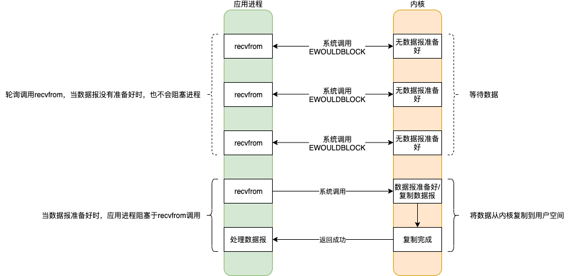
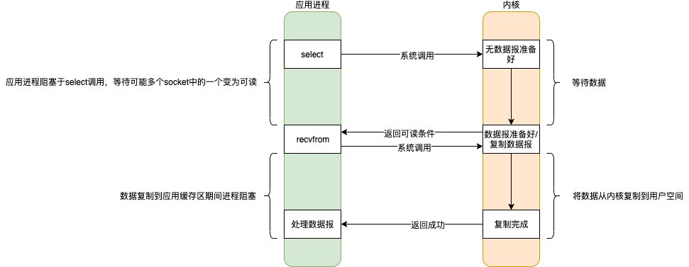
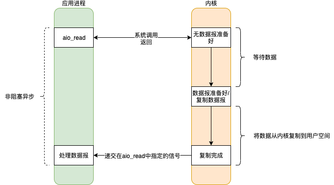

# IO模型

|          | 阻塞                         | 非阻塞                         |
| -------- | ---------------------------- | ------------------------------ |
| **同步** | 阻塞I/O模型、I/O多路复用模型 | 非阻塞I/O模型、信号驱动I/O模型 |
| **异步** |                              | 异步I/O模型                    |

阻塞程度：阻塞I/O>非阻塞I/O>I/O多路复用模型>信号驱动I/O>异步I/O ，效率由低到高。

## 阻塞IO（blocking I/O）

## 非阻塞IO（noblocking I/O）

## IO多路复用（I/O multiplexing）

## 信号驱动IO（signal blocking I/O）

## 异步IO（asynchronous I/O）

