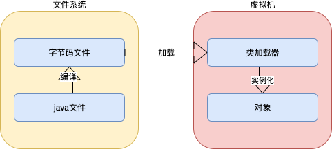
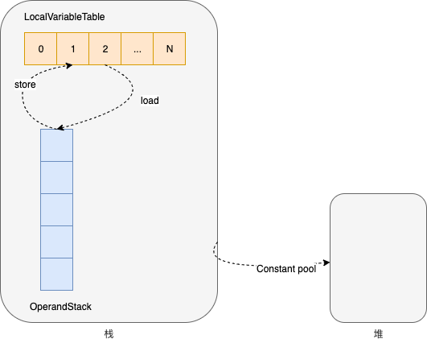

# 概述

Java是一种面向对象、静态类型、编译执行，有 VM/GC 和运行时、跨平台的高级语言。




# 字节码

Java bytecode由<font color=red>单字节指令</font>组成，理论上最多支持256个操作码（opcode）。实际Java只使用了200左右的操作码。还有一些操作码则保留给调试操作。

- 栈操作指令，包括与局部变量交互的指令
- 程序流程控制指令
- 对象操作指令，包括方法调用指令
- 算术运算及类型转换指令


## 字节码运行时结构

JVM是一台基于**栈**的计算机器。每个线程都有一个独属于自己的线程栈，用于存储栈帧。每一次方法调用，JVM都会自动创建一个栈帧。栈帧由操作数栈，局部变量表以及一个Class引用组成。Class引用指向当前方法在运行时常量池中对应的Class。

- 所有指令的起点都是操作数栈，在其上进行运算，临时结果继续入栈；而最终结果可以保存在本地变量表中，用于其他指令读取。




## 字节码分析

### HelloByteCode

- 源码

  ```java
  public class HelloByteCode {
      public static void main(String[] args) {
          HelloByteCode helloByteCode = new HelloByteCode();
      }
  }
  ```


- 分析

  ```shell
  # 反编译 HelloByteCode.class
  javap -c -verbose HelloByteCode 
  
  # 输出
  Classfile /Users/yangxiaoyu/work/bigdata/project/hadoop-dev/hadoop-java/hadoop-java-jvm/target/classes/com/sciatta/hadoop/java/jvm/bytecode/HelloByteCode.class
    Last modified 2020-10-18; size 499 bytes
    MD5 checksum 39bee97c80c36566884eb74e401f2321
    Compiled from "HelloByteCode.java"
  public class com.sciatta.hadoop.java.jvm.bytecode.HelloByteCode
    minor version: 0
    major version: 52
    flags: ACC_PUBLIC, ACC_SUPER
  Constant pool:
     #1 = Methodref          #4.#19         // java/lang/Object."<init>":()V
     #2 = Class              #20            // com/sciatta/hadoop/java/jvm/bytecode/HelloByteCode
     #3 = Methodref          #2.#19         // com/sciatta/hadoop/java/jvm/bytecode/HelloByteCode."<init>":()V
     #4 = Class              #21            // java/lang/Object
     #5 = Utf8               <init>
     #6 = Utf8               ()V
     #7 = Utf8               Code
     #8 = Utf8               LineNumberTable
     #9 = Utf8               LocalVariableTable
    #10 = Utf8               this
    #11 = Utf8               Lcom/sciatta/hadoop/java/jvm/bytecode/HelloByteCode;
    #12 = Utf8               main
    #13 = Utf8               ([Ljava/lang/String;)V
    #14 = Utf8               args
    #15 = Utf8               [Ljava/lang/String;
    #16 = Utf8               helloByteCode
    #17 = Utf8               SourceFile
    #18 = Utf8               HelloByteCode.java
    #19 = NameAndType        #5:#6          // "<init>":()V
    #20 = Utf8               com/sciatta/hadoop/java/jvm/bytecode/HelloByteCode
    #21 = Utf8               java/lang/Object
  {
    public com.sciatta.hadoop.java.jvm.bytecode.HelloByteCode();
      descriptor: ()V
      flags: ACC_PUBLIC
      Code:
        stack=1, locals=1, args_size=1
        	 # 4、从本地变量表中拿出第0个元素，this引用入栈
        	 # -> this
           0: aload_0
           # 5、this出栈，调用父类的初始化方法
           # ->
           1: invokespecial #1                  // Method java/lang/Object."<init>":()V
           # 6、调用结束，没有返回值；方法结束时，操作数栈必须为空
           # ->
           4: return
        LineNumberTable:
          line 8: 0
        LocalVariableTable:
          Start  Length  Slot  Name   Signature
              0       5     0  this   Lcom/sciatta/hadoop/java/jvm/bytecode/HelloByteCode;
  
    public static void main(java.lang.String[]);
      descriptor: ([Ljava/lang/String;)V
      flags: ACC_PUBLIC, ACC_STATIC
      Code:
        stack=2, locals=2, args_size=1
           # 1、在堆中为HelloByteCode分配内存空间，其引用入栈
           # -> ref
           0: new           #2                  // class com/sciatta/hadoop/java/jvm/bytecode/HelloByteCode
           # 2、复制栈顶元素
           # -> ref ref
           3: dup
           # 3、ref 出栈，调用该实例的初始化方法，为HelloByteCode构造新的栈帧
           # -> ref
           4: invokespecial #3                  // Method "<init>":()V
           # 7、ref 出栈，保存引用到本地变量表中第1个元素
           # ->
           7: astore_1
           # 8、调用结束
           # ->
           8: return
        LineNumberTable:
          line 10: 0
          line 11: 8
        LocalVariableTable:
          Start  Length  Slot  Name   Signature
              0       9     0  args   [Ljava/lang/String;
              8       1     1 helloByteCode   Lcom/sciatta/hadoop/java/jvm/bytecode/HelloByteCode;
  }
  ```


### MovingAverage

- 源码

  ```java
  public class MovingAverage {
      private int count = 0;
      private double sum = 0.0D;
  
      public void submit(double value) {
          this.count++;
          sum += value;
      }
  
      public double getAvg() {
          if (0 == count) return sum;
          return sum / count;
      }
  
      public static void main(String[] args) {
          MovingAverage movingAverage = new MovingAverage();
          int num1 = 1;
          int num2 = 2;
          movingAverage.submit(num1);
          movingAverage.submit(num2);
          double avg = movingAverage.getAvg();
      }
  }
  ```


- 分析

  ```shell
  # 反编译
  javap -c -verbose MovingAverage
  
  # 输出
  Classfile /Users/yangxiaoyu/work/bigdata/project/hadoop-dev/hadoop-java/hadoop-java-jvm/target/classes/com/sciatta/hadoop/java/jvm/bytecode/MovingAverage.class
    Last modified 2020-10-18; size 930 bytes
    MD5 checksum 6f577201cd5747c22b3ae11db0aba16d
    Compiled from "MovingAverage.java"
  public class com.sciatta.hadoop.java.jvm.bytecode.MovingAverage
    minor version: 0
    major version: 52
    flags: ACC_PUBLIC, ACC_SUPER
  Constant pool:
     #1 = Methodref          #8.#36         // java/lang/Object."<init>":()V
     #2 = Fieldref           #4.#37         // com/sciatta/hadoop/java/jvm/bytecode/MovingAverage.count:I
     #3 = Fieldref           #4.#38         // com/sciatta/hadoop/java/jvm/bytecode/MovingAverage.sum:D
     #4 = Class              #39            // com/sciatta/hadoop/java/jvm/bytecode/MovingAverage
     #5 = Methodref          #4.#36         // com/sciatta/hadoop/java/jvm/bytecode/MovingAverage."<init>":()V
     #6 = Methodref          #4.#40         // com/sciatta/hadoop/java/jvm/bytecode/MovingAverage.submit:(D)V
     #7 = Methodref          #4.#41         // com/sciatta/hadoop/java/jvm/bytecode/MovingAverage.getAvg:()D
     #8 = Class              #42            // java/lang/Object
     #9 = Utf8               count
    #10 = Utf8               I
    #11 = Utf8               sum
    #12 = Utf8               D
    #13 = Utf8               <init>
    #14 = Utf8               ()V
    #15 = Utf8               Code
    #16 = Utf8               LineNumberTable
    #17 = Utf8               LocalVariableTable
    #18 = Utf8               this
    #19 = Utf8               Lcom/sciatta/hadoop/java/jvm/bytecode/MovingAverage;
    #20 = Utf8               submit
    #21 = Utf8               (D)V
    #22 = Utf8               value
    #23 = Utf8               getAvg
    #24 = Utf8               ()D
    #25 = Utf8               StackMapTable
    #26 = Utf8               main
    #27 = Utf8               ([Ljava/lang/String;)V
    #28 = Utf8               args
    #29 = Utf8               [Ljava/lang/String;
    #30 = Utf8               movingAverage
    #31 = Utf8               num1
    #32 = Utf8               num2
    #33 = Utf8               avg
    #34 = Utf8               SourceFile
    #35 = Utf8               MovingAverage.java
    #36 = NameAndType        #13:#14        // "<init>":()V
    #37 = NameAndType        #9:#10         // count:I
    #38 = NameAndType        #11:#12        // sum:D
    #39 = Utf8               com/sciatta/hadoop/java/jvm/bytecode/MovingAverage
    #40 = NameAndType        #20:#21        // submit:(D)V
    #41 = NameAndType        #23:#24        // getAvg:()D
    #42 = Utf8               java/lang/Object
  {
    public com.sciatta.hadoop.java.jvm.bytecode.MovingAverage();
      descriptor: ()V
      flags: ACC_PUBLIC
      Code:
        stack=3, locals=1, args_size=1
        	 # -> this
           0: aload_0
           # ->
           1: invokespecial #1                  // Method java/lang/Object."<init>":()V
           # -> this
           4: aload_0
           # -> this 0
           5: iconst_0
           # 栈顶的两个元素一起出栈，设置对象的值
           # ->
           6: putfield      #2                  // Field count:I
           # -> this
           9: aload_0
          # -> this 0
          10: dconst_0
          # ->
          11: putfield      #3                  // Field sum:D
          # ->
          14: return
        LineNumberTable:
          line 8: 0
          line 9: 4
          line 10: 9
        LocalVariableTable:
          Start  Length  Slot  Name   Signature
              0      15     0  this   Lcom/sciatta/hadoop/java/jvm/bytecode/MovingAverage;
  
    public void submit(double);
      descriptor: (D)V
      flags: ACC_PUBLIC
      Code:
        stack=5, locals=3, args_size=2
        	 # -> this
           0: aload_0
           # -> this this
           1: dup
           # -> this value
           2: getfield      #2                  // Field count:I
           # -> this value 1
           5: iconst_1
           # -> this result
           6: iadd
           # ->
           7: putfield      #2                  // Field count:I
          10: aload_0
          11: dup
          12: getfield      #3                  // Field sum:D
          15: dload_1
          16: dadd
          17: putfield      #3                  // Field sum:D
          20: return
        LineNumberTable:
          line 13: 0
          line 14: 10
          line 15: 20
        LocalVariableTable:
          Start  Length  Slot  Name   Signature
              0      21     0  this   Lcom/sciatta/hadoop/java/jvm/bytecode/MovingAverage;
              0      21     1 value   D
  
    public double getAvg();
      descriptor: ()D
      flags: ACC_PUBLIC
      Code:
        stack=4, locals=1, args_size=1
           0: iconst_0
           1: aload_0
           2: getfield      #2                  // Field count:I
           5: if_icmpne     13
           8: aload_0
           9: getfield      #3                  // Field sum:D
          12: dreturn
          13: aload_0
          14: getfield      #3                  // Field sum:D
          17: aload_0
          18: getfield      #2                  // Field count:I
          21: i2d
          22: ddiv
          23: dreturn
        LineNumberTable:
          line 18: 0
          line 19: 13
        LocalVariableTable:
          Start  Length  Slot  Name   Signature
              0      24     0  this   Lcom/sciatta/hadoop/java/jvm/bytecode/MovingAverage;
        StackMapTable: number_of_entries = 1
          frame_type = 13 /* same */
  
    public static void main(java.lang.String[]);
      descriptor: ([Ljava/lang/String;)V
      flags: ACC_PUBLIC, ACC_STATIC
      Code:
        stack=3, locals=6, args_size=1
        	 # -> ref
           0: new           #4                  // class com/sciatta/hadoop/java/jvm/bytecode/MovingAverage
           # -> ref ref
           3: dup
           # -> ref
           4: invokespecial #5                  // Method "<init>":()V
           # ->
           7: astore_1
           # -> 1
           8: iconst_1
           # -> 
           9: istore_2
          # -> 2
          10: iconst_2
          # ->
          11: istore_3
          # -> ref
          12: aload_1
          # -> ref 1
          13: iload_2
          # 取出栈顶整数1，转换成double后，再压入栈
          # -> ref 1
          14: i2d
          # 从ref开始全部出栈
          # ->
          15: invokevirtual #6                  // Method submit:(D)V
          18: aload_1
          19: iload_3
          20: i2d
          21: invokevirtual #6                  // Method submit:(D)V
          24: aload_1
          25: invokevirtual #7                  // Method getAvg:()D
          28: dstore        4
          30: return
        LineNumberTable:
          line 23: 0
          line 24: 8
          line 25: 10
          line 26: 12
          line 27: 18
          line 28: 24
          line 29: 30
        LocalVariableTable:
          Start  Length  Slot  Name   Signature
              0      31     0  args   [Ljava/lang/String;
              8      23     1 movingAverage   Lcom/sciatta/hadoop/java/jvm/bytecode/MovingAverage;
             10      21     2  num1   I
             12      19     3  num2   I
             30       1     4   avg   D
  }
  SourceFile: "MovingAverage.java"
  ```


### ForLoop

- 源码

  ```java
  public class ForLoop {
      public static void main(String[] args) {
          int[] numbers = {1, 2, 3};
          MovingAverage movingAverage = new MovingAverage();
  
          for (int number : numbers) {
              movingAverage.submit(number);
          }
  
          double avg = movingAverage.getAvg();
      }
  }
  ```

  

- 分析

  ```shell
  javap -c -verbose ForLoop 
  
  # output
  Classfile /Users/yangxiaoyu/work/bigdata/project/hadoop-dev/hadoop-java/hadoop-java-jvm/target/classes/com/sciatta/hadoop/java/jvm/bytecode/ForLoop.class
    Last modified 2020-10-18; size 844 bytes
    MD5 checksum 3d7b2aa7f6295d94dcc4821eb793e1f4
    Compiled from "ForLoop.java"
  public class com.sciatta.hadoop.java.jvm.bytecode.ForLoop
    minor version: 0
    major version: 52
    flags: ACC_PUBLIC, ACC_SUPER
  Constant pool:
     #1 = Methodref          #7.#33         // java/lang/Object."<init>":()V
     #2 = Class              #34            // com/sciatta/hadoop/java/jvm/bytecode/MovingAverage
     #3 = Methodref          #2.#33         // com/sciatta/hadoop/java/jvm/bytecode/MovingAverage."<init>":()V
     #4 = Methodref          #2.#35         // com/sciatta/hadoop/java/jvm/bytecode/MovingAverage.submit:(D)V
     #5 = Methodref          #2.#36         // com/sciatta/hadoop/java/jvm/bytecode/MovingAverage.getAvg:()D
     #6 = Class              #37            // com/sciatta/hadoop/java/jvm/bytecode/ForLoop
     #7 = Class              #38            // java/lang/Object
     #8 = Utf8               <init>
     #9 = Utf8               ()V
    #10 = Utf8               Code
    #11 = Utf8               LineNumberTable
    #12 = Utf8               LocalVariableTable
    #13 = Utf8               this
    #14 = Utf8               Lcom/sciatta/hadoop/java/jvm/bytecode/ForLoop;
    #15 = Utf8               main
    #16 = Utf8               ([Ljava/lang/String;)V
    #17 = Utf8               number
    #18 = Utf8               I
    #19 = Utf8               args
    #20 = Utf8               [Ljava/lang/String;
    #21 = Utf8               numbers
    #22 = Utf8               [I
    #23 = Utf8               movingAverage
    #24 = Utf8               Lcom/sciatta/hadoop/java/jvm/bytecode/MovingAverage;
    #25 = Utf8               avg
    #26 = Utf8               D
    #27 = Utf8               StackMapTable
    #28 = Class              #20            // "[Ljava/lang/String;"
    #29 = Class              #22            // "[I"
    #30 = Class              #34            // com/sciatta/hadoop/java/jvm/bytecode/MovingAverage
    #31 = Utf8               SourceFile
    #32 = Utf8               ForLoop.java
    #33 = NameAndType        #8:#9          // "<init>":()V
    #34 = Utf8               com/sciatta/hadoop/java/jvm/bytecode/MovingAverage
    #35 = NameAndType        #39:#40        // submit:(D)V
    #36 = NameAndType        #41:#42        // getAvg:()D
    #37 = Utf8               com/sciatta/hadoop/java/jvm/bytecode/ForLoop
    #38 = Utf8               java/lang/Object
    #39 = Utf8               submit
    #40 = Utf8               (D)V
    #41 = Utf8               getAvg
    #42 = Utf8               ()D
  {
    public com.sciatta.hadoop.java.jvm.bytecode.ForLoop();
      descriptor: ()V
      flags: ACC_PUBLIC
      Code:
        stack=1, locals=1, args_size=1
           0: aload_0
           1: invokespecial #1                  // Method java/lang/Object."<init>":()V
           4: return
        LineNumberTable:
          line 8: 0
        LocalVariableTable:
          Start  Length  Slot  Name   Signature
              0       5     0  this   Lcom/sciatta/hadoop/java/jvm/bytecode/ForLoop;
  
    public static void main(java.lang.String[]);
      descriptor: ([Ljava/lang/String;)V
      flags: ACC_PUBLIC, ACC_STATIC
      Code:
        stack=4, locals=7, args_size=1
        	 # -> 3
           0: iconst_3
           # -> arrayref
           1: newarray       int
           # -> arrayref arrayref
           3: dup
           # -> arrayref arrayref 0
           4: iconst_0
           # -> arrayref arrayref 0 1
           5: iconst_1
           # 在数组array指定index保存value
           # -> arrayref
           6: iastore
           7: dup
           8: iconst_1
           9: iconst_2
          10: iastore
          11: dup
          12: iconst_2
          13: iconst_3
          # -> arrayref
          14: iastore
          # ->
          15: astore_1
          16: new           #2                  // class com/sciatta/hadoop/java/jvm/bytecode/MovingAverage
          19: dup
          20: invokespecial #3                  // Method com/sciatta/hadoop/java/jvm/bytecode/MovingAverage."<init>":()V
          23: astore_2
          # -> arrayref
          24: aload_1
          # ->
          25: astore_3
          # -> arrayref
          26: aload_3
          # 数组长度入栈
          # -> 3
          27: arraylength
          # ->
          28: istore        4
          # -> 0
          30: iconst_0
          # ->
          31: istore        5
          # -> 0
          33: iload         5
          # -> 0 3
          35: iload         4
          # 取出两个操作数 v1=0 v2=3 如果 v1>=v2 则指令跳转到指定index 59位置执行；否则执行后续指令
          # ->
          37: if_icmpge     59
          # -> 每次都取出堆中的数组，线程不安全
          # -> arrayref
          40: aload_3
          # -> arrayref 0
          41: iload         5
          # -> 弹出数组和索引，取值后入栈
          # -> 1
          43: iaload
          # ->
          44: istore        6
          # -> maref
          46: aload_2
          # -> maref 1
          47: iload         6
          # -> maref 1.0
          49: i2d
          # ->
          50: invokevirtual #4                  // Method com/sciatta/hadoop/java/jvm/bytecode/MovingAverage.submit:(D)V
          # 数组index=5加1
          # ->
          53: iinc          5, 1
          # 调整到33，继续执行
          56: goto          33
          59: aload_2
          60: invokevirtual #5                  // Method com/sciatta/hadoop/java/jvm/bytecode/MovingAverage.getAvg:()D
          63: dstore_3
          64: return
        LineNumberTable:
          line 10: 0
          line 11: 16
          line 13: 24
          line 14: 46
          line 13: 53
          line 17: 59
          line 18: 64
        LocalVariableTable:
          Start  Length  Slot  Name   Signature
             46       7     6 number   I
              0      65     0  args   [Ljava/lang/String;
             16      49     1 numbers   [I
             24      41     2 movingAverage   Lcom/sciatta/hadoop/java/jvm/bytecode/MovingAverage;
             64       1     3   avg   D
        StackMapTable: number_of_entries = 2
          frame_type = 255 /* full_frame */
            offset_delta = 33
            locals = [ class "[Ljava/lang/String;", class "[I", class com/sciatta/hadoop/java/jvm/bytecode/MovingAverage, class "[I", int, int ]
            stack = []
          frame_type = 248 /* chop */
            offset_delta = 25
  }
  SourceFile: "ForLoop.java"
  ```

  

# 类加载器


# 内存模型

## 静态

## 动态


# 监控工具


# 调优


# 面试


