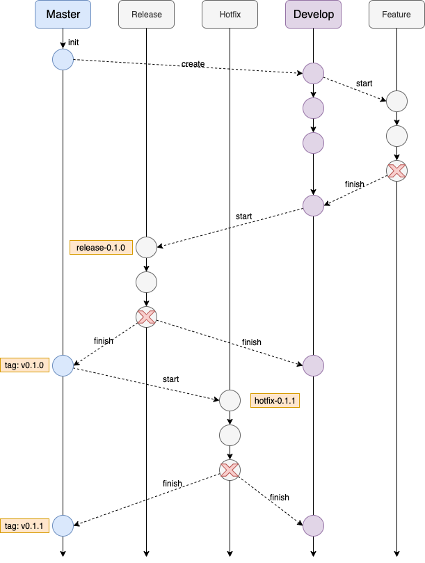

# GitHub 开发规范

- **Master**
  - 稳定分支
  - <font color=red>长存</font>
  - 只从Hotfix和Release分支合并，不会直接commit
  - 经过测试的分支，但不是最新的
- **Develop**
  - 开发分支
  - <font color=red>长存</font>
  - 未经过测试的分支，保持最新
- Feature
  - 特性分支
  - 开发特定需求且时间较长时建立，开发完成向Develop分支合并后删除
- Release
  - 发布分支
  - 测试时建立，测试完成合并后删除
  - 从Develop分支，是准备释出的版本，**只修改版本号与Bug**，完成后合并回Develop和Master分支，并在Master上标出版本号的tag
- Hotfix
  - 缺陷分支
  - 修复生产Bug时建立，修复完成合并后删除
  - 从Master分支，处理已释出版本需要立即修改的错误，完成后合并回Develop和Master分支，并在Master上标出版本号的tag




## create develop branch

```shell
git branch develop
# 本地develop上传到远程分支（如果没有则创建），然后再关联upstream
git push -u origin develop
```


## Start new feature

```shell
# 以develop为基准创建feature分支，并切换到feature分支
git checkout -b some-feature develop
# 可选提交到远程
git push -u origin some-feature

git status
git add some-file
git commit
```


## finish the feature

```shell
# 合并前先更新，保证提交不冲突
git pull origin develop
git checkout develop
# 关闭fast-forward模式，保留分支commit信息
git merge --no-ff some-feature
git push origin develop

# 删除本地feature分支
git branch -d some-feature
# 删除远程feature分支，如有
git push origin --delete some-feature
```


## Start new release

```shell
git checkout -b release-0.1.0 develop
```


## Finish the release

```shell
git pull origin master
git checkout master
git merge --no-ff release-0.1.0
git push

git pull origin develop
git checkout develop
git merge --no-ff release-0.1.0
git push

git branch -d release-0.1.0
git push origin --delete release-0.1.0

# 给当前master版本打上tag
git tag -a v0.1.0 master
# 提交到远程
git push --tags
```


## Start new hotfix

```shell
git checkout -b hotfix-0.1.1 master
```


## Finish the hotfix

```shell
git pull origin master
git checkout master
git merge --no-ff hotfix-0.1.1
git push

git pull origin develop
git checkout develop
git merge --no-ff hotfix-0.1.1
git push

git branch -d hotfix-0.1.1

git tag -a v0.1.1 master
git push --tags
```


# 向开源项目提交 Pull request

## 将开源项目fork到远程origin仓库

`https://github.com/sciatta/shardingsphere`


## 将远程origin仓库clone到本地仓库

- 将远程origin仓库clone到本地仓库 `git clone git@github.com:sciatta/shardingsphere.git`

- 通过 `git status` 查看当前所在分支 On branch master

- 通过 `git remote -v` 查看远程仓库映射关系

  ```shell
  origin	git@github.com:sciatta/shardingsphere.git (fetch)
  origin	git@github.com:sciatta/shardingsphere.git (push)
  ```


## 与上游upstream仓库建立映射关系

- 建立映射 `git remote add upstream https://github.com/apache/shardingsphere.git`

- 通过 `git remote -v` 查看远程仓库映射关系

  ```shell
  origin	git@github.com:sciatta/shardingsphere.git (fetch)
  origin	git@github.com:sciatta/shardingsphere.git (push)
  upstream	https://github.com/apache/shardingsphere.git (fetch)
  upstream	https://github.com/apache/shardingsphere.git (push)
  ```

  

## 创建本地仓库develop分支开发

- 创建develop分支 `git checkout -b develop`
- 在此分支上进行开发 `git add -A`
- 提交本地仓库 `git commit -m` 


## 提交远程origin仓库

- 本地仓库拉取远程upstream仓库的最新内容 `git fetch upstream`
- 切换到本地master分支 `git checkout master`
- 本地仓库和远程upstream仓库的master分支同步 `git rebase upstream/master`
  - <font color=red>rebase</font> 合并为一条时间轴。如在master中执行git rebase develop，找到master和develop的公共祖先，祖先先合并develop的新增提交，然后在后面追加master的新增提交，即**变更起始点**。**注意必须没有待提交的文件**
    - 优点：得到更简洁的项目历史，去掉了merge commit
    - 缺点：如果合并出现代码问题不容易定位，因为re-write了history
  - <font color=red>merge</font> 合并路径为分叉时间轴。如在master中执行git merge develop，找到master和develop的公共祖先，然后由公共祖先、master最新提交和develop最新提交，三方合并产生一个**新的提交**
    - 优点：记录了真实的commit情况，包括每个分支的详情
    - 缺点：因为每次merge会自动产生一个merge commit，所以在使用一些git 的GUI tools，特别是commit比较频繁时，看到分支很杂乱。
- 切换到本地develop分支 `git checkout develop` 不要在master分区rebase，这样会将最新修改放在最前面
- 合并最新master分支 `git rebase master` 
  - 远程master分支位置不变，其他人修改位置不变。但最新起始点已经变成develop的位置，本地master位置改变
  - 提交到远程，其他人更新前fetch最新版本再提交，不会冲突
- 将本地develop分支提交到origin仓库 `git push origin develop:develop`


## 提交 Pull Request

在远程origin仓库 `https://github.com/sciatta/shardingsphere` 提交 Pull request

